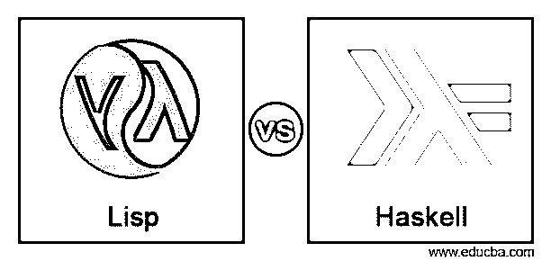

# Lisp vs Haskell

> 原文：<https://www.educba.com/lisp-vs-haskell/>

## Lisp 和 Haskell 的区别

下面的文章提供了 Lisp 和 Haskell 的概要。Lisp 也是继 Fortran 之后的一种程序设计语言，它是一种历史悠久的高级程序设计语言。Lisp 是由约翰·麦卡锡在 1958 年引入的。这种语言可以有效地处理符号信息，因此非常适合人工智能编程。它有许多特性，其中之一是它是独立于机器的，这使它成为一个很好的选择。另一方面，Haskell 也是一种通用编程语言，但它是一种函数式编程语言，它也基于 lambda 演算。它于 1990 年推出。如果我们用 Haskell 编写一个程序，它将总是以数学函数的形式表示，这些函数有它们的好处。

### Lisp 与 Haskell 的正面比较(信息图)

以下是 Lisp 和 Haskell 之间的 11 大区别:

<small>网页开发、编程语言、软件测试&其他</small>

### Lisp 和 Haskell 的主要区别

让我们讨论 Lisp 和 Haskell 之间的一些主要区别:

*   Lisp 是一种通用编程语言，在人工智能 ML(机器学习)和其他高级编程逻辑中普遍流行。Lips 也为控制语句提供了很好的支持，这再次使它成为 AI 的绝佳选择。
*   Lips 基本上代表列表处理，这个名字是因为它使用列表数据结构来表示它的数据。
*   另一方面，我们有 Haskell，它是一种纯粹的函数编程语言。基于数学函数用 Haskell 编写的函数，有利于减少错误。

如果我们使用这种语言，它会提供各种好处，如下所述:

*   如果我们用 Haskell 编写任何应用程序，它将为我们提供更高的可靠性和更少的错误。
*   通过使用它，我们可以提高开发人员的生产力。
*   用 Haskell 编写的代码易于阅读、更新、易于维护，而且非常清晰。

lisp 编程提供的一些基本和高级特性如下:

*   Lips 编程语言提供并支持高级的面向对象编程方法。
*   因为它是一种为调试提供良好支持高级编程语言。
*   lisp 的一个主要优点是它是独立于机器的，不依赖于机器的特性。
*   正如我们所知，Haskell 是纯函数式编程，而 Lips 是基于表达式的语言。
*   这种编程语言使用并提供迭代方法。
*   利用这一点，我们可以动态地更新和修改程序。
*   还为控制结构提供支持。
*   正如我们现在已经知道的，Haskell 是一种函数式编程，所以这提供了易于维护的优势，并且在应用程序中具有高度的可修改性。Haskell 提供的另一个优势是，如果你想在 Haskell 中开发规范或原型，那么可以很容易地执行、调试和测试。

#### 例子#1: **Lisp**

让我们举一个例子来理解如何用 Lisp 编写程序。

这是一个显示其语法的示例程序，在这里我们执行数字的加法，还试图通过使用 LISP 中的函数 write line 打印一些随机消息。

**代码:**

`(write (+ 100 200 300 40 5))
(write-line " ")
(write-line " Start ***********")
(write-line "Hello World from LISP")
(write-line "Sample program in LISP for understanding !!")
(write-line " End **********")`

**输出:**

#### 例子 2: Haskell

使用 Haskell 中的 putStrLn 函数打印 Haskell 中任何字符串的简单语法。

**语法:**

`main = putStrLn "i am string in haskell language"`

**输出:**

### Lisp 与 Haskell 对照表

让我们讨论 Lisp 和 Haskell 之间的顶级比较:

| **Lisp** | 哈斯克尔 |
| Lisp 是一种通用动态编程语言。它提出了先进的面向对象方法。 | 另一方面，Haskell 是一种严格类型化的编程语言。简而言之，我们可以说它是一种函数式编程语言。 |
| 因为它是独立于机器的，不依赖于机器特性。 | Haskell 像 java、c、c++一样是严格类型的语言，所以只在编译时检查错误是非常容易的。 |
| 我们有一些用 Lisp 开发和编写的应用程序列表，如:Yahoo Store、AutoCad、G2 等。 | 另一方面，Wagon、thought-out 和 DoxIQ 使用 Haskell。 |
| 这种语言对人工智能编程很有用，因为它能很好地处理符号信息。 | Haskell 基于 lambda 演算，而且我们用 Haskell 写的每个函数都是数学函数，这导致了更少的错误。 |
| Lisp 编程语言由约翰·麦卡锡于 1958 年发布，它是第二古老的编程语言。 | Haskell 稳定版是在 2010 年由 Paul Hudak 设计的。 |
| Lisp 主要用于机器学习、人工智能、高级编程等领域。 | 函数式编程语言越来越并行，因此也提供了更好的性能。 |
| Lisp 也支持广泛的数据类型，包括列表、数组、向量、哈希表、对象等。 | 另一方面，Haskell 可以用来设计和处理列表处理和符号计算应用程序。 |
| 我们已经知道 Lisp 代表列表处理，这通常意味着它使用列表作为其主要数据结构。 | Some of the features which are provide by Haskell which make it better choice to use over Java, C and other programming like:模块化、懒惰、函数式语言、可维护性等等。 |
| 它的一个特点包括对控制结构的广泛支持，这使它成为人工智能的良好选择。 | 另一方面，Haskell 被开发来非常有效地处理多线程。 |
| 在 lisp 程序中，我们通常不遵循程序步骤，而是对数据应用函数。 | 它基于 lambda 微积分和数学函数。 |
| 在 Lisp 中，我们使用列表数据结构来表示我们的数据。Lisp 编程语言提出了几种方言，如 COMMON LISP 和 SCHEMA，这再次使它成为 AI 的良好选择。 | We have three types of installer available for Haskell to be installed on the machine. Which area as:Haskell 平台，堆栈安装程序，最小安装程序。 |

### 结论

正如我们在文章中所讨论的，两种语言都有各自的优势和劣势。一种是基于 lambda 演算的函数式编程，另一种是用于符号信息处理的通用编程语言。两者都有各自的优点，可以根据需要使用。

### 推荐文章

这是 Lisp vs Haskell 的指南。这里我们分别用信息图和比较表来讨论 Lisp 和 Haskell 的主要区别。您也可以看看以下文章，了解更多信息–

1.  [核心 Java vs Java](https://www.educba.com/core-java-vs-java/)
2.  [Java vs Java EE](https://www.educba.com/java-vs-java-ee/)
3.  [Java vs Node JS](https://www.educba.com/java-vs-node-js/)
4.  [Python vs C++](https://www.educba.com/python-vs-c-plus-plus/)

