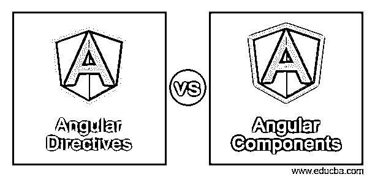
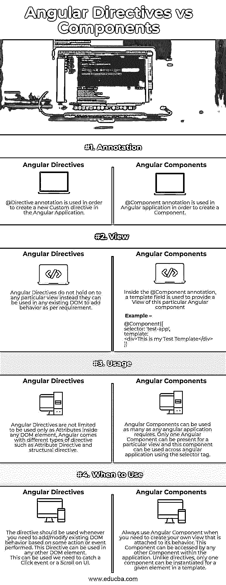

# 角度指令与组件

> 原文：<https://www.educba.com/angular-directives-vs-components/>

## 角度指令与组件之间的差异

角度组件是角度应用程序的主要 UI 构建块，角度组件是指令的子集，角度组件总是与模板相关联，即角度组件具有自己的视图，而角度指令用于向现有 DOM 元素或现有组件实例添加附加行为。此外，角度指令根据其用途有不同的类型。让我们在下面详细讨论角分量和方向之间的区别。在本主题中，我们将学习角度指令和组件。

### 角度指令与组件之间的直接比较(信息图)

以下是角度指令和组件之间的主要区别

<small>网页开发、编程语言、软件测试&其他</small>

### 角度指令与组件之间的主要比较

使用角度分量和角度方向两者同等重要，在建立角度应用时使用。角分量和方向之间有一些区别，值得了解，因为它们有助于我们知道在哪里使用什么。

角度组件和角度方向之间的一个主要区别是，每个角度组件必须有一个与之相关联的视图/模板，没有视图，角度组件无法创建，而方向不必特别有与之相关联的视图。

#### 角度方向

角度指令有不同的类型，

**属性指令–**当我们想要改变 DOM 元素的外观或行为时，使用属性指令。该指令可用于处理点击、滚动、模糊等事件。我们也可以通过属性指令传递值。

**结构指令****–**这些是角度指令，通过添加和删除 DOM 元素来改变 DOM 布局。

内置指令的一些例子有 NgStyle、NgClass 等。

角度指令用于设计可重用的组件，并且可以跨角度应用程序使用。根据需要，可以在 DOM 中使用各种不同的指令。指令没有关联的视图或模板，而是捕获事件并执行所需的操作。角度指令的另一个限制是不能使用带有角度指令的管道。

**示例**–

`import {Directive} from '@angular/core';
@Directive({
selector: "[buttonClick]",
hostListeners: {
'click': 'onClick()',
},
})
class buttonClick {
constructor() {}
onClick() {
console.log(‘---- Button Event Has Been   Clicked ----');  }
}
<button buttonClick>Testing Button Click</button>`

上面的行可以添加到任何 HTML 视图中，其中 buttonClick 属性用于捕获 Click 事件并打印该行—- Button 事件已被单击—-

#### 角度分量

每当我们想要注册角度分量时，我们需要使用元数据注释@Component。角度组件是角度方向的子集，它们总是与模板/视图相关联。与其他指令不同，对于模板中的给定元素，只能实例化一个组件。Angular 中的每个组件都属于一个 NgModule，因此它可以被 Angular 应用程序中的另一个组件使用。

为了使新创建的 Angular 组件成为 NgModule 的成员，我们应该在 NgModule 元数据的声明字段中添加这个组件名称。组件通常用于创建跨应用程序使用的 UI 小部件和小组件。角度组件也可用于定义管道。组件用于将应用程序分解成更小的组件，使核心可读性更好。创建角度组件时，@View decorator 或 templateUrl 模板是必需的。

**例子**

`import {Component, View} from '@angular/core';
@Component({
selector: 'registration-form',
template: `

<h1>Registration Form</h1>

{{fname}} {{lname}}

{{city}}

`
})
class RegistrationForm {
@Input() fname: string
@Input() lname: string
@Input() city: string
constructor() {}
}`

### 角度指令与分量之间的比较

下面列出了角度指令和组件之间的主要区别

| **#1。注释** |
| **Angular Directive**@Directive 注释用于在 Angular 应用程序中创建新的自定义指令 | **Angular Component**@组件注释用于角度应用程序，以便创建组件 |
| **#2。查看** |
| **Angular Directive**Angular 指令并不依赖于任何特定的视图，相反，它们可以在任何现有的 DOM 中根据需要添加行为。 | **Angular Component**在@Component 注释中，模板字段用于提供这个特定角度分量的视图**示例—**

`@Component({
selector: 'test-app',
template:

This is my Test Template

})`

 |
| **#3。用法** |
| **Angular Directive**Angular 指令不仅限于在任何 DOM 元素中作为属性使用，Angular 有不同类型的指令，比如属性指令和结构指令。 | **Angular Component**可以根据任何角度应用的需要使用任意多的角度组件。对于一个特定的视图，只能有一个角度分量，并且可以使用选择器标签在整个角度应用中使用该分量。 |
| **#4。何时使用** |
| **Angular Directive**每当您需要根据执行的某些操作或事件添加/修改现有的 DOM 行为时，都应该使用该指令。这个指令可以在任何其他 DOM 元素中使用。这可以用在我们需要捕捉点击事件或用户界面上的滚动。 | **Angular Component**当您需要创建自己的附加到其行为的视图时，请始终使用角度组件。应用程序中的任何其他组件都可以访问该组件。与指令不同，对于模板中的给定元素，只能实例化一个组件。 |
|  |
|  |  |
|  |  |  |

### 结论

在构建角度应用程序时，角度指令和组件被广泛使用。创建与视图相关联的新的角度组件，以及创建这样的多个较小的组件，有助于代码分离，提高可读性，并保持代码的可重用性。另一方面，角度指令被添加或修改现有的 DOM 行为，并处理各种不同的事件，如点击、模糊、聚焦、滚动等。并且可以在指令文件中采取适当的动作。从构建 Angular 应用程序和使用 Angular 指令或组件开始，你需要知道什么时候使用什么。

### 推荐文章

这是角度指令与组件的指南。在这里，我们通过信息图和比较表来讨论角度指令与组件的主要区别。您也可以看看以下文章，了解更多信息–

1.  [股票 vs 共同基金](https://www.educba.com/shares-vs-mutual-funds/)
2.  [Tekla vs Revit](https://www.educba.com/tekla-vs-revit/)
3.  [Webflow vs bubble](https://www.educba.com/webflow-vs-bubble/)
4.  [哈斯克尔 vs 鲁斯特](https://www.educba.com/haskell-vs-rust/)

