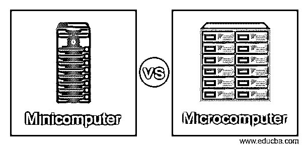
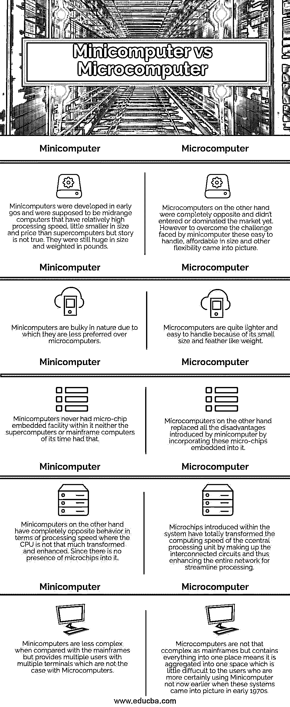

# 小型计算机对微型计算机

> 原文：<https://www.educba.com/minicomputer-vs-microcomputer/>

## 小型计算机与微型计算机的区别

小型计算机或微型计算机听起来一样，但它们之间有很大的区别。微型计算机是大多数人日常使用的计算机类型，例如与小型计算机相比具有高处理速度的笔记本电脑或台式个人电脑。另一方面，小型机在 90 年代早期使用，处理和计算能力非常慢。小型机一般体积较大，与微机比较时速度相当慢。微型计算机有很大的存储量，因此现在人们更喜欢用它来满足日常需要。

### 小型机与微机的正面比较(信息图表)

以下是 Draw.io 与 Lucidchart 的 5 大区别:

<small>网页开发、编程语言、软件测试&其他</small>

### 小型机和微机的主要区别

小型机和微机之间的一些主要区别如下:

小型机和微型机相比有一些关键的区别。举例来说，其中一些如下:

*   小型计算机是 1960 年推出的小型计算机，用于各种商业企业和科学应用工作。
*   微型计算机是一种用于多种通用工作的个人计算机，于 1970 年推出，以解决大多数任务。
*   微型计算机被用于教育、演示和娱乐的许多目的。
*   另一方面，小型计算机不用于上述任何目的，而是用于控制这些计算机的生产过程。
*   微型计算机支持由优化和评估组成的单个处理单元。
*   小型机用于支持由双处理单元组成的优化，也用于任何操作和评估。
*   与小型计算机相比，微型计算机是最便宜和用户友好的，而小型计算机非常复杂和昂贵。与小型计算机相比，它也很难使用。
*   小型计算机体积很大，存储容量以兆字节(TB)计，而微型计算机重量较轻，分别以千兆字节(GB)计。
*   小型机用于过程控制、许多管理任务和财务工作，这些都主要与工业任务有关，而微机则不同，在微机中，文字处理、数据库管理、电子表格、制图和一般办公应用是主要的重点任务，可以毫不费力地无缝完成。
*   与微型计算机相比，小型计算机功能更强，反之亦然。
*   微型计算机利用磁带和磁盘来构成整个存储设备，而小型计算机利用磁盘和磁带在辅助设备中进行存储，特别是在其上进行任何读写活动。
*   微型计算机在速度和性能方面比小型计算机慢得多，而小型计算机在速度和性能方面要快得多，这是因为多处理系统具有多用户处理能力，特别是同时处理不同用户的能力。
*   小型计算机的一些例子包括 AS/400 计算机，MV 1500，摩托罗拉 68040。
*   微型计算机的一些例子包括 IBM-PC、台式计算机、膝上型计算机等。
*   一些早期的型号，包括 DEC PDP-8，或者称为直-8 小型计算机，是由 Digitial Equipment Corporation 引进和制造的，PDP-8 被认为是所使用的最好和最著名的小型计算机之一，在价格上也是可承受的，其价格接近 20000 美元。
*   因此，它在 1971 年与 Intel 4004 一起推出，这是第一个用于读写各种指令的微处理器，具有各种 CPU、内存和硅片上的控制。
*   然后以微型计算机的形式出现在桌面上，现在几乎每个人都知道它的工作原理。
*   与微型计算机相比，台式计算机到膝上型计算机的进化转变也在系统的使用和处理因素方面带来了许多变化，尽管微型计算机的处理能力相当强大，但是由于其笨重和庞大的尺寸，所以不太受欢迎。
*   大型组织确实在处理这些小型计算机，尤其是那些有遗留系统和现有项目的组织，他们只是在使用这些小型计算机，除此之外，当微型计算机已经存在时，使用大型计算机甚至都不方便。

### 小型计算机与微型计算机对照表

小型计算机与微型计算机的比较如下:

| **小型机** | **微型计算机** |
| 小型机是在 90 年代早期开发的，被认为是具有相对较高处理速度的中型计算机，在尺寸和价格上比超级计算机略小，但这个故事是不真实的。它们的体积仍然很大，重达 100 磅。 | 另一方面，微型计算机完全相反，还没有进入或主导市场。然而，为了克服小型机所面临的挑战，这些易于操作、尺寸适中且具有其他灵活性的产品出现了。 |
| 小型计算机本质上体积庞大，因此不如微型计算机受欢迎。 | 由于微型计算机体积小，重量轻，所以非常轻便，易于操作。 |
| 小型机从来没有内置微芯片的设备，当时的超级计算机和大型计算机都没有。 | 另一方面，微型计算机通过嵌入这些微芯片取代了小型机带来的所有缺点。 |
| 另一方面，小型机在处理速度方面有完全相反的行为，因为 CPU 没有得到太多的转换和增强。因为里面没有微芯片。 | 系统中引入的微芯片通过组成互连电路完全改变了中央处理器的计算速度，从而增强了整个网络的处理效率。 |
| 与大型计算机相比，小型计算机没有那么复杂，但它能为多个用户提供多个终端，这与微型计算机不同。 | 微型计算机不像大型机那样复杂，但它把所有的东西都放在一个地方，这意味着它被聚集在一个空间里，这对那些更肯定使用微型计算机的用户来说有点困难，而不是在这些系统于 20 世纪 70 年代初出现的时候。 |

### 结论

从 20 世纪 60 年代至今，随着微型计算机从小型计算机发展而来的技术进步，大多数用户现在都精通技术。微型计算机在效率和处理速度方面取得了很大的进步，并试图使之轻便。

### 推荐文章

这是一本小型计算机和微型计算机的指南。在这里，我们也用信息图和比较表来讨论小型机和微机的主要区别。您也可以看看以下文章，了解更多信息–

1.  [微处理器 vs 微控制器](https://www.educba.com/microprocessor-vs-microcontroller/)
2.  [Ubuntu 的使用](https://www.educba.com/uses-of-ubuntu/)
3.  [飞镖 vs 围棋](https://www.educba.com/dart-vs-go/)
4.  [网页 vs 网站](https://www.educba.com/webpage-vs-website/)
5.  [Docker 容器 vs 图片](https://www.educba.com/docker-containers-vs-images/)

