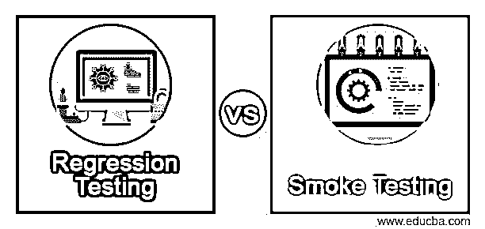

# 回归测试与冒烟测试

> 原文：<https://www.educba.com/regression-testing-vs-smoke-testing/>

## 回归测试和冒烟测试的区别

回归测试和冒烟测试都是用于检查软件的测试技术。这些测试类型的目标都是检查软件，但是方法和技术是不同的。它们在功能上互不相同。回归测试是深层测试，而冒烟测试是表层测试。让我们讨论一下回归测试和冒烟测试。

### 回归测试

回归测试是重新运行测试功能和非功能测试，以确保先前开发和测试的软件在更改后仍能运行。如果不是，这将被称为倒退。可能需要回归测试的更改包括软件环境、错误修复、配置更改，甚至电子组件的替换。测试自动化经常涉及到，因为回归测试套件往往会随着每个发现的缺陷而增长。回归测试不仅用于检查软件的正确性，还用于跟踪输出的质量。如果遵循全面测试的方法，可以通过多种方法实现，但是提供了对软件所做的更改没有影响未改变的现有功能的确定性。各种回归技术是重测所有，测试用例优先，回归测试收集，混合。

<small>网页开发、编程语言、软件测试&其他</small>

### 烟雾测试

冒烟测试是一个软件测试过程，它决定了部署的软件版本是否稳定。它对问答团队进行进一步的软件测试起到了确认的作用。它由在每个构建上运行的最小测试集组成，以测试软件功能。它用于确保所有关键功能是否正常工作。因为它在初始阶段确保了软件的正确性，所以需要较少的努力和成本。如果我们不在早期阶段执行冒烟测试，那么在成本有效的后期阶段可能会遇到缺陷。在后期阶段发现的缺陷可能会影响可交付产品的发布。冒烟测试将集成风险降至最低。

### 回归测试和冒烟测试的直接比较(信息图)

以下是回归测试和冒烟测试之间的 11 大对比:

### 回归测试和冒烟测试的主要区别

让我们从以下几点来讨论回归测试和冒烟测试之间的一些关键区别:

*   冒烟测试也称为构建验证测试，而回归测试没有任何其他名称。
*   回归测试由专业测试人员执行，而冒烟测试由代码开发人员和测试人员执行。
*   回归测试经常在测试阶段进行，而冒烟测试之后是回归测试。
*   回归测试是深层次的测试，因为它用于检查代码的更改部分是否影响现有的功能，而冒烟测试是表层测试，因为它用于检查新开发的产品。
*   回归测试用于检查系统的合理性，冒烟测试是否用于系统的稳定性。
*   在执行冒烟测试时，测试的每个细节都被记录和编写脚本，而在回归测试中，细节没有被记录和编写脚本。
*   回归测试的成本很高，因为它需要更多的时间和人力，而冒烟测试需要较少的成本，因为它需要较少的时间和人力。

### 回归测试与冒烟测试对比表

下表总结了回归测试与冒烟测试之间的比较 **:**

| **回归测试** | **烟雾测试** |
| 回归测试用于验证系统的合理性。 | 烟雾测试用于验证系统的稳定性。 |
| 是深层次的测试。 | 这是表层测试。 |
| 回归测试是在测试阶段进行的。 | 冒烟测试之后总是进行回归测试。 |
| 回归测试由测试人员执行。 | 冒烟测试由 web 开发人员执行。 |
| 它是从软件需求说明书或功能说明书中获得的。 | 冒烟测试的测试用例是回归测试的一部分，只覆盖核心功能。 |
| 回归测试的整个过程没有文档和脚本。 | 冒烟测试的整个过程都有记录和脚本。 |
| 它比烟雾测试需要更多的时间和人力。 | 它比回归测试需要更少的时间和人力。 |
| 回归测试成本高于冒烟测试。 | 冒烟测试成本低于衰退测试。 |
| 回归测试不负责接受和拒绝进一步测试程序的软件构建 | 快速执行冒烟测试以确认是接受还是拒绝构建。 |
| 执行回归测试是为了检查更改后的代码是否会影响现有的特性。 | 烟雾测试在新开发的软件上进行。 |
| 回归测试或者手动执行，或者通过自动化工具执行。 | 使用手动和自动化工具来执行烟雾测试。 |

### 结论

回归测试和冒烟测试各自都很重要。每一种都有自己的技术、方法和关注点。在本文中，我们借助比较表和关键区别讨论了这两种测试技术之间的区别。希望你喜欢这篇文章。

### 推荐文章

这是回归测试和冒烟测试之间主要区别的指南。在这里，我们讨论回归测试与冒烟测试的关键区别，包括信息图和比较表。您也可以看看以下文章，了解更多信息–

1.  [回归测试工具](https://www.educba.com/regression-testing-tools/)
2.  [回归测试](https://www.educba.com/regression-testing/)
3.  [冒烟测试与健全性测试](https://www.educba.com/smoke-testing-vs-sanity-testing/)
4.  [烟雾测试](https://www.educba.com/smoke-testing/)

