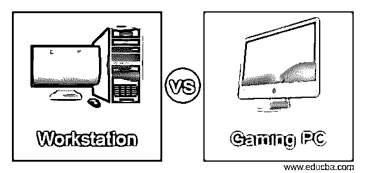
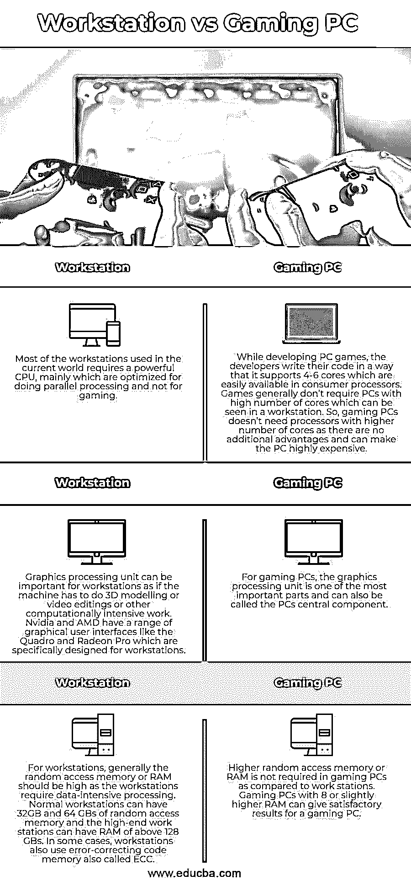

# 工作站与游戏电脑

> 原文：<https://www.educba.com/workstation-vs-gaming-pc/>

## 工作站与游戏电脑的区别

专门为科技应用和计算而设计的专用计算机称为工作站。这种 PC 通常一次可以由一个用户使用，并且通常连接到广域网或局域网，并且可以使用多用户操作系统。从大型计算机到连接到网络的个人电脑，一切都可以被认为是工作站。另一方面，游戏 PC 是专门用于视频游戏的。游戏电脑使用高性能显卡和高核心数中央处理器以及原始性能，这是普通电脑和游戏电脑之间的主要区别。游戏电脑还可以用于其他需要高分辨率图形的任务，如视频编辑。

### 工作站与游戏电脑的直接对比(信息图表)

以下是工作站与游戏电脑之间的三大区别:

<small>网页开发、编程语言、软件测试&其他</small>

### 工作站与游戏电脑的对比表

| **工作站** | **游戏电脑** |
| 

1.  At present, most workstations used in the world need powerful CPU, which is mainly optimized for parallel processing, not for games.

 | 在开发 PC 游戏时，开发人员以支持 4-6 核的方式编写代码，这在消费类处理器中很容易获得。游戏通常不需要在工作站上就能看到的高内核数量的电脑。因此，游戏电脑不需要更多内核的处理器，因为没有额外的优势，而且会使电脑变得非常昂贵。T3】 |
| 2.如果机器必须进行 3D 建模、视频编辑或其他计算密集型工作，图形处理单元对于工作站可能非常重要。Nvidia 和 AMD 有一系列图形用户界面，如专门为工作站设计的 Quadro 和镭龙 Pro。 | 2.对于游戏电脑来说，图形处理单元是最重要的部件之一，也可以称为电脑的核心组件。 |
| 3.对于工作站，通常随机存取存储器或 RAM 应该很高，因为工作站需要数据密集型处理。普通工作站可以有 32GB 和 64gb 的随机存取内存，高端工作站可以有 128 GBs 以上的 RAM。在某些情况下，工作站还使用纠错码存储器，也称为 ECC。 | 3.与工作站相比，游戏 PC 不需要更高的随机存取存储器或 RAM。对于游戏电脑而言，8 或稍高内存的游戏电脑可以提供令人满意的结果。 |

### 工作站与游戏电脑的主要区别

工作站和游戏电脑的主要区别在于它们使用的 CPU。大多数被称为工作站的个人电脑都有强大的中央处理器。虽然工作站需要拥有强大的处理器，能够高效地进行并行处理，但这在游戏电脑中通常是不需要的。工作站中使用的处理器可以是英特尔至强或 AMD Threadripper。

众所周知，图形处理单元是游戏电脑的主要需求，也是其核心组件。但是，如果工作站必须处理 3D 建模、视频编辑或任何其他需要大量视觉计算的任务，它们也可能需要图形处理单元。市场上图形处理器的两大主要厂商是 Nvidia GeForce 和 AMD 镭龙。其他 GPU 厂商大多沿用这两款产品。这两家厂商都有一系列用于工作站的 GPU，分别是 Quadro 和镭龙 Pro。这两个图形处理器与普通图形处理器略有不同，因为它们提供了更高数量的视频内存，并且是专门为面向图形处理器的软件而不是游戏设计的，它还提供了更高的时钟速度。但是，它们也可以用于偶尔出现支持问题的游戏。

在随机存取存储器的基础上，运行游戏 PC 不需要更高的 ram。8GB 或稍高一点的随机存取内存对于现在的游戏电脑来说已经足够了，并且可以流畅地运行几乎所有的电脑游戏。但是，有时工作站需要更高的随机存取内存或进行数据密集型处理。高端工作站需要 128 GB 或更高的随机存取存储器，普通工作站对随机存取存储器的要求较低，主要是 32 或 64gb。工作站中使用的另一种 RAM 称为纠错码存储器。这也称为 ECC，它有助于提高程序的稳定性并阻止重要数据的损坏，这是通过有效地检测其范围内的数据损坏来实现的。在允许零损坏的情况下，如科学研究或银行职能，纠错码可能是工作站的有用部分。而且对游戏玩家也没有纠错码内存的要求。因为与普通的随机存取存储器相比，它将花费游戏玩家一大笔钱，并且它甚至可以在不同的条件下表现最差。如果不需要对数据损坏的高免疫力，那么就不需要它。这是纠错码存储器在工作站中普遍存在的主要原因。

工作站一般使用指定的中央处理器和随机存取存储器，在主板上也有匹配差异。除了为工作站的中央处理器配备完美的插槽之外，这些主板还需要更高的随机存取内存，并且大多具有良好的构建质量。另一方面，对于游戏电脑来说，声音容量有很大的区别。在工作站的情况下，声音不是一个重要的因素，但它是游戏电脑的必需品。对于所有游戏玩家来说，无论是新手还是专业玩家，声音芯片组都非常重要。有许多主板具有高保真结构，包括镀金输入输出触点。

### 结论

根据上述文章，我们了解了工作站和游戏电脑的基础知识。我们讨论了他们之间的主要区别。任何想买电脑的人都很困惑，如果他必须购买工作站或游戏 PC，可以参考这篇文章，根据他的要求选择最佳选项。

### 推荐文章

这是一份工作站与游戏电脑的对比指南。在这里，我们分别通过信息图和比较表来讨论工作站和游戏电脑的主要区别。您也可以看看以下文章，了解更多信息–

1.  [伪代码 vs 算法](https://www.educba.com/pseudocode-vs-algorithm/)
2.  [WhatsApp vs 信号](https://www.educba.com/whatsapp-vs-signal/)
3.  [OpenGL vs 火山](https://www.educba.com/opengl-vs-vulkan/)
4.  [Simplenote vs Evernote](https://www.educba.com/simplenote-vs-evernote/)

