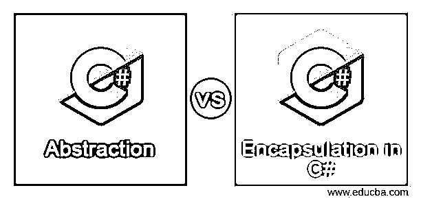
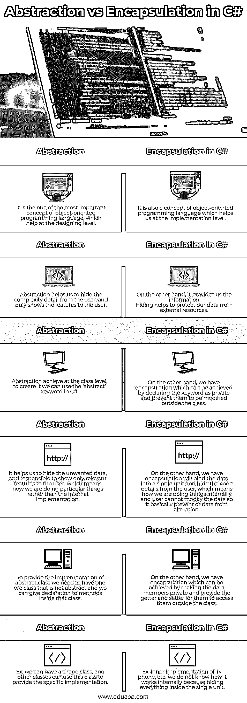

# C#中的抽象与封装

> 原文：<https://www.educba.com/abstraction-vs-encapsulation-in-c-sharp/>




## C#中抽象与封装的定义

抽象是 OOPs 最重要的概念之一，它有助于向用户隐藏复杂性，并有助于只向用户显示重要的服务。我们有 Java 编程语言，它利用抽象，能够对用户隐藏复杂的代码，我们只应该提供对用户有用的服务，在现实世界中，我们有许多解释可以定义面向对象编程语言中抽象的用法。让我们举一个例子，自动柜员机功能，电话，银行功能提供给用户，等等。另一方面，我们有用于信息隐藏的封装，它基本上对外界隐藏了对象的行为。它基本上为我们提供了隐藏层来保护我们的数据。在本教程的下一节中，我们将更详细地研究这两者的工作原理，以便更好地理解。

### C#中抽象和封装的直接比较(信息图)

以下是 C#中抽象和封装的 6 大区别:

<small>网页开发、编程语言、软件测试&其他</small>




### C#中抽象与封装的比较表

| **抽象** | **封装** |
| 它是面向对象编程语言最重要的概念之一，在设计层面上有所帮助 | 它也是面向对象编程语言的一个概念，在实现层面上帮助我们。 |
| 抽象帮助我们向用户隐藏复杂的细节，只向用户显示特性 | On the other hand, it provides us the information隐藏有助于保护我们的数据免受外部资源的侵害。 |
| 抽象在类级别实现，要创建它我们可以在 C#中使用' abstract '关键字 | 另一方面，我们有封装，这可以通过将关键字声明为 private 并防止它们在类外被修改来实现。 |
| 它帮助我们隐藏不想要的数据，并负责只向用户显示相关的特性，这意味着我们如何做特定的事情，而不是内部实现 | 另一方面，我们的封装将数据绑定到一个单元中，并对用户隐藏代码细节，这意味着我们是如何在内部做事情的，用户无法修改数据，因此基本上可以防止数据被修改。 |
| 为了提供抽象类的实现，我们需要一个非抽象的类，我们可以在这个类中声明方法。 | 另一方面，我们有封装，这可以通过使数据成员私有并为它们提供 getter 和 setter 以在类外访问它们来实现。 |
| 我们可以有一个 shape 类，其他类可以使用这个类来提供具体的实现。 | 例如:电视、电话等的内部实现。我们不知道它内部是如何工作的，因为它把所有的东西都藏在一个单元里。 |

### C#中抽象和封装的主要区别

从上表中我们已经知道了它是如何工作的，以及我们如何在我们的程序中实现它。在这一节中，我们将更仔细地看一些例子和一些要点，使它们之间的区别更加明显。下面我们开始看；

#### 抽象

假设我们去 ATM 机取钱，一开始我们只知道它是如何工作的。但在内部，它处理许多事情，就像它使用服务器、数据库和许多其他东西来处理您的数据。它为我们提供了如此多的功能，帮助我们在更短的时间内完成所需的操作。我想提取一些钱，所以我将作为用户选择提取选项，并提取我想要的钱。但在内部，我们不知道它是如何工作的，所以它对用户是隐藏的，以保持简单，并为他们提供他们想要的必要服务。

在 C#中，我们可以通过使用“abstract”关键字来实现抽象。在 C#中，该关键字可以与类和方法一起使用，下面让我们仔细看看这两者。

a)抽象类:如果我们对 class 使用 abstract 关键字，那么这意味着我们不能实例化那个类，如果我们想访问那个类，那么它应该被其他类继承，以便访问它。作为参考，让我们看看使用它的语法，见下文；

**语法:**

```
abstract class Demo
{
// logic goes here ..//
}
```

正如你所看到的，我们通过使用 abstract 关键字定义了一个抽象类。现在让我们看看这里的抽象方法。

**b)抽象方法:**如果我们用抽象关键字定义一个方法，那么它将被称为抽象方法，这意味着我们不能在我们必须继承的类中提供它的主体并提供它的实现。作为参考，让我们看看它的语法，见下文；

**语法:**

```
abstract class Demo
{
public abstract void m1();
}
```

这样，我们就可以用 C#来定义和实现抽象。

#### 包装

如果我们谈论封装概念，那么我们应该理解它将数据成员和方法绑定到一个单元，并保护它们不被修改。现在，我们可以简单地通过将类成员设为私有来实现这一点，并且我们可以定义公共方法来访问这些变量。让我们通过下面的简单例子来理解这一点。

**语法:**

```
public class Demo {
private String name;
private int rollno;
}
```

正如你所看到的，我们已经定义了私有类成员，之后，我们可以有 getter 和 setter，它们将是公共的，以便访问它们。所以在 C#中，利用 getter 和 setter 来定义封装是非常容易的。因此，它将对象绑定到一个单一的单元，这将防止它从外界开始访问，并隐藏信息和代码，以及复杂性。

### 结论

两者都是面向对象编程语言的关键概念，在其他编程语言中也是如此。只是语法和使用方式的不同。通过使用抽象和封装，我们可以很容易地为用户提供方便，并且保护数据不被修改。

### 推荐文章

这是 C#中抽象与封装的指南。在这里，我们将分别讨论 C#中的抽象与封装、信息图的主要区别以及比较表。您也可以看看以下文章，了解更多信息–

1.  [大本营 vs 懈怠](https://www.educba.com/basecamp-vs-slack/)
2.  [懈怠 vs 不和谐](https://www.educba.com/slack-vs-discord/)
3.  [特雷罗 vs 斯莱克](https://www.educba.com/trello-vs-slack/)
4.  [Yammer vs Slack](https://www.educba.com/yammer-vs-slack/)


