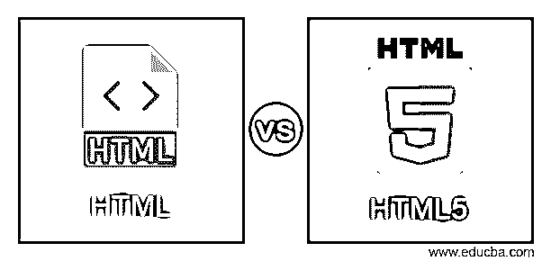
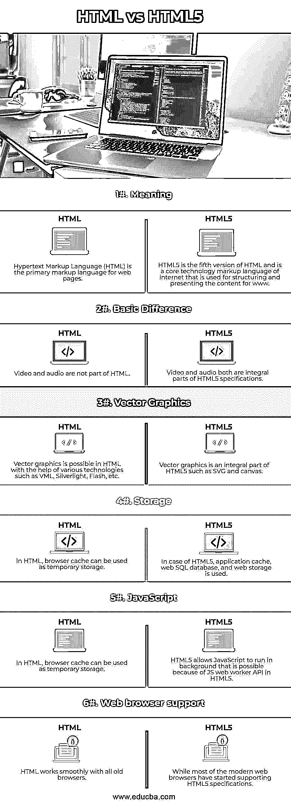

# HTML 与 HTML5 的 10 大区别(信息图表)

> 原文：<https://www.educba.com/html-versus-html5/>

HTML5 标准于 2014 年最终确定并发布，这是多年前第一个版本发布时 HTML 应该有的样子。HTML 2.0 是第一个真正的“标准”，早在 1995 年就发布了。两年后，HTML 3 发布了。又过了两年，HTML 4.01 问世了，从那以后，它一直是互联网的主力。

HTML5 的第一个“工作草案”是在 2008 年推出的，当时有着惊人的广泛浏览器支持。我们今天所知道的 HTML5 与过去的 HTML 有很大的不同，在这里我们将讨论最新的标准随着它的发布而改变了什么。自从 HTML5 推出以来，它已经被广泛接受，现在所有主流浏览器都支持它的所有特性和功能。仍然有一些小问题，但总的来说，HTML5 已经很好地融入了现代在线体验。

<small>网页开发、编程语言、软件测试&其他</small>

作为一名 [web 开发人员](https://www.educba.com/web-developer-vs-web-tester/)，你可能是一名已经掌握了旧标准的老手，也可能是一名好奇地旁观新标准发展的新手。不管怎样，你最终必须开始过渡到 HTML5。

## HTML 与 HTML5 信息图

过渡到 HTML5 或学习的第一步是理解旧标准和最新标准之间的区别。以下是 HTML 和 HTML5 的一些主要区别:

1.  [T0】 HTML5 is a living language

HTML5 是一门活的语言，一项正在发展的工作。看到 HTML5 能做什么是很神奇的，但同样重要的是要知道 HTML5 不是像 HTML4 一样的完全标准化的版本，html 4 已经有十几年的历史了，是一个设定好的标准，不可更改。

如果你正在进入 HTML5，你将不得不做一些更新。每年都会添加和定期修改属性和元素。这也取决于你在多大程度上使用了丰富的元素，但是当你使用像 HTML5 这样一种流动的、不断变化的语言时，这无疑是一个风险。

2.  [T0】 HTML5 is simpler

虽然 HTML5 确实有不断更新的风险，但通常很容易跟上变化和更新，因为与 HTML4 相比，它的语法更简单。例如，在页面开始处有一个非常简单的声明来将其设置为 HTML5 页面:

简单 Doctype 声明是对 HTML 语法的简化之一，它兼容从 HTML4 到 XHTML1 的所有版本。但是，HTML5 与 SGML 不兼容。

3.  ### New

    <canvas>element</canvas>

HTML5 附带了许多新元素，并删除了其他几个元素(我们将在稍后介绍)，但它的一个关键添加元素是

<canvas>，这对 Adobe Flash 在网站中的使用产生了巨大影响。虽然 Flash 仍然被几个网站使用，但 HTML5 已经被许多人采用，许多人认为它最终会使 Flash 过时。只有时间会决定这一点；在那之前，HTML5 的 cascade 元素已经证明了自己是 Flash 的一个很好的替代品。</canvas>

元素可以用来通过脚本(通常是 JavaScript)绘制各种形状和颜色的图形。元素只是图形的容器；你需要使用一个脚本来定义图形。默认情况下，画布是一个没有内容或边框的矩形区域。市场是这样的:

*<canvas id = " my canvas " width = " 200 " height = " 100 "></canvas>*

指定 id 属性以及宽度和高度来定义画布大小非常重要。您可以[添加一个样式属性](https://www.educba.com/html-style-attribute/)来定义边框。

*<canvas id = " my canvas " width = " 200 " height = " 100 " style = " border:1px solid # 000000；">*

*</画布>*

您也可以使用 [JavaScript](https://www.educba.com/course/javascript-javascript-for-beginners/) ，如下例所示:

*var c = document . getelementbyid(" my canvas ")；*

*var CTX = c . get context(" 2d ")；*

*CTX . fill style = " # ff 0000 "；*

*ctx.fillRect(0，0，150，75)；*

4.  ### New

    and

    elements

    

HTML5 带来的另一个重大变化是新的

和

元素，这表明了一种新的网络结构。有了这些新标签，就不再需要用一个标签来标识这两个元素了。

规范将 header 元素定义为表示一组“导航”或“介绍性”帮助。因此，元素可用于定义页面某一部分的介绍，或整个页面本身的介绍。下面是使用 header 元素的代码片段。

*<标题>*

*< h1 >头衔< /h1 >*

*
T1】*

*< p >作者</a>提交于 Web 2.0
*

*
T1】*

*</表头>*

*<条>*

*< p >正文< /p >*

*</文章>*

HTML5 规范将 foot 元素称为表示“其最近祖先分节内容或分节根元素的页脚”，并且通常包含关于该节的信息，如作者姓名、版权数据、文档链接等。

逻辑上，页脚放在网页的底部。但是它也可以放在页面部分的末尾。下面是一些使用 footer 元素的示例代码:

*<师>*

*<标题>*

*< h1 >内容标题</h1>T1】*

*
T1】*

*< p >作者</a>提交于 Web 2.0
*

*
T1】*

*</表头>*

*<条>*

*<正文>正文。
T1】*

*</文章>*

*<页脚>*

*
T1】*

*标签:<a href = " # " rel = " tag ">命令提示符< /a >，< a href="#" rel="tag" >指南针< /a >，<a href = " # " rel = " tag ">CSS</a>，< a href*

*
T1】*

*
T1】*

*< div > 10 喜欢
T1】*

*
T1】*

*</页脚>*

*
T1】*

这里，页脚包含帖子标签和帖子“脸书喜欢”。

5.  Elements

    ### 

    and

现在，如果你浏览了上面的例子，你会注意到更多的新元素，比如

。这个元素和

元素一起，可以让你标记布局的特定部分，对[搜索引擎优化](https://www.educba.com/search-engine-optimization-seo-basics/)非常有益。article 元素被指定为表示网页的独立可重用或可分发的自包含组件。这可能是报纸、论坛帖子、杂志文章、博客条目或任何其他东西。

article 元素通常在 header 元素中有自己的标题，甚至可能有页脚，正如您在上面的例子中看到的。您可以简单地将该元素视为一个博客条目或一段独立的内容；棘手的部分是识别什么是独立的。简单地说，一个独立的内容片段就是一个本身有意义的内容。

了解一段内容是否独立的一个好方法是询问它在 RSS 提要中是否有意义。博客文章和静态页面确实有意义，一些网站有评论提要。但是文章中的一个段落脱离了其余的内容是没有任何意义的。下面是带有页脚和发布标签的代码片段。

*<条>*

*<标题>*

*< h1 >内容标题</h1>T1】*

*< p >发布:<时间 pubdate = " pubdate ">2016-02-24</时间> < /p >*

*</表头>*

*< p >正文< /p >*

*<页脚>*

*< p > <小>知识共享许可</小> < /p >*

*</页脚>*

*</文章>*

根据 W3C 规范，section 元素表示应用程序或文档的“通用部分”。它可能会和

标签混淆，所以让我们现在就来澄清这个混淆。当其中的内容必须与页面的其余部分分开分组，只有一个主题，并且它应该被视为页面轮廓中的一个条目时，使用 [section 标签](https://www.educba.com/html-section-tag/)。然而，div 元素被指定为“通用容器”，这意味着除了它自己的标题、语言和类属性之外，它并不独立于主页本身。

6.  ### New

    <menu>and

    elements

    </menu>

HTML5 的新

<menu>和元素是交互元素规范的一部分，但却是开发人员谈论最少的元素之一。鉴于网络已经变得不仅仅是链接的页面和文档，这些元素对于更好的网络交互性来说是一个受欢迎的补充。</menu>

不要将

<menu>元素与

<nav>元素混淆，后者被定义为表示页面导航块的 HTML 导航标签。它通常包含链接，供用户在页面内的各个部分之间跳转，或者跳转到另一个页面。另一方面，菜单标签表示桌面和[移动应用](https://www.educba.com/course/module-7/)中的简单菜单命令。下面是一个<菜单>元素的例子:</nav>

</menu>

*<正文上下文菜单= "新建-上下文-菜单">*

*<菜单 id= "新建-上下文-菜单" type= "上下文">*

*<menu item>hello world</menu item>*

*</菜单>*

*</正文>*

同时，

元素是另一种排列图像和文本的方式。它与

元素一起用于标记[插图](https://www.educba.com/course/adobe-illustrator-tutorials/)，图表和照片。下面给出了一个简短的代码片段，展示了这两个元素的作用。

*<图>*

**

*</图>*

7.  ### New

    <audio>and <video>elements</video></audio>

这是对 HTML5 标准的两个主要补充。像视频标签一样，音频标签允许开发者在他们的网站上嵌入音乐和音频。与以前的标准不同，您不局限于添加 midi 音乐，尽管对使用的文件类型仍有一些限制。大多数 Webkit 相关的浏览器支持常规的 MP3 文件，但是其他的只支持 OGG 格式。好消息是有大量的文件转换器，你可以简单地提供两个版本的音频文件；正确的版本将被自动选取。

您可以像使用任何其他元素一样使用音频标签。以下是一个示例片段:

*<音频自动播放= "自动播放"控件= "控件">*

*<来源 src="music.ogg" / >*

*<来源 src = " music . MP3 "/>*

*</音频>*

audio 标记还有许多用于附加控件的属性，包括事件属性，事件包括窗口事件、窗体事件、媒体事件和鼠标事件。视频元素也有许多内容属性，包括 SRC、全局属性、循环、控制、预加载和海报。SRC、loop、autoplay 和 controls 属性是不言自明的，对所有媒体元素都是一样的，而 global 属性对所有元素都是通用的。它们包括目录、隐藏、上下文菜单等等。

HTML5 附带了一些其他多媒体属性和元素，比如为视频元素提供文本轨道的 track 元素。

8.  ### New form

HTML5 现在带有表单和<forminput>元素。如果不打算在页面上使用很多表，也可以删除该属性，并在继续之前查看所做的更改。</forminput>

9.  There are no more elements in

    ### **and**

 这意味着允许开发人员创建一个完美布局的有色表格的所有属性，如边框、背景颜色、对齐、高度、规则等等。所有这些属性都被 CSS 所取代。

10.  ### There are no more ,

    
and <big>,</big>

    <big>and</big>

 <big>这对那些在 HTML 早期工作过的开发人员来说非常好。frameset、frame 和 noframes 属性已被完全删除，还有其他属性，如 blink、basefont 等等。你将不得不在不使用表格的情况下进行布局。表格仍然是 HTML5 的一部分，但是它们不再用于像素。规范规定，表格不应该用于辅助布局和控制页面布局。

### 结论

正如您可以清楚地看到的，HTML5 有很多变化，您需要小心谨慎地使用它。您还需要更新您的语言知识，因为它会随着时间的推移而发生变化，并得到更多的更新。你需要停止使用 HTML5 已经从自身移除的元素，并使用新的 HTML5 元素，这些元素肯定会保留下来，比如标题或[页脚标签](https://www.educba.com/footer-tag-in-html/)。

你已经在上面看到了简化版的 HTML5 的发布带来了多少变化。但是，让我们诚实地说:HTML5 的采用没有简单或缓慢，新标准增加了许多对现代用户体验至关重要的功能。你需要跟上新的语言，还需要学习一些 [CSS](https://www.educba.com/course/css-training-tutorials/) ，这比以前有更大的作用。

这些变化的好处是，尽管它们很大，但它们是朝着更好的方向发展的，这里涉及的所有利益相关者都理解这一点。随着浏览器向云迁移，它们将变得更加强大，能够自己处理更多内容。有了 Ajax、视频和音频嵌入之类的东西，用一种简单明了的方法编码将会容易得多，并允许浏览器承担繁重的工作。例如，新的结构元素(如图、页脚、摘要和节)都被引用到文档结构中，而呈现则留给浏览器。

**相关文章:-**

这里有一些文章可以帮助你获得更多关于 HTML 和 HTML5 的细节，所以只要浏览一下链接就可以了。

1.  [HTML 和 XML](https://www.educba.com/html-vs-xml/)
2.  [HTML5 与 Flash 的 9 大区别(附信息图)](https://www.educba.com/html5-vs-flash/)
3.  [HTML vs XHTML](https://www.educba.com/html-vs-xhtml/)
4.  [HTML5 vs Flash](https://www.educba.com/html5-vs-flash/)
5.  【HTML5 与 JavaScript 的惊人差异
6.  [关于 Python 编程的 10 个非常有用的技巧(窍门)](https://www.educba.com/10-simple-yet-useful-tips-on-python-programming/)

</big>