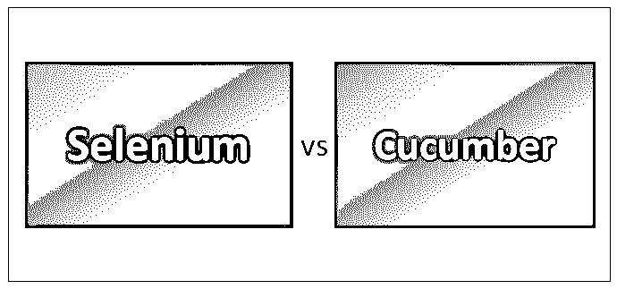

# 硒 vs 黄瓜

> 原文：<https://www.educba.com/selenium-vs-cucumber/>

## 硒和黄瓜的区别

[Selenium 是一个](https://www.educba.com/what-is-selenium/)自动化测试框架，用于测试使用 Java 或任何其他编程语言的网站或基于网络的应用软件，而 [Cucumber 是另一个](https://www.educba.com/what-is-cucumber/)自动化测试工具，用于测试任何类型的软件应用程序，使用类似编程语言“小黄瓜语言”的纯文本。尽管 selenium 和 cucumber 都是开源的，并且是免费的，但是公司正在尽最大努力在 selenium 框架上实现 cucumber，因为 Cucumber 通过其纯文本代码允许透明性，并且 Selenium 的性能相对来说非常出色。

### 硒

Jason Huggins 在 2004 年创建了 selenium，在其他开发人员的帮助下，selenium 套件最终得以开发。在 Selenium 中，可以编写测试脚本来测试 web 应用程序。Selenium 支持不同的语言来开发测试脚本，如 [Java](https://www.educba.com/java-vs-ruby/) 、 [Javascript](https://www.educba.com/java-vs-javascript/) 、C#、Ruby、Python、Perl、PHP、 [Groovy](https://www.educba.com/groovy-interview-questions/) 。

<small>网页开发、编程语言、软件测试&其他</small>

Selenium 包含各种工具或 selenium 的变体:

1.  硒 IDE
2.  [Selenium web 驱动程序](https://www.educba.com/what-is-selenium-web-driver/)
3.  硒遥控器(遥控)
4.  [硒栅](https://www.educba.com/selenium-grid/)
5.  Selenium 客户端 API

Selenium 测试了一个自动化框架，该框架使用可以跨多个浏览器直接测试的脚本，如 google chrome、Internet、Mozilla Firefox。既可以实现移动 web 应用，也可以实现 iOS、Android 等。

### 黄瓜

黄瓜是用红宝石写的。Cucumber 支持其他语言，如 Java。Net、Javascript 和其他平台。在 BDD 中，编写带有场景的文本描述是为了测试整个系统，而不是测试特定的代码。

黄瓜由以下术语组成:

1.  **Feature:** 它描述了写在一个文件中的特性，这个文件用来编写自动化测试的步骤。
2.  **场景:**定义需要测试的功能。
3.  **Give-When-Then:** 它提供关于前置条件、后置条件和执行条件的信息。
4.  **And (|):** 用于组合两个或多个动作。
5.  **但是:**它被用于相交两个或多个动作或命令

黄瓜遵循小黄瓜的语言或规则。它是一种简单、轻量级和结构化的语言，用于描述特性、需求和场景。它有自己的语法来编写特色文件和一组关键字来定义场景的不同操作。

### 硒和黄瓜的直接差别(信息图)

以下是硒和黄瓜的八大对比:

### 硒和黄瓜的主要区别

下面解释了硒和黄瓜之间的一些区别:

1.  Selenium 通常被称为浏览器自动化测试工具。Cucumber 被称为基于行为驱动框架的测试工具。
2.  在 Selenium 中，[测试脚本可以用 Java、C#等语言编写](https://www.educba.com/c-sharp-interview-questions-and-answers/)。在 Cucumber 中，根据小黄瓜语言的规则，用纯文本语言编写测试脚本。
3.  在 Selenium 中，我们可以有效而轻松地使用条件语句。在 Cucumber 中，我们不能像 if 语句一样使用这些语句。
4.  在 Selenium 中，我们需要根据测试用例和需求编写脚本。我们需要在 Cucumber 中编写场景，并让业务分析师和其他管理团队进行验证。
5.  在 Selenium 中，脚本的开发和执行更加复杂。在黄瓜中，很容易编写或开发和执行。
6.  Selenium 脚本看起来更像是开发应用程序。黄瓜脚本类似于以正确的顺序记录过程或功能。
7.  在 Selenium 中，开发时很容易发现语法错误。在 cucumber 中，语法错误在写作时不会被注意到。
8.  在 Selenium 中，有一套工具或一组软件工具用于不同的目的。每一个都有不同的功能需要测试；像 Selenium 一样，web driver 主要用于测试跨所有平台的 web 应用程序。在 Cucumber 中，我们有一组术语，这样，我们只需要为所有支持的平台编写文件。

### 硒和黄瓜对照表

下面是硒和黄瓜的对比表。

| **BASIS FOR****比较** | **硒** | **黄瓜** |
| **框架** | 这是一个软件测试框架。 | 它不是一个测试框架。 |
| **已编程** | Selenium 主要用 Java 编写。 | 它是用 [Ruby 编程](https://www.educba.com/install-ruby/)语言编写的。 |
| **自动化** | Selenium 是功能和性能自动化测试工具 | 它不是一个自动化测试工具。 |
| **可读性** | 对于管理团队来说，Selenium 脚本很难读懂。 | Cucumber 脚本很容易被管理团队阅读。 |
| **安装** | 硒安装相对困难。 | 黄瓜有一个快速设置和安装。 |
| **性能** | Selenium 在执行测试脚本方面有相当不错的性能。 | Cucumber 使得脚本的执行速度变慢。 |
| **可靠性** | selenium 过程使测试更加可靠。 | 黄瓜测试相对来说不太可靠。 |
| **插件** | 在 Selenium 中，插件的运行速度比黄瓜慢 | 在黄瓜中，插件比 selenium 更快 |

### 结论

Selenium 和 Cucumber 都是开源工具且免费。它们可以很容易地下载并随时可用。黄瓜可以和硒结合起来检测。Selenium 和 Cucumber 工具都可以用于跨浏览器 web 应用程序。Selenium 和 [Cucumber](https://www.educba.com/cucumber-interview-questions/) 脚本对于不同的平台和语言来说易于维护和重用。这些是 DevOps CICD 流程中使用的一些最佳工具。

Selenium 是许多公司用于功能测试的非常好的工具。学习 selenium 后，你将成为开发人员和测试人员，因为我们需要根据测试用例及计划开发脚本和进行测试。Selenium 永远是开发者构建脚本和测试应用的首选。

黄瓜不如[硒在市场](https://www.educba.com/selenium-commands/)有名。黄瓜也在缓慢而稳固地占领市场。如果你是初学者，你可以很容易地学习黄瓜，因为它很容易理解和写作没有任何困难。

自动化是 IT 公司的核心需求之一。自动化测试确实有助于团队更加有效和一致地检查漏洞。每天都会生成报告来检查进度，这有助于提高交付质量，最重要的是，按时交付，没有任何问题。上述 Selenium 和 Cucumber 工具有助于职能领域的任何组织实现这些基本目标。每种工具都有自己的强项。您需要完成您的需求，并检查哪个工具可以被选择或最适合您的需求。

### 推荐文章

这是硒和黄瓜区别的有用指南。在这里，我们已经讨论了硒与黄瓜头头比较，关键差异以及信息图和比较表。您也可以阅读以下文章，了解更多信息——

1.  [硒 vs 幻影](https://www.educba.com/selenium-vs-phantomjs/)
2.  [Java 堆 vs 栈](https://www.educba.com/java-heap-vs-stack/)
3.  [软件开发 vs 网页开发](https://www.educba.com/software-development-vs-web-development/)
4.  [数据分析 vs 数据分析](https://www.educba.com/data-analytics-vs-data-analysis/)

