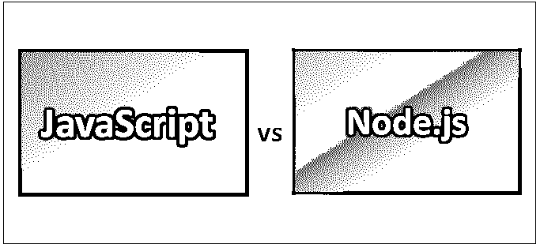

# JavaScript vs Node.js

> 原文：<https://www.educba.com/javascript-vs-node-dot-js/>

## JavaScript 和 Node.js 的区别

Web [开发技术](https://www.educba.com/web-development-interview-questions/)，javascript，是主要的解释编程语言，它是高级的、弱类型的、动态的、基于原型的、多范例的。 [Javascript 也是万维网的三大核心技术之一，可以实现交互式网页。所有主要的网络浏览器和网站都有专门的 JS 引擎来执行它们。它支持事件驱动、命令式和函数式编程风格的结构。](https://www.educba.com/what-is-javascript/)

另一方面，Node.js 是一个跨平台、开源的运行时环境，有助于在服务器端执行 javascript 代码。如果你谈论 Javascript 的早期版本，它主要是一种客户端脚本语言，代码嵌入在 T2 网页的 HTML 中，引擎在浏览器中。现在，它被用作服务器端脚本语言，在网页呈现到用户的 web 浏览器之前，生成动态的基于 web 的内容。它旨在统一 [web 应用开发](https://www.educba.com/how-to-build-web-applications-using-mongodb/)体验，这种体验围绕着一种单一的[编程语言](https://www.educba.com/what-is-a-programming-language/)。

<small>网页开发、编程语言、软件测试&其他</small>

javascript 有 API，用于处理数组、文本、[正则表达式](https://www.educba.com/regular-expressions-in-javascript/)、日期和基本级别的 DOM 操作。使 [javascript 成为流行语言](https://www.educba.com/javascript-vs-vbscript/)的最大特点是它不包括图形设备、网络、存储等 I/O。它们都依赖于嵌入式主机环境。早期的 javascript 只在 web 浏览器中作为客户端实现；今天，这些引擎被嵌入到其他类型的主机软件中，这些软件本质上包括 web 服务器和数据库中的服务器端脚本。它们还被嵌入到 PDF、文字处理器和运行时环境等非 web 程序中，这使得 JS 可用于编写桌面和[移动应用](https://www.educba.com/mobile-applications/)以及桌面小部件。

.js 是一个传统的文件扩展名，它仅仅是产品的名称。它采用事件驱动的架构，具有处理 I/O 的功能。随着输入/输出操作和实时网络应用(如基于浏览器的游戏和实时通信系统和程序)的使用量增加，设计选择旨在优化可扩展性、吞吐量和减少延迟。

JavaScript 和 node.js 有很强的相似性，包括名称、语法、标准库等参数。，但无论是 JavaScript 还是 node.js，在实现和设计上差别都很大，也受到 Scheme、Self 等编程语言的影响。让我们详细看看 JavaScript 和 node.js 的区别。

### JavaScript 和 Node.js 的直接比较(信息图表)

以下是 JavaScript 和 Node.js 的 9 大区别:

### JavaScript 和 Node.js 的主要区别

JavaScript vs Node.js 都是市场上的热门选择；让我们讨论一下 JavaScript 和 Node.js 之间的一些主要区别:

1.  Javascript 是一种跨平台、开源、轻量级的解释脚本编程语言，主要用于客户端脚本。它被集成到 Java 和 HTML 中。因此，它用于创建以网络为中心的应用程序，而 [Node.js 构建在谷歌 Chrome V8 引擎](https://www.educba.com/node-dot-js-commands/)上，是一种服务器端脚本语言。它分布在自然界，用于数据密集型[实时应用](https://www.educba.com/real-time-analytics/)。
2.  一个简单的 Javascript 程序 alert(“嘿，你好！”);.这将被放在 HTML 页面上的脚本标签中，并告诉用户的 web 浏览器将其解释为 javascript 代码，例如 script alert(“嘿，你好！”);这将生成一个小的警告框，而对于 REPL 上的节点，您只需编写一个节点，您的解释器就可以运行了。例如，
    T5【节点】T3>1+5
    6
3.  Javascript 的优势包括主要功能，如大量的接口和交互性，以及适量的服务器交互，并为访问者提供即时反馈，而 node.js 在其节点包管理器中有 550 多个模块，并提供并发请求处理。它还具有支持微服务架构以及支持 [IoT](https://www.educba.com/iot-careers/) 的独特功能。

### JavaScript 和 Node.js 对照表

下面是 JavaScript 和 Node.js 最顶层的比较。

| 【BetweenJavaScript 与 Node.js 的对比基础 | **Javascript** | **Node.js** |
| **定义** | Javascript 是一种开源的、跨平台的、解释性的、轻量级的脚本编程语言。 | 这是一个基于 Chrome 的 JS 引擎(V8 引擎)的服务器端平台 |
| **用于** | 它被设计用来创建以网络为中心的应用程序，因为它集成了 HTML 和 Java。 | 它[用于](https://www.educba.com/why-use-node-js/)跨分布式设备运行的数据密集型实时应用。 |
| **特性** | 

*   Universal support
*   dynamic
*   Command and structure
*   Object-oriented (prototype-based)
*   Entrust type
*   functionality
*   Vendor-specific extensions

 | 

*   异步和事件驱动
*   [非常快](https://www.educba.com/features-of-node-js/)
*   单线程但高度可扩展
*   许可证
*   无缓冲

 |
| **社区** | 所有 javascript 项目不一定都属于节点社区 | 所有节点项目都属于 Javascript 社区 |
| **目的** | 

*   There is no processing pressure on the server
*   Server traffic is lower
*   End users respond faster.
*   Provide a better user experience.
*   Web application with faster response

 | 

*   I/O binding application
*   Data intensive real-time application
*   Data flow application
*   Single page application
*   Application based on JSON APIs

 |
| **专用服务器** | Javascript 没有专用的服务器 | Node.js 有一个专用的服务器来执行服务器端请求 |
| **使用这些技术的公司** | 图钉、LiveRamp、Google、埃森哲、微软、New Relic、Groupon、优步、Shopify、Chegg、Yelp、Slack、Udacity、Hootsuite、Opendoor、Weebly、Birchbox、Fitbit、Segment、Sendgrid、Okta、instacart、Canon 等 | 网飞、Linkedin、沃尔玛、优步、Paypal、Trello、易贝、Medium、Groupon、NASA、DataEximIT、纽约时报、hapi 等。 |
| **优势** | 

*   speed
*   simplicity
*   Interoperability
*   universality
*   Server load
*   Extended functionality
*   Generality
*   Quick update
*   Less server interaction
*   Immediate feedback to visitors
*   Increase interactivity
*   A richer interface

 | 

*   Follow the data flow
*   Express kit
*   ubiquitous
*   Real-time web application
*   Resolve all database queries
*   Dynamic NPM
*   Easy coding
*   Responsible for proxy server
*   Productivity improvement
*   Escrow transaction
*   Good at dealing with synchronization problems.
*   Community friendship

 |
| **限制** | 

*   The client does not allow reading and writing of files.
*   Network application is not supported.
*   No multithreading ability
*   No multi-processor capability
*   Different browsers interpret it differently.

 | 

*   Bad concurrency primitive
*   Single thread
*   API instability
*   More development time
*   Not suitable for apps with a large amount of calculation
*   Tools and packages are immature.

 |

### 结论

JavaScript vs Node.js 与被比较的方式不同。一个是所有主要 web 开发语言的基础，而服务器端脚本语言。选择合适的技术取决于项目所需的工作类型和资源支持。我希望现在您已经对 JavaScript 和 Node.js 技术有了更公平的认识。请继续关注我们的博客，了解更多类似的文章。

### 推荐文章

这是 JavaScript 和 Node.js 之间主要差异的指南。在这里，我们讨论了 JavaScript 和 Node.js 的直接比较、主要差异，以及信息图和比较表。您也可以看看以下文章，了解更多信息–

1.  [节点 JS](https://www.educba.com/javascript-vs-node-js/) [vs JavaScript](https://www.educba.com/javascript-vs-node-js/)
2.  [node . js](https://www.educba.com/python-vs-node-js/)[vs Python——有用的对比](https://www.educba.com/python-vs-node-js/)
3.  [JavaScript vs C#](https://www.educba.com/c-sharp-vs-javascript/)
4.  [Java vs Node JS–有价值的差异](https://www.educba.com/java-vs-node-js/)
5.  [c# vs Js 有什么特点](https://www.educba.com/c-sharp-vs-js/)
6.  [Node.js 与 Asp.net 的区别](https://www.educba.com/node-js-vs-asp-net/)
7.  [node . js 和 Go 的最佳特性](https://www.educba.com/node-js-vs-go/)
8.  [MongoDB vs PostgreSQL 最佳指南](https://www.educba.com/mongodb-vs-postgresql/)
9.  [MongoDB vs Hadoop:最佳指南](https://www.educba.com/hadoop-vs-mongodb/)
10.  [MongoDB vs Oracle:想知道最好的区别](https://www.educba.com/mongodb-vs-oracle/)
11.  [MongoDB vs Cassandra:最佳指南](https://www.educba.com/mongodb-vs-cassandra/)
12.  [ETF vs 指数基金:什么是最好的收益](https://www.educba.com/etf-vs-index-funds/)
13.  [Java 测试面试问题:牛逼指南](https://www.educba.com/java-testing-interview-questions/)
14.  [C#与 JavaScript:有哪些惊人的不同](https://www.educba.com/c-sharp-vs-javascript/)

