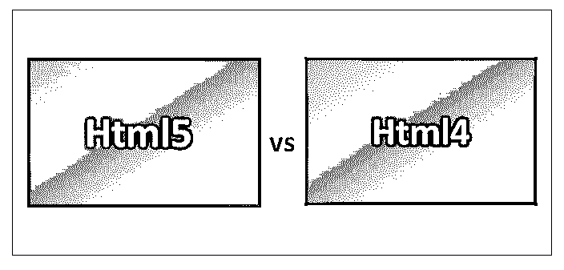
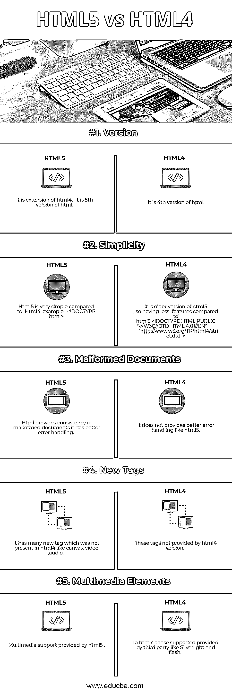

# Html5 与 Html4

> 原文：<https://www.educba.com/html5-vs-html4/>




## Html5 和 Html4 的区别

HTML5 是取代 HTML 4.01 的 HTML 标准的下一个修订版。HTML5 是在万维网上构建和呈现内容的标准。它是万维网联盟和网络超文本应用技术工作组之间的合作。它拥有视频播放和拖放等新功能，这些功能以前依赖于微软 Silverlight 和 Adobe Flash 等第三方浏览器插件。最新版本的几乎网络浏览器支持 html5，如谷歌 Chrome、苹果 Safari、Mozilla Firefox、Opera 等。所有移动浏览器也支持 Html5，如 android、iPhones、iPads。它有许多新的特性和属性，这对制作漂亮的网站很有用。

### Html5 和 Html4 的示例

以下是 Html5 和 Html4 的示例:

<small>网页开发、编程语言、软件测试&其他</small>

**例#1:**

```
<!DOCTYPE html>
<html>
<head>
<title>This is document title</title>
</head>
<body>
<h1>This is a heading</h1>
<p>Document content goes here.....</p>
</body>
</html>
```

[HTML 是超文本标记语言](https://www.educba.com/html-stands-for/)的缩写，用于开发网站的前台，超文本是指网页链接的方式。因此，网页上的链接叫做超文本。标记语言，这意味着你使用 HTML 简单地用标签“标记”一个文本文档，告诉 Web 浏览器如何组织它来显示。早期开发 HTML 的目的是定义文档的结构，如标题、列表、段落等，以促进科学信息在 researchers.Html 之间的共享。它有许多标签来设计网站的各个部分，它有 header 来显示网站的标题部分，有各种列表来以各种形式显示数据。

**例 2:**

```
<!DOCTYPE HTML PUBLIC "-//W3C//DTD HTML 4.01//EN"
"http://www.w3.org/TR/html4/strict.dtd">
<html>
<head>
This is header part
</head>
<body>
Hello html4
</body>
</html>
```

### Html5 和 Html4 的面对面比较(信息图表)

下面是 Html5 和 Html4 的 5 大区别




### Html5 和 Html4 的主要区别

Html5 vs Html4 都是市场上的热门选择；让我们讨论一些主要的区别:

*   HTML5 仍处于发展的过程中，目前可用的标签正在被修改，新的标签也正在被添加。因此，在与不同浏览器的兼容性方面，HTML5 落后于 HTML4。HTML4 是开发浏览器应用程序的既定标准，已经使用了 10 多年。由于这个原因，HTML4 与几乎所有的网络浏览器兼容
*   在 HTML5 中，
*   在 Html5 中标签已经被删除，标签是在 Html 文档的 header 部分定义的，包含关于数据的信息。在 HTML 4 中，这个标签曾经包含一个名为 schema 的属性，它定义了文档的模式
*   在 Html5

    <canvas>标签中介绍，canvas 是 Html 页面中的一个矩形区域。

    <canvas>标签用于使用 JavaScript 绘制图形。它是图形的容器。在这个容器中，图形是使用 JavaScript 绘制的。Canvas 有不同的方法用于框、路径、圆、字符和添加图像。默认情况下，它没有边框，也没有内容。</canvas>

    </canvas>

**示例:-**

```
<canvas id="canvas1" width =”600” height= “500”> hello update the your browser</canvas>
```

id 属性用于引用 javascript 中的画布，宽度和高度用于定义画布的大小。

我们可以在一个 HTML 页面上有多个画布。

**举例:**

```
<!DOCTYPE html>
<html>


<body>
<h3>hello demo</h3>
<canvas id="canid" width="600" height="400">Update your browser chrome</canvas>
<script>
var tempcan=document.getElementById(canid);
var tempcan2=tempcan.getContext("2d");
tempcan2.fillStyle='#0000ff';
tempcan2.fillRect(25,25,180,100);
</script>
</body>
</html>
```

在 html4 中没有这个标签。

*   在 HTML5 中，没有必要使用脚本属性。而在 HTML4 和更早的 HTML 版本中，script 属性被用来在 link 标签中引用 JavaScript 或其他类似的脚本
*   在 HTML5 中，标签只能有一个属性边框，这个属性的值只能是 0 或 1。而在 html4 中，

    标签有很多属性。

*   在 Html5 中，applet 标签已被删除，该标签用于在 web 浏览器中显示 applet。在 html5 中，引入了新标签<object>,在 html4 中，只有 applet 标签用于在 web 浏览器中显示 applet。</object>
*   在用于客户端和服务器通信支持的 html5 中，它包含允许客户端和服务器之间全双工通信的 web 套接字，而在 html4 中，客户端和服务器之间的通信是通过流和长轮询来完成的，因为在 HTML4 中没有可用的 web 套接字。
*   在 [HTML5 中很容易](https://www.educba.com/html5-semantics/)得到用户的位置。HTML5 的 JS 地理定位可以被[利用](https://www.educba.com/leveraged-vs-unleveraged/)来识别访问网站的用户的位置，而在 Html4 的情况下；获取访问网站的访问者的地理位置是一项极其麻烦的任务。当通过移动设备访问网站时，甚至更困难。

### Html5 与 Html4 比较表

下面是 Html5 和 Html4 之间最顶层的比较

| **比较的基础** | **HTML5** | **HTML4** |
| **版本** | 它是 html4 的扩展。它是 HTML 的第五个版本。 | 这是 HTML 的第四个版本。 |
| **简单** | 与 Html4 相比，Html5 非常简单。例-
<！DOCTYPE html > | 它是 html5 的旧版本，所以与 html5
<相比功能较少！DOCTYPE HTML PUBLIC "-//W3C//DTD HTML 4.01//EN " " http://www . w3 . org/TR/HTML 4/strict . DTD "> |
| **格式错误的文档** | Html 在格式错误的文档中提供了一致性，它有更好的错误处理能力。 | 它不像 html5 那样提供更好的错误处理。 |
| **新标签** | 它有很多 html4 中没有的新标签，比如画布、视频、音频 | html4 版本不提供这些标签 |
| **多媒体元素** | html5 提供的多媒体支持。 | 在 html4 中，这些支持由第三方提供，如 Silverlight 和 flash |

### 结论

正如我们看到的，html5 是 html4 的高级版本，它有许多 html4 中没有的新标签和功能，另一方面，我们可以看到 html4 比 html5 更兼容浏览器，所以我们的选择应该根据产品开发要求，如果我们正在修复旧网站上的一些错误，那么由于兼容性问题，我们不能使用 html5。而在下一代网站的新网站开发中，我们应该始终使用最新版本。我希望现在你已经对 Html5 和 Html4 有了更公平的认识。请继续关注我们的博客，获取更多类似的文章。

### 推荐文章

这是 Html5 和 Html4 之间最大区别的指南。在这里，我们还将讨论信息图和比较表的主要区别。您也可以看看下面的 Html5 与 Html4 文章，了解更多信息

1.  [HTML vs XML](https://www.educba.com/html-vs-xml/)
2.  [HTML vs HTML5](https://www.educba.com/html-vs-html5/)
3.  [XHTML vs HTML5](https://www.educba.com/xhtml-vs-html5/)
4.  [HTML5 vs Flash](https://www.educba.com/html5-vs-flash/)


