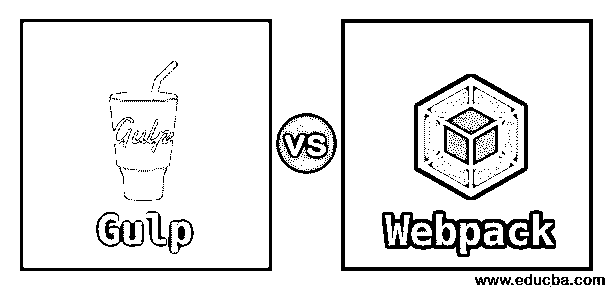

# Gulp vs Webpack

> 原文：<https://www.educba.com/gulp-vs-webpack/>

## Gulp 与 Webpack 的区别

Gulp 是用 JavaScript 编写的前端开发中用于流的工具包。它是一个任务运行器，开发人员可以在其中自动化大多数开发任务。文件被认为是流，它们作为不同的任务被传输。插件被用来运行任务，并且为任务编写代码。Webpack 也是用 JavaScript 写的，但这基本上是一个 bundler。前端任务，如 CSS，HTML 可以修改时，适当的输入和加载器给定。它可以跨平台工作，并且在系统中具有依赖关系的模块。

### Gulp 与 Webpack 的面对面比较(信息图表)

以下是 Gulp 与 Webpack 之间的 8 大区别:

<small>网页开发、编程语言、软件测试&其他</small>

### Gulp 和 Webpack 的主要区别

以下是 Gulp 与 Webpack 的主要区别:

*   基本区别是 Gulp 是任务执行者，而 Webpack 是捆绑者。因此，Webpack 可以自己运行大多数功能，而无需任何其他应用程序的帮助。在捆绑包中，有在系统中运行任务、缩小和源地图的规定。因此，react 社区单独使用 Webpack，而不是在他们的系统中同时使用两者。
*   此外，Webpack 可以用作中间件，有助于监督系统的任务。这是在名为 webpack-dev-server 的开发环境中的服务器的帮助下完成的，它管理软件中的重载。实时重装和热重装都在系统中完成。这些加载器也有助于系统中的处理。当考虑 Gulp 时，它没有这些设施中的任何一个，所有的工作都被分成任务。这将运行软件并帮助管理系统。因此，它不如 Webpack 强大。
*   两个应用程序中都可能有错误，但是在 Gulp 中找到这些错误比在 Webpack 中更困难。在 Webpack 中，很容易找到没有运行的代码，如果不需要就删除它们。这使得代码错误自由，并可以使应用程序值得使用更少的空间占用。这被称为应用程序的死代码消除。但是这个功能 Gulp 是没有的。因此，不容易找出错误并消除未使用的代码。
*   由于 Webpack 是一个捆绑器，它为用户捆绑代码。当用户只需要一个应用程序时，它只向用户提供那些 Java 脚本，而不是提供完整的脚本供用户使用。这使得应用程序可以在更少的负载下自由工作，并且运行良好。当考虑 Gulp 时，它是一个任务运行器，并且只分配给整个应用程序的任务，而不是不同的应用程序。因此，整个任务的 Java 脚本将被囫囵吞下，并向用户提供相同的内容。它们在应用程序中不是孤立的。
*   Webpack 被认为是一个高级构建系统，其中管理文件更改，如果任务在第一次尝试中不起作用，它们将重新运行。使用 CSS 和 HTML 文件，它可以很容易地在整个应用程序中找到代码。Gulp 只能管理一个应用程序，而且它永远不能替代 Webpack，而 Webpack 可以用来替代 Gulp。由于两者都使用 JavaScript，用户在从 Gulp 迁移到 Webpack 时不会感到不同。

### Gulp 与 Webpack 对比表

让我们讨论一下 Gulp 和 Webpack 之间的主要比较:

| **一饮而尽** | **网络包** |
| 重新运行 Gulp 任务并不容易，如果第一次出现问题，我们必须单独编写代码来重新运行任务。 | 在 Webpack 中重新运行任务是很容易的，因为所有的文件都被加载了，并且它知道它在哪里失败了。这使得系统很容易重新运行。 |
| 配置 Gulp 的应用程序并不费力，因为它的功能较少，而且只能管理一个应用程序。我们必须通过在系统中本地和全局安装来配置 Gulp。 | Webpack 中的配置过程很困难，因为它的功能很先进，并且很难在应用程序中解析配置文件。如果管理不当，整个过程会一团糟。 |
| 所需的代码更少，插件更少，它可以更好地管理任务和处理应用程序。 | 所需的代码更多，并且每个任务的插件使得系统更加复杂。 |
| 应用程序很简单，因此语法也很简单。我们可以很容易地一口气完成这项任务。插件用得不多，因此这个应用程序只占用较少的内存。 | 应用程序是复杂的，系统中有复杂的流程。这使得任务也变得复杂，即使它们很简单，但应用程序中提供了复杂的功能。所有简单的事情都是在插件的帮助下完成的，因此需要时间。 |
| 由于所有任务都在内存中处理和处理，因此它具有良好的效率和更快的性能。 | 与其他应用程序相比，性能并没有提高。但是由于它本身处理更多的应用程序，它不能将任务保存在内存中。 |
| Gulp 很少使用，用户也不太喜欢这个应用程序。 | Webpack 是用户的首选，比 Gulp 更老。社区支持对 Webpack 也有好处。 |
| 系统中的流程得到了很好的控制，用户将对流程有更清晰的了解。 | 过程流没有得到很好的控制，并且由于过程是复杂的，用户将不容易理解活动。 |
| Gulp 是一个稳定的应用程序，由于需要的内存更少，使用的插件数量更少，它在工作时不会崩溃。 | 在稳定的应用程序组中不能信任 Webpack，因为它可能会由于应用程序中的重负载而崩溃。 |

### 结论

尽管可以让 Gulp 完成 Webpack 处理的任务，但 Gulp 并不是为完成这些任务而设计的，因此应用程序可能无法很好地工作。因此，如果有许多应用程序要运行，使用 Webpack 是很好的，尽管必须注意 bundler 中插件和高级功能的存在。

### 推荐文章

这是 Gulp vs Webpack 的指南。在这里，我们还讨论了 Gulp 与 Webpack 的主要区别，并提供了信息图表和比较表格。您也可以看看以下文章，了解更多信息–

1.  [全栈 Web 开发人员](https://www.educba.com/full-stack-web-developer/)
2.  [GitLab vs 吉拉](https://www.educba.com/gitlab-vs-jira/)
3.  [JMeter vs LoadRunner](https://www.educba.com/jmeter-vs-loadrunner/)
4.  [ARM vs X86](https://www.educba.com/arm-vs-x86/)

