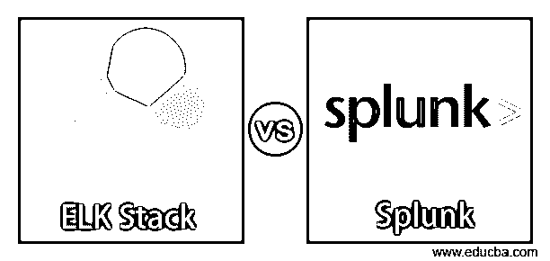

# ELK 堆栈与 Splunk

> 原文：<https://www.educba.com/elk-stack-vs-splunk/>

## ELK Stack 与 Splunk 的区别

今天，大多数商业交易都是以在线数字方式进行的。此类在线应用程序中的任何小故障都会迫使客户将忠诚度转移到竞争对手，企业实际上将会损失收入。至关重要的是，应用程序应该以预期的性能水平全天候可供用户使用，同时应该符合法规条件和安全性。

如果在性能方面出现问题，即使是暂时的，或者在法规遵从性或不安全性方面出现问题，组织都会遭受巨大的损失。由于处理微服务、Kubernetes、容器和云的复杂环境，监控现代应用的性能已经成为一项艰巨的任务。内部团队不可能手动监控应用程序。IT 团队需要一种工具来从应用程序/周围基础架构中提取数据或日志，并分析数据以进行监控和解决问题。

<small>网页开发、编程语言、软件测试&其他</small>

日志管理工具应该能够处理来自被监控的应用程序和硬件环境的大量数据，并监控应用程序的性能。ELK stack 和 Splunk 是这一类别中的领先工具，让我们在本文中详细分析它们的功能。

### ELK Stack 与 Splunk 之间的直接比较(信息图表)

以下是 ELK Stack 和 Splunk 之间的主要比较:

### 不同的工具

以下是 ELK Stack 与 Splunk 的不同工具

#### 每个人都离开了

Elk 表示一家名为 Elastic 的公司的三种产品。这三个开源产品是

Elasticsearch，Logstash，Kibana。随着一年前第四款产品 Beats 的加入，这款工具更名为 Elastic stack。这四种产品的简介

*   Elasticsearch:Elk stack 中最重要的玩家是 elastic search，由于它的关键功能，stack 本身就是以它命名的。一个用 Java 构建的开源产品是一个基于 Apache Lucene 的当代搜索/分析引擎，属于 NoSQL 类别。逻辑分区的数据存储为索引和文档。该工具提供了高效的存储和索引层。
*   这个开源工具处理从多个来源收集的大量日志数据。它以收集数据和分析数据而闻名。该层使用输入数据创建一个可靠的数据结构，并在弹性搜索中将其存储在 NoSQL 数据库中。坚固的结构便于搜索。
*   **Kibana:** 是麋鹿栈的分析可视化手臂。基于浏览器的开源工具有助于分析存储在 Elasticsearch 层索引中的数据，并以丰富的图形模式呈现结果。这一层使用户能够查询大量数据。
*   **Beats:** 这个工具专注于从各种来源收集日志。这个开源的轻量级日志发送器在不同的服务器中扮演代理的角色，将数据注入到 Elasticsearch 索引或 Logstash 中，以便在存储之前进行额外的处理。

#### Splunk

总部位于旧金山的 Splunk 处理大数据分析。该工具使用捕获的数据，生成信息丰富的仪表板、报告、图表和其他 GUI 图像。这些 GUI 有助于监控应用程序并向用户发出异常警报。IT 部门和最终用户利用 Splunk 生成的结果。

该工具处理法规遵从性和安全性问题。该工具提供的信息帮助用户使用人工智能技术进行根本原因分析，并尽早解决问题。它处理所有数据类型，并帮助用户从收集的数据中构建操作智能。

它有 3 个稳定的产品范围，即。,

*   **Splunk Enterprise:** 用于大企业
*   Splunk Light: 功能有限，而且是免费的
*   **Splunk 云:**作为托管服务提供

### ELK Stack 与 Splunk 的主要区别

让我们讨论一下 ELK Stack 和 Splunk 之间的一些主要区别:

*   **方法:** Splunk 动态提取大量数据，使用户能够以他们想要的方式轻松分析数据。提取数据和分析数据不需要预先计划。Splunk 为用户提供了极大的灵活性。ELK 要求在活动开始前对信息需求和数据模型进行全面的预先规划。一旦设计完成，提取和查看就简单多了。
*   **技术:** Splunk 是由三部分组成的单一产品:a .数据转发器、b .索引器、c .搜索(前端)。ELK 有 3 种不同的开源产品 Elastic search、Logstash 和 Kibana。Logstash 在弹性搜索中提取、处理和存储 NoSQL 数据库中的数据。Kibana 提供了一个坚实的前端。Splunk 和 ELK 都使用单个代理从源服务器收集日志数据。它们将提取的数据存储在索引中。Splunk 使用专有索引，ELK 使用 Apache Lucene。Splunk 使用搜索头进行搜索操作，ELK 使用 Kibana。
*   **GUI 可视化:** Splunk 能够灵活地将新组件动态添加到仪表板中。它为管理员授权用户访问数据提供了很好的控制。因此，用户可以自己轻松定制他们的仪表板。Kibana 在 ELK stack 中提供可视化效果，并提供令人印象深刻的图表、图形和仪表板。但它不像 Splunk 那样提供用户管理功能。
*   **搜索功能:** Splunk 使用搜索编程语言(SPL)进行搜索操作。Kibana 使用 Lucene 查询语法。Splunk 提供动态搜索功能，用户可以使用任何数据字段查询数据。ELK 中没有这种功能，只有预先设计的字段可用于查询。
*   **费用:** Splunk 许可证按照每天处理的日志数据量定价。许可证要么是永久的，要么每年更新。ELK 许可证是开源的，是免费的。
*   **用法:**Splunk 仪表盘中的功能比 ELK 更易于操作，Splunk 的配置比 ELK 更精细。
*   **训练；**ELK 有大量训练有素的人力资源，Splunk 用户将不得不在培训上投入大量资金

### ELK 堆栈与 Splunk 的对比表

让我们看看 ELK Stack 与 Splunk 之间的主要对比。

| **Sr 号** | **各堆叠** | **Splunk** |
| One | 3 种不同产品的组合，用于提取、存储和分析日志数据 | 它是一个具有三个不同组件的单一产品，用于管理监控操作 |
| Two | 数据模型和索引设计需要提前完成。任何数据提取之前都应该在 Logstash well 中配置。每个字段都应在配置中定义 | 可以动态地从源中提取任何数据，并对其进行分析。 |
| Three | 可视化中的数据字段是预先固定的，不能随时更改。 | 在运行时可以灵活地添加新的数据字段。 |
| Four | 搜索操作标准是预先确定的 | 可以使用任何数据字段进行搜索。 |
| Five | 拥有庞大的社区基础和充足的支持。 | 具有良好的文档和知识丰富的支持形式 |
| Six | 用户管理功能没那么强 | 管理员可以很好地控制向用户提供字段级授权。用户可以配置他们自己的定制仪表板。 |
| Seven | 完全开源且免费 | 许可证按每日使用量定价。按年或永久收费 |
| Eight | ELK 中的某些功能很难配置 | 配置很容易处理 |
| Nine | 功能和优势较少 | 拥有更多的功能和优势。 |
| Ten | 由于受过培训的人力资源充足，因此无需在培训方面进行大量投资。 | 用户需要在培训上投入大量资金。 |

### 结论

平台的选择取决于用户需求和管理预算的能力。Splunk 提供灵活、功能丰富且用户友好的平台，但其成本高昂。

### 推荐文章

这是 ELK Stack vs Splunk 的指南。在这里，我们讨论 ELK 与 Splunk 之间的信息图和比较表的主要差异。您也可以浏览我们的其他相关文章，了解更多信息——

1.  [EJB Vs 春天](https://www.educba.com/ejb-vs-spring/?source=leftnav)
2.  [拉拉维尔 Vs Zend](https://www.educba.com/laravel-vs-zend/?source=leftnav)
3.  [JSP Vs ASP](https://www.educba.com/jsp-vs-asp/?source=leftnav)
4.  [吉拉 Vs Github](https://www.educba.com/jira-vs-github/?source=leftnav)

