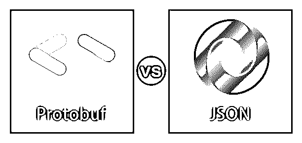

# Protobuf vs JSON

> 原文：<https://www.educba.com/protobuf-vs-json/>




## Protobuf 和 JSON 的区别

Protobuf 是协议缓冲区的首字母缩写。Protobuf 或协议缓冲区是 Google 为结构化数据的序列化和反序列化而设计的。它提供了不同系统之间更好的通信方式，因为它比 XML 更简单、更快、更易管理。JSON 代表 JavaScript 对象符号。它源于 JavaScript，但并不特定于一种语言。JSON 是标准化的，几乎所有语言都支持它。Protobuf vs JSON 都是为了序列化；然而，关键的区别在于 Protobuf 是二进制数据交换格式，而 JSON 以人类可读的文本格式存储数据。

### Protobuf 与 JSON 的面对面比较(信息图)

下面是 Protobuf 和 JSON 的 11 大对比 **:**

<small>网页开发、编程语言、软件测试&其他</small>


### Protobuf 和 JSON 的主要区别

让我们从以下几点来讨论 Protobuf 和 JSON 之间的一些关键差异:

*   Protobuf 是 Google 开发的二进制数据交换格式，而 JSON 是人类可读的数据交换格式。JSON 源自 JavaScript，但是顾名思义，它不仅限于 JavaScript。它被设计成可以在多种语言中使用
*   Protobuf 支持二进制序列化格式，而 JSON 支持简单文本序列化格式
*   JSON 对于常见任务很有用，并且仅限于某些类型的数据。这意味着 JSON 不能序列化和反序列化每个 python 对象。而与 JSON 相比，Protobuf 涵盖了广泛的数据类型。甚至枚举和方法都可以用 Protobuf 序列化。
*   协议缓冲区和 JSON 都是可互操作的语言，但是 Protobuf 仅限于编程语言的子集，而 JSON 被广泛接受。
*   JSON 只包含消息而不包含模式，而 Protobuf 不仅包含消息，还包含一组规则和模式来定义这些消息。
*   Protobuf 主要用于内部服务，而 JSON 主要用于 web 应用程序。
*   在解码 Protobuf 消息时，模式的先验知识是必不可少的，而在预先知道模式的情况下，可以在 JSON 中轻松解码或解析数据。

**例子**

**Protobuf:**

```
message employee_details {
required int32 employee_id = 1;
required string name = 2;
optional string address = 3;
```

}

**JSON 数据:**

```
{
"employee_details" : { "name" : 'John Anderson', "employee id" : 2001, "address" : "California"}
}
```

### Protobuf 与 JSON 的对比表

下表总结了 Protobuf 与 JSON 的比较 **:**

| **Protobuf** | **JSON** |
| Protobuf 是一种高效的数据编码方式，由 Google 开发，用于结构化数据的序列化和反序列化。 | JSON 代表 JavaScript 对象符号。JSON 是一种轻量级数据交换格式，源自 JavaScript。 |
| 协议缓冲区是独立于语言和平台的编码机制。 | 虽然源自 JavaScript，但 JSON 是语言互操作的 JSON 是将 python 对象存储到磁盘的另一种方式，这样以后就可以加载它，而不需要重新创建数据。 |
| Protobuf 不仅仅是一种消息格式，它还包含了一组定义和交换消息的规则。 | JSON 只是一种没有任何模式的消息格式。 |
| Protobuf 消息是二进制格式的。这些消息不仅包括消息，还包括定义和交换这些消息的一组规则和工具。 | JSON 消息以人类可读的文本格式进行交换。 |
| 虽然 Protobuf 是语言中立的，但目前仅限于几种编程语言。比如 JAVA，C，C++，Python，GO，ruby 都支持，r 就不支持。 | 几乎所有的编程语言都支持 JSON。JSON 是独立于语言的。因此，即使非 Python 程序员也可以使用它进行数据交换。 |
| Protobuf 模式与数据相关联。 | JSON 以文本格式存储数据，没有任何与之相关联的模式。 |
| Protobuf 缓冲区主要用于在内部服务之间发送数据。 | JSON 主要用于在浏览器和服务器之间进行数据交换的 web 应用程序。 |
| Protobuf 比 JSON 支持更多的数据类型。 | JSON 仅限于某些 python 对象，它不能序列化每个 python 对象。 |
| 与 JSON 相比，Protobuf 支持更广泛的数据类型。比如枚举和方法，Protobuf 支持，JSON 不支持。 | JSON supports only a subset of python data types. Following data types:

*   用线串
*   数字
*   jsonobject
*   阵列
*   布尔值
*   空

JSON 不支持以下数据类型:

*   班
*   功能

 |
| 协议缓冲区比 JSON 快得多。 | JSON 是轻量级的，比 pickle 等其他序列化技术更快。 |
| **Advantages:**

*   Protobuf 模式与数据一起编码；它确保信号不会在应用程序之间丢失。
*   语言互用性。
*   非常快速的处理。
*   支持向前和向后兼容。

**缺点:**

*   消息是二进制格式的，不可读。
*   如果不知道模式，很难解码协议缓冲区，因为数据在内部是不明确的。
*   协议缓冲区不适合存储数据，例如，文本文档或数据库中的数据。
*   较小的社区支持和资源的缺乏使得 protobuf 不太受欢迎。

 | **优点:**

*   JSON 是轻量级的，速度更快。
*   支持人类可读的文本格式
*   语言互用性。
*   数据可以被解码或解析，而不必事先知道模式。
*   用于在数据库或文件系统中存储数据。
*   非常大的社区支持和巨大的资源使 JSON 更受欢迎。

**缺点:**

*   JSON 不是为数字设计的。
*   不支持架构。
*   不支持命名空间。

 |

### 结论

在这里，我们看到了两种不同且简单的数据序列化技术。两者各有利弊。如果用户喜欢二进制格式，他可以使用协议缓冲区，但是如果互操作性是用户的限制，并且需要文本格式，那么他可以使用 JSON 模块。这取决于程序员或用户根据他们的需要在其中进行选择。但是，建议不要反序列化来自未知来源的数据，因为它可能包含恶意和错误的数据。

### 推荐文章

这是一个关于 Protobuf 和 JSON 之间主要区别的指南。这里我们用信息图和比较表来讨论 Protobuf 和 JSON 的主要区别。您也可以看看以下文章，了解更多信息–

1.  [JSON 与 SOAP 的主要区别](https://www.educba.com/json-vs-soap/)
2.  [JSON 是什么？](https://www.educba.com/what-is-json/)
3.  [JSON 与 XML |大对比](https://www.educba.com/json-vs-xml/)
4.  [十大 JSON 面试问题](https://www.educba.com/json-interview-questions/)


