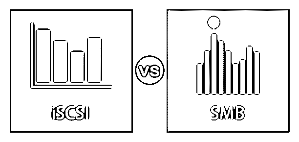

# iSCSI vs 中小企业

> 原文：<https://www.educba.com/iscsi-vs-smb/>

## iSCSI 与中小企业的区别

互联网小型计算机系统接口是建立在 TCP 协议之上的传输层协议。它确保数据在数据块级别通过 TCP/IP 网络在 iSCSI 启动器和存储目标之间传输。它还支持对已传输的数据包进行高级加密，并在数据包到达目标端时进行解密。[服务器消息块(SMB)](https://www.educba.com/what-is-smb/) 协议最早由 IBM 在 20 世纪 80 年代创建。它是通过网络传输文件的通用互联网文件系统(CIFS)的版本之一。SMB 是一种网络通信传输协议，用于在网络之间提供对文件、打印机和端口的共享访问。

**什么是 iSCSI:** ISCSI 或互联网小型计算机系统接口是一种块传输层协议，工作在块级协议接口上。块协议也可以直接访问存储器，并通过协议 SCSI 控制数据流入或流出。来自源和目标的数据被加密，因为它们在 iSCSI 启动器(源)级别高度加密，并在到达 iSCSI 目标(目标)级别时解密。只有在 LAN(局域网)或 WAN(广域网)之间有数据传输时，才能考虑 iSCSI，因为数据访问速度非常快。

<small>网页开发、编程语言、软件测试&其他</small>

**什么是** **SMB:** SMB 是一种客户端-服务器交互协议，客户端请求文件，服务器将文件提供给客户端。它现在是一个基于 Windows 的网络，允许用户创建、修改和删除网络中的共享文件、文件夹和打印机。SMB 是一种应用层协议，使用 TCP 端口 445 进行通信。它还提供了一种 kerborized 的相互通信机制，以在客户机和服务器之间传输和共享文件。

### iSCSI 与中小企业的直接比较(信息图表)

以下是 iSCSI 与中小企业的 6 大对比 **:**

### iSCSI 与中小企业的主要区别

让我们从以下几点来讨论 iSCSI 与中小企业之间的一些关键区别:

*   **配置** : SMB 选择基于用户的身份验证来访问服务器中的文件，而 ISCSI 使用基于主机的身份验证。
*   **网络共享访问** : Linux:网络共享中的挂载选项取决于我们需要安装的包。安装在 CIFS-utils 和 NFS-common 完成。我们需要在挂载之前安装这些软件包。这些文件夹可以在/mnt 文件夹下创建。
*   **写选项:**根据研究，据说 NFS 协议中的写操作比 SMB 有效得多。据观察，NFS 协议的写入性能是 SMB 协议的三倍。但是，当我们看到在大于 5MB 的文件上写入的性能时，ISCSI 和 SMB 的性能几乎相同。
*   **读取选项:**在读取大量数据时，NFS 和中小企业之间的差异可以忽略不计。但是当谈到较小的数据量时，我们可以说 NFS 协议比 SMB 协议好得多。
*   **数据共享协议:** SMB 用于在服务器内的多台机器之间共享数据。这是一个文件共享协议。iSCSI 被认为是在客户端和服务器之间共享数据。共享文件基本上是单通道架构。
*   **缓存含义:** SMB 的文件系统位于服务器级别，而 iSCSI 的文件系统位于客户端级别。这反过来会让 SMB 不断检查服务器级别的缓存和元数据。
*   **实现**:与 SMB 相比，ICSCI 的处理和实现有点困难。iSCSI 需要检查主机—IQN 需要检查主机和存储选项、服务配置等。SMB 是一种共享协议，其本身更加精简和高效，因此使其更加有效和易于实现。

### iSCSI 与中小企业对比表

下表总结了 iSCSI 与中小企业的对比 **:**

| **ISCSI** | **中小企业** |
| iSCSI 或互联网小型计算机系统接口是块传输层协议，主要在块级协议接口上工作。 | SMB is a network communication transfer protocol to provide shared access to files, printers, ports between the networks. |
| 只有在 LAN(局域网)或 WAN(广域网)之间有数据传输时，才能考虑 iSCSI，因为数据访问速度非常快。 | SMB 是一种应用层协议，使用 TCP 端口 445 进行通信。它还提供了一种 kerborized 的相互通信机制，以在客户机和服务器之间传输和共享文件。 |
| 对于单通道架构(客户端-服务器)之间的数据共享，应考虑 iSCSI。 | SMB 用于在多台客户机之间同时共享数据。 |
| iSCSI 有点难以处理和实施，因为我们需要配置主机、存储选项、VLANS 等。，只需在我们的系统中配置 iSCSI。 | SMB 是一种更加高效和简化的协议。因为它是一个共享协议，所以它使得客户端或用户能够容易地实现它。 |
| iSCSI 是基于块级别的共享。 | SMB 是基于文件的共享 |
| 在 iSCSI，文件系统位于客户端级别，因此数据和元数据都可以读取。 | SMB 需要不断检查服务器级别的缓存和元数据。 |

### 结论

借助文件传输过程中的高级预认证检查，SMB 接管了 iSCSI。在 windows OS 的世界里，SMB 最有可能被使用。SMB2 是 Windows Vista 2006 的标准配置，SMB3 用于 Windows 8 和 Windows Server 2012。iSCSI 有点难以处理和实施，因为我们需要配置主机、存储选项、VLANS 等。，只需在我们的系统中配置 iSCSI。

### 推荐文章

这是 iSCSI 与中小型企业之间主要差异的指南。在这里，我们通过信息图和比较表来讨论 iSCSI 与中小型企业的主要区别。您也可以看看以下文章，了解更多信息–

1.  [CIFS 与中小企业–主要差异](https://www.educba.com/cifs-vs-smb/)
2.  [什么是 SMB？](https://www.educba.com/what-is-smb/)
3.  [CIFS vs NFS | 13 强对比](https://www.educba.com/cifs-vs-nfs/)
4.  [NAS 存储设备简介](https://www.educba.com/nas-storage-device/)

