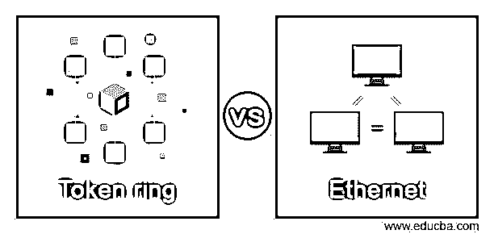

# 令牌环与以太网

> 原文：<https://www.educba.com/token-ring-vs-ethernet/>

## 令牌环网与以太网的区别

令牌环是一种星形拓扑结构，用于借助称为令牌的特殊信号将数据帧从一个工作站传输到环中的另一个工作站。一次只允许一个工作站发言，传输以单向方式进行。它使用电话线或屏蔽双绞线来传输数据。

以太网是一种更便宜、速度更快的拓扑结构，用于将数据传输到各种工作站。它不遵循令牌的许可机制，因为当网络空闲时，所有工作站都被允许发言。它在后来的物理中使用了 UTP 布线。用于在以太网中传输数据的机制是 CSMA/CD。

<small>网页开发、编程语言、软件测试&其他</small>

### 令牌环网与以太网的直接比较(信息图表)

以下是令牌环网与以太网的主要区别

### 令牌环网与以太网的主要区别

下面给出了令牌环网和以太网之间的一些主要区别:

1.谈到成本，安装令牌环网的价格要高得多，不是就布线而言，而是就集线器而言，大约 15 美元的网卡和 40 美元的集线器。与此同时，网络布线的成本根据工作站的要求而增加，[而以太网](https://www.educba.com/what-is-ethernet/)在安装上更便宜，用户可以轻松地在任何工作场所使用。

2.令牌环网和以太网这两种拓扑之间的一个重要区别是，令牌环网使用令牌来传输环中的数据帧(这意味着站点只有在拥有令牌时才能传递数据帧)。一次只有一个工作站可以通话。工作站只有在轮到它们时才能说话；否则，他们不应该在网络中交谈。相比之下，以太网使用 CSMA/ CD，它代表碰撞检测多路访问/碰撞检测机制，在这种机制中，如果所有工作站同时通话，则等待随机时间，然后继续相同的操作。理论上，假设一个工作站一次讲话，其他工作站会监听它，保持沉默，并在另一个结束时开始讲话。

3.令牌环和以太网拓扑之间的另一个重要区别是，在令牌环中，站点等待发言许可，但它可以转发它正在接收的所有流量，直到它获得一个许可。尽管在工作站被允许发言之前有一些严格的规则和时间限制，然而在以太网中没有许可问题，工作站总是假定它有许可发言。一旦发现线路空闲，它就开始传输。如果两个或更多的站同时这样做，就会发生“碰撞”,数据就会丢失，它们会等待一段随机的时间，然后再次尝试发送数据。

4.令牌环拓扑指定特殊信号/令牌由网络上的设备或计算机共享，而以太网拓扑指定不应该控制何时应该传输数据。在网络空闲的时候随时都可以传输。

5.在以太网拓扑中，即使负载变小或变大，流量也保持不变，不受影响；而在令牌环拓扑中，当网络负载增加时，流量会受到影响，速度会变慢，因为数据是通过单个工作站一个接一个地传输的。

6.如果我们谈论方向，从两种拓扑的工作机制中可以理解，令牌环流是单向的，因为数据帧在收到令牌时从一个工作站传输到另一个工作站，而在[以太网拓扑](https://www.educba.com/ethernet-topology/)中，没有数据帧流的方向，因为任何一个工作站如果发现网络空闲都可以传输数据(流可以随时间而改变，因为如果发生冲突，工作站需要关闭自己或关闭，并在随机时间段后继续相同的操作)。

### 令牌环网与以太网的比较表

下面给出的比较表显示了令牌环网和以太网之间的头对头比较:

| **序列号** | **令牌环** | **以太网** |
| One | 当我们谈到物理层时，令牌环使用屏蔽双绞线(STP)布线。 | 另一方面，以太网使用 UTP 布线。 |
| Two | 在传输数据帧时，令牌环中的工作站遵循优先级处理。 | 以太网在传输数据时不对工作站采用任何优先级。 |
| Three | 就价格而言，令牌环网比以太网贵。 | 以太网比令牌环网便宜得多(大约百分之几)。 |
| Four | 为了在令牌环中传输数据帧，使用了星形拓扑。 | 为了传输数据，以太网使用总线拓扑结构。 |
| Five | 顾名思义，令牌环使用令牌机制来传输数据帧。每个工作站都需要一个令牌来传输数据。 | 另一方面，以太网使用 CSMA/ CD(载波侦听多路访问/冲突检测)机制，以便在不需要令牌的地方传输数据。一旦发现网络空闲，每个工作站就传输数据。 |
| Six | 按照 IEEE 标准，令牌环是在 802.5 标准中定义的。 | IEEE 802.3 标准中定义了以太网。 |
| Seven | 令牌环本质上是确定性的。 | 以太网本质上是不确定的。 |
| Eight | 令牌环包含路由信息。 | 以太网不包含路由信息。 |
| Nine | 就数据传输速度而言，令牌环相当慢，可能是 16M 位/秒。 | 就数据传输速度而言，以太网要快很多倍，大概是 100 兆位/秒。 |

### 结论

上面的描述清楚地解释了令牌环网和以太网以及两者之间的主要区别。这两种拓扑使用不同的方法来传输数据。此外，令牌环网是一种较老的技术，比以太网更昂贵。今天，在各种情况下，令牌环仍然被认为是正确的拓扑结构，并被广泛使用。

### 推荐文章

这是令牌环网与以太网的对比指南。这里我们用信息图和比较表来讨论令牌环网和以太网的关键区别。您也可以看看以下文章，了解更多信息–

1.  [vs 兰](https://www.educba.com/vlan-vs-lan/)
2.  [以太网 vs 互联网](https://www.educba.com/ethernet-vs-internet/)
3.  [内联网 vs 外联网](https://www.educba.com/intranet-vs-extranet/)
4.  [互联网 vs 内部网](https://www.educba.com/internet-vs-intranet/)

