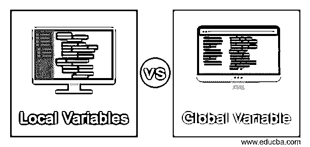

# 局部变量与全局变量

> 原文：<https://www.educba.com/local-variables-vs-global-variable/>

## 局部变量与全局变量的区别

在任何编程中，语言变量被分为局部变量和全局变量，用于声明任何变量，这些变量将存储一些值以及供程序执行的内存空间。一般来说，局部变量被定义为可以在任何函数或任何语句块中声明的变量，这样的变量称为局部变量，而全局变量被定义为可以在任何函数或任何语句块之外但在程序内声明的变量，在大多数情况下，这些变量是在程序开始时声明的，这样的变量称为全局变量。

### 局部变量与全局变量的直接比较(信息图表)

以下是局部变量与全局变量之间的 10 大差异:

<small>网页开发、编程语言、软件测试&其他</small>

### 局部变量与全局变量的主要区别

以下是局部变量与全局变量之间的主要区别:

#### 1.范围和可及性

全局变量的作用域是这样定义和声明的，即这些全局变量是可用的，或者这些变量的作用域在整个程序中保持不变，这意味着可以访问函数或任何语句块，并且这些全局变量的可访问性是这样的，即这些变量可以从程序或任何函数或任何语句块的任何地方访问，但只能在程序内访问，而不能在程序外访问。而局部变量是以这样一种方式定义和声明的，即这些局部变量是可用的，或者这些局部变量的范围只保留在定义这些局部变量的函数或任何语句块中，并且这些变量的可访问性是这样的，即这些变量只能在定义这些变量的函数或语句块中访问，而不能在程序之外或整个程序中访问。

#### 2.初始化

全局变量的初始化是由系统初始化的，而不是由任何开发人员或我们自己初始化的，并且全局变量的初始化不是由系统用任何值初始化的，那么它将存储零作为值。而局部变量的初始化不是由系统完成的，而是由开发人员完成的，或者我们可以初始化这些变量，如果初始化不是由开发人员完成的，那么它存储的是垃圾值，而不是像全局变量那样的零。

#### 3.可用性和示例

当需要在整个程序中访问变量时，使用全局变量，该程序包括程序中的所有函数或任何语句块，只需声明一次就可以使用在开始时声明的相同数据。然而，局部变量仅在任何特定函数或任何语句块需要变量声明时使用，并且这些变量仅在该函数中定义，也仅与该函数一起使用。

##### 例子

下面是显示全局和局部变量声明的 C 程序，其中全局变量的示例是在主函数外部声明的，而局部变量的示例是在主函数内部声明的。

**全局变量:**

`#include <stdio.h>
int p = 10, q = 20;
void main()
{
printf("Demonstration of Global variables in C programming language is as follows:");
printf("\n");
printf("The values of global variables are as follows: ");
printf("p = %d and q = %d",p,q);
}`

**输出:**

**局部变量:**

`#include <stdio.h>
void main()
{
int p = 70, q = 80;
printf("Demonstration of Global variables in C programming language is as follows:");
printf("\n");
printf("The values of global variables are as follows: ");
printf("p = %d and q = %d",p,q);
}`

**输出:**

### 局部变量与全局变量对照表

局部变量与全局变量的比较如下:

| **Sr 号** | **全局变量** | **局部变量** |
| One | 全局变量可以被定义为用于全局声明变量的变量，这意味着在程序的开始或在函数或任何语句块之外，但在程序之内。 | 局部变量可以定义为用于在任何函数或任何语句块内声明的变量，这意味着在任何函数或语句块内。 |
| Two | 全局变量通常在定义任何函数或块之前，在任何程序的开始声明。 | 局部变量是在程序中任何块或函数的开头声明的。 |
| Three | 在大多数情况下，全局变量在声明时是由系统初始化的，而不是由开发人员初始化，或者如果系统没有初始化，那么它存储零作为值，而不是像在局部变量中那样存储任何垃圾值。 | 局部变量在声明时由开发者初始化，但是它们并不像全局变量那样由系统初始化，否则如果没有被用户初始化，那么它将存储一些垃圾值。 |
| Four | 在程序开始的顶部声明的全局变量也在程序开始执行时创建，在程序结束时结束。 | 在任何函数或块的顶部声明的局部变量是在函数或任何块开始执行时创建的，当声明该变量的函数终止时，这些变量的访问将丢失。 |
| Five | 当全局变量被系统初始化时，它们被存储在某个固定的内存位置，这个位置是由编译器决定的。 | 由于局部变量不是由系统初始化的，所以它们通常存储在堆栈中。 |
| Six | 每当我们访问这些全局变量时，没有必要将这些变量作为参数传递。 | 无论何时访问这些局部变量，都必须将这些变量作为参数传递 |
| Seven | 对任何一个函数中的全局变量的值的任何改变或修改对整个程序或通过程序是可见的或可用的。 | 对任何一个函数或任何语句块中的局部变量的值所做的任何更改或修改，只对该函数不可用或可见，而对任何其他函数不可见。 |
| Eight | 在全局变量的情况下，数据共享是可能的，因为程序中的各种函数可以被同一个全局变量访问 | 在局部变量的情况下，数据共享是不可能的，因为局部变量的数据的可访问性只能由声明该局部变量的一个函数来访问。 |
| Nine | 在程序的任何一点访问全局变量时，都不能更改它的名字，因为它只在程序开始时声明和定义一次。 | 在任何不同的函数中，局部变量的名字可以相同也可以不同，因为这些函数只对那些在该函数中声明的函数可用。 |
| Ten | 这些变量可以在整个程序中全局访问。 | 这些变量可以在本地访问，也可以在声明这些变量的函数或任何语句块中访问。 |

### 结论

在本文中，我们得出结论，全局变量和局部变量从它们的角度来看都很重要，这取决于开发人员编写的程序在这些变量之间的选择，有时两者都可以在一个程序中使用。我们应该注意到，由于全局变量比局部变量使用更多的内存，所以有时建议使用局部变量而不是全局变量。

### 推荐文章

这是一个关于局部变量和全局变量的指南。在这里，我们还讨论了局部变量与全局变量的关键差异，并提供了信息图表和比较表。您也可以看看以下文章，了解更多信息–

1.  [堆栈与堆内存](https://www.educba.com/stack-vs-heap-memory/)
2.  [Rust vs C++](https://www.educba.com/rust-vs-c/)
3.  [萨斯 vs SCSS](https://www.educba.com/sass-vs-scss/)
4.  [c++中的变量](https://www.educba.com/variables-in-c-plus-plus/)

