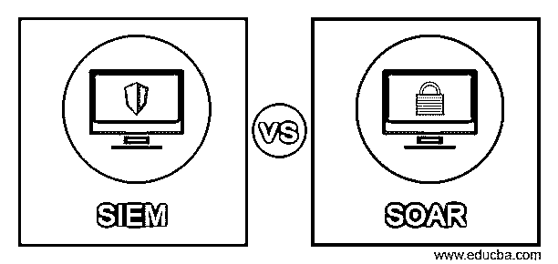

# 暹罗 VS 翱翔

> 原文：<https://www.educba.com/siem-vs-soar/>

## SIEM VS SOAR 简介

SIEM 被定义为一种网络安全工具，它将安全数据转换为一些可操作的情报，这些数据是从存储和收集安全数据的中心点获得的，在安全数据收集完成后，将对其进行分析，以便在获得任何故障活动时发出警报。然而，SOAR 也被定义为网络安全工具，它还收集大量安全数据，并在任何警报发生时响应安全管理，以实现复杂的深度防御能力。因此，两者几乎用于相同的议程，因为它们有许多共同点，但它们的行为不同，所以我们不能互换使用这两者，因此让我们看到一些差异。

### SIEM 与 SOAR 之间的直接比较(信息图)

以下是 SIEM 与 SOAR 之间的 8 大区别:

<small>网页开发、编程语言、软件测试&其他</small>

### SIEM 与 SOAR 的主要区别

SIEM 与 SOAR 之间的主要区别如下:

*   **定义和目的:**

SIEM 是一种安全工具，代表安全信息和事件管理，是一个安全平台，它在中心点收集所有安全数据，并将这些数据转换为可操作的情报，并在发生异常活动时发出警报。而 SOAR 也是一种安全工具，代表安全协调、自动化和响应，也是一种帮助安全团队管理并快速或自动响应所发生的警报的系统，因此它将管理安全数据和工作流，以实施深度防御功能。

*   **人力资源需求:**

SIEM 应用程序或此 SIEM 工具需要更多的人力资源管理，因为团队需要时间来决定对可疑活动进行调查，当可疑活动发生时会生成警报。因此，无论何时发生此类活动，SIEM 解决小组都需要更多的小组成员来决定并解决安全系统中的这些警报。然而，SOAR 不需要很多人力资源，因为这些 SOAR 应用程序或解决方案是自动和协调的，因此无论何时出现任何警报，它们都会自动解决，需要解决的团队成员更少，并且在 SOAR 中解决此类警报所需的时间也比 SIEM 中的任何团队都少。

*   **快速高效**

SIEM 工具通常需要定期监控或调整，以了解和区分发生的正常和异常活动并生成警报，因此这些工具效率较低，并且还需要更多时间，因为分析师会浪费他们的时间让该工具为他们工作，而不是跟踪数据的持续异常活动。而 SOAR 工具不需要更多的时间，因此它是一种快速而有效的安全工具，因为它可以自动响应作为警报或警告出现的威胁，从而快速解决这些威胁，并提供适当的解决方案。因此，SOAR 比 SIEM 更快速高效。

### SIEM 与 SOAR 对比表

SIEM 与 SOAR 之间的比较如下:

| **序列号** | **暹罗** | **翱翔** |
| One | SIEM(安全信息和事件管理)是一种安全工具，它收集和存储来自各种内部和外部来源的安全数据，并使用高级机器学习和模式识别技术检测可能导致网络攻击的故障或不必要的行为。 | SOAR(安全协调、自动化和响应)也是一款安全工具，用于管理和处理威胁、漏洞、安全运营自动化，此外，该工具还响应安全团队，并集成所有现有工具和应用程序，以提供自动响应，并减少数据泄露的时间。 |
| Two | SIEM 通过向分析师提供警报来提供安全解决方案，当发生一些不必要的事件或活动时，这些警报会提醒他们，分析师将决定是否需要进一步调查。 | SOAR 还在警报发生时提供调查，当它检测到有利的事件或活动时，它会自动调用调查路径工作流，并减少解决此类警报的时间，而不像 SIEM 团队那样首先决定进行调查。 |
| Three | 与 SOAR 相比，SIEM 应用程序需要更多人力资源来管理规则和用例，以处理困难，例如将正常事件或活动与任何可疑或不必要的活动混合，这可能导致雇用更多员工或团队来管理此类困难。 | SOAR 应用程序不需要太多的人力资源，因为它更关注自动化和协调，这将进一步减少人力资源完成任务所需的时间。 |
| Four | SIEM 在一个中心点收集和存储所有这些安全数据，如 IPSs、防火墙、DLP 工具、反恶意软件等。 | SOAR 从外部应用程序或更广泛的来源(如 SSL 证书链数据)收集和存储安全数据。 |
| Five | SIEM 解决方案产生的警报比 SOAR 多，并且需要更多时间来响应警报。 | SOAR 也产生警报或警告，但这些警告在很短的时间内得到解决，因此它可以比 SIEM 解决方案更快、更有效地处理这些警告。 |
| Six | SIEM 从许多来源聚合安全数据，其中 SIEM 系统从各种组件来源接收不同类型的事件数据和日志。 | SOAR 还聚合来自许多不同来源的安全数据，这些来源从端点安全软件(如外部或第三方来源)获取所有数据。 |
| Seven | SIEM 会检测安全事件并触发警报，这提供了一系列无法创建统一流程和技术的功能。 | SOAR 将来自 SIEM 的此类警报提升到下一个级别，更高效、更快速地响应此类警报，并在必要时采取补救措施。 |
| Eight | 与 SOAR 相比，SIEM 是网络安全领域最古老的工具之一，因此结合了除位置和信息数量之外的所有安全数据。 | SOAR 是比 SIEM 最新的安全工具，它还收集不同位置和不同安全数据量的安全数据。 |

### 结论

在本文中，我们得出结论，很难说哪个工具更好，也很难理解 SOAR 和 SIEM 之间的主要区别。虽然 SOAR 和 SIEM 有几个共同的组成部分，但网络安全行业或任何安全团队成员都有必要了解它们之间的区别，因为这两者不同，不可能互换使用。

### 推荐文章

这是一个 SIEM VS SOAR 的指南。在这里，我们分别通过信息图和比较表来讨论 SIEM 与 SOAR 的主要区别。您也可以看看以下文章，了解更多信息–

1.  [气雾 vs 雷耶斯](https://www.educba.com/aerospike-vs-redis/)
2.  [Lua vs JavaScript](https://www.educba.com/lua-vs-javascript/)
3.  [工作站 vs 笔记本电脑](https://www.educba.com/workstation-vs-laptop/)
4.  [securect vs Putty](https://www.educba.com/securecrt-vs-putty/)

