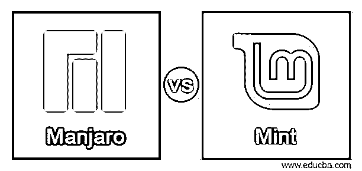

# 曼哈罗 vs 薄荷

> 原文：<https://www.educba.com/manjaro-vs-mint/>

## 曼哈罗和薄荷简介

Manjaro 和 Mint 都是基于 Linux 的操作系统，开发者可以根据自己的需要免费使用它们。单独定义这些术语，Manjaro 是一个基于 Arch 的 Linux 操作系统发行版，它是开源的，除了通过预安装的不同应用程序和软件提供更好的可用性和可访问性之外，还免费提供给开发人员用于各自的用例。另一方面，Mint 是一个基于 Debian 或 Ubuntu 的 Linux 发行版，由社区驱动，提供各种开源软件供随时使用。在这篇文章中，我们将会看到 Manjaro 和 Mint 可以被区分的各种流派，这样在决定使用什么发行版的时候，它会成为一个更容易的选择。

### Manjaro 与 Mint 之间的直接对比(信息图)

以下是 Manjaro 与 Mint 的 10 大区别:

<small>网页开发、编程语言、软件测试&其他</small>

### Manjaro 和 Mint 的主要区别

在我们了解 Manjaro 和 Mint 之间的区别之前，我们需要了解相似之处，以便理解为什么这两个 Linux 发行版之间的混淆会出现在本文中。因为它们都是 Linux 发行版，所以用户有时很难理解 Manjaro 和 Mint 中哪一个最适合这个场景。在这篇文章中，我们将列出一些要点，使用户能够轻松地收集最适合做出正确明智决策的要点。

第一个不同点是发行版的架构。Manjaro 是一个基于 arch 的 Linux 发行版，注册在 Manjaro GmbH & Co. KG 下，由同一组织驱动，而 Mint 是一个基于 Debian 或 Ubuntu 的发行版，由社区支持驱动。更多关于 Debian 和 arch 的区别可以在我们的另一篇文章中找到(链接:https://www . educba . com/Debian-vs-arch/)。在 Manjaro 来自德国的地方，个人分销的概念本身是不同的，另一方面，Mint 来自爱尔兰。作为默认的桌面环境，Manjaro 提供了 KDE、GNOME 和 XFCE，而 Mint 提供了 Cinnamon、MATE 和 XFCE，我们可以看到 XFCE 的桌面环境与这两者相似。官方表示，Manjaro 支持 i386 和 AMD64 CPU 架构，Mint 支持 x86-64 CPU 架构。

现在从软件包管理器的角度来看，它允许用户决定安装或卸载软件的难易程度，Manjaro 使用 Pacman，它结合了简单的二进制软件包格式，以制作一个易于使用的构建系统，Mint 使用 Debian 软件包管理器，如 APT 或 snappy，它为用户提供从存档列表安装一致的内置二进制软件包。对于任何发行版来说，另一个重要的事情是更新的频率，在这里，Manjaro 提供了滚动发布周期，因为更新是在一个有规律的短时间间隔内交付给应用程序的，并且只保留发行版的一个版本。Mint 为发行版提供 6 个月的发布和 2 年的长期支持。

Manjaro 作为一个发行版面向有经验的用户，因此初学者可能会发现很难从发行版中获得最大收益，另一方面，Mint 对于初学者来说非常有用，它有大量的文档和社区支持来指导他们解决用例。最后也是最不重要的一点，Mint 需要一个更好的系统来运行，尽管这种差异不太重要，而 Manjaro 能够在旧的架构中高效地运行。

### Manjaro 与 Mint 对比表

下面是提到的几个比较:

| **比较的热恩** | **Manjaro** | **薄荷** |
| 分配方式 | 从定义中，我们了解到第一个流派的区别是，Manjaro 是一个基于 arch 的 Linux 发行版。 | 另一方面，在同一流派的差异中，Mint 是基于 Debian 或 Ubuntu 的 Linux 发行版 |
| 原产地 | Manjaro Linux 发行版的概念起源于德国 | Mint Linux 发行版的概念起源于爱尔兰。 |
| 桌面中的默认环境 | 默认的桌面环境是 KDE、GNOME 和 XFCE 中的一个。 | 默认的桌面环境是肉桂，伴侣，XFCE 之一。 |
| 官方支持的架构 | Manjaro 发行版支持的 CPU 架构是 **i386** ，这是 x86 和 **AMD64 家族中的第一个 32 位 CPU。** | 在 Mint 中，x86-64 CPU 架构按照发布的文档得到官方支持。 |
| 包装经理 | 在打包管理方面，pacman 是一个包管理器，它结合了一个简单的二进制包格式来构建一个易于使用的构建系统。 | 在 Mint 中，我们使用 Debian package manager，它为用户提供从存档列表中安装一致的内置二进制软件包。 |
| 升级或错误修复的发布周期 | Manjaro 有一个滚动的发布周期，在这个周期中，更新经常被发布到应用程序中，而且版本是单一的。 | Mint 对发行版有 6 个月和 2 年的长期支持发布周期。 |
| 现成的软件支持 | Manjaro 在软件支持方面的支持稍弱，但支持基本工具和专有驱动程序。 | Mint 有更好的开箱即用软件支持，以及对基本工具和专有驱动程序的支持。 |
| 储存库大小 | 与 Mint 的仓库相比，Manjaro 的仓库规模较小。 | Mint 向用户或开发人员提供了对更大的存储库的访问。 |
| 所需的专业水平 | Manjaro 发行版的目标是成熟和有经验的开发人员。 | Mint 对于初学者来说是最好的，它有很好的社区支持和文档，对于初学者来说足够容易理解。 |
| 硬件要求 | Manjaro 能够在旧的硬件上高效运行，并且可以在任何一种机器上运行 | Mint 需要一台像样的机器来高效地运行发行版，使每个组件都能正常运行！ |

### 结论

看完所有的差异，我们确实明白，由于表面上的相似性，开发人员开始难以为他们的用例选择正确的发行版，而且人们经常选择错误的发行版。对于所有这些人，让我们记住 Manjaro 是为那些想要最好的游戏发行版的人准备的，Mint 是为那些需要工作站发行版的人准备的。

### 推荐文章

这是一个指导曼加洛 vs 薄荷。在这里，我们用信息图和比较表来讨论 Manjaro 和 Mint 的主要区别。您也可以看看以下文章，了解更多信息–

1.  [conamu vs cmd](https://www.educba.com/conemu-vs-cmder/)
2.  [F# vs 哈斯克尔](https://www.educba.com/f-sharp-vs-haskell/)
3.  [基维 vs 特克因特](https://www.educba.com/kivy-vs-tkinter/)
4.  [Datadog vs CloudWatch](https://www.educba.com/datadog-vs-cloudwatch/)

