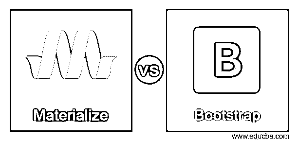

# 物化与引导

> 原文：<https://www.educba.com/materialize-vs-bootstrap/>

## 物化与引导的区别

有 CSS、HTML、Java 脚本来设计网页设计前端，由 Google 开发的网页设计叫 Materialize framework。经典的设计可以保持为基本的，用户可以设计自己的网页，并在物化框架中进行更改，而没有任何麻烦。为开发人员设计的使用 HTML、CSS 和 JavaScript 构建高响应网站的前端框架称为 Bootstrap。模板以按钮或任何类型的导航的形式提供，使用户可以轻松地从一个页面移动到另一个页面。

### 物化与引导之间的直接比较(信息图表)

以下是物化与引导之间的 7 大区别:

<small>网页开发、编程语言、软件测试&其他</small>

### 物化与引导之间的主要区别

物化与引导之间的一些关键区别是:

*   Bootstrap 旨在创建功能性网页。Bootstrap 的用户界面中有许多功能和 CSS 模板，使它看起来很笨重。搜索应用程序中的一些模板和功能将需要时间，因为该应用程序不是很多用户友好的。这些大量的功能使应用程序运行缓慢，并使用户失去精力。同时，在 Materialize 中，用户可以定制他们需要的组件，并定制易于使用的 UI。用户界面看起来并不笨重，很容易在应用程序中找到对 CSS 开发人员有用的功能。
*   两个应用程序的设计本身是不同的。在不容易比较的两种情况下，我们有相似的工具栏和菜单。但是，我们应该记住，Bootstrap 是为了制作更快的网页而设计的，而 Materialize 是为了制作动画和丰富多彩的网站而创建的，以使用户在创建动画和网页时有无缝的体验。Materialize 中的侧边栏组件使用户可以选择和粘贴任何需要的组件，但是这个侧边栏在 Bootstrap 中不存在，使用户可以从菜单本身选择功能。
*   与物化相比，自举中的一致性更好。但是当我们使用 Bootstrap 创建更多的网站时，我们可以看到大多数网站看起来都很相似。Bootstrap 在这方面是用户友好的，但独特的网站肯定不是 Bootstrap 的茶。使用 Materialize 可以轻松创建独特而有创意的网站。当我们使用 Materialize 创建第二个网站时，它看起来与 Bootstrap 不同。
*   在 1 到 10 的范围内，Bootstrap 位于前 5 名，而 Materialize 则不太受欢迎。这可能是因为用户并不总是需要独特的网站，因为要求将总是在类似的内容。此外，网页浏览者不会乐意看到网页上的许多动画而不是内容。我认为这使得 Bootstrap 成为一个庞大的支持者社区，他们总是帮助解决网站创建中的疑问。通过快速修复 bug 和解决代码问题(如果有的话),社区变得更加强大。我们应该总是依赖文档来实现，在某些情况下，这是没有用的。

物化和引导都是独一无二的，这使得两者都与众不同。Bootstrap 以其一致的设计和社区支持最适合初学者。Materialize 最适合那些打破常规来实现完美屏幕设计的开发人员。它还可以与用户交互，让用户使用自己的模板。

### 物化与引导比较表

让我们讨论物化与引导之间的主要比较:

| **物化** | **自举** |
| 这是由谷歌开发的，它提供基于网格的布局和交互式设计来帮助用户获得高质量，并承诺在任何设计条件下都可以在他们的网站上实现 UX。 | 这是由 Twitter 开发的，它的重点是 CSS，但也为 HTML 和 Java 组件提供了模板，这样用户就可以使用模板直接构建网站。 |
| 这适用于任何浏览器，并为用户选择和修改网页提供了流畅的动作和不同的调色板。物化的 UI 中直接提供了任何类型的设计供用户选择和应用。 | Bootstrap 的浏览器兼容性和 Materialize 一样好，它通过手机向用户提供 web 应用程序。这使得 Bootstrap 对用户更加友好，在应用程序模式下使用它不需要编写很多代码。 |
| Materialize 提供了 12 点网格系统，帮助用户创建一个完整的响应性 UI，其中的列和边距帮助他们创建一个易于管理的灵活布局。 | Bootstrap 也有一个 12 点网格系统，它有行和列，使任何图像适应屏幕大小。这些行和列组合在一起有助于创建容器，并且这些行应该是空的以便编辑它们。 |
| 定制选项在 Materialize 中更多，用户可以设置屏幕大小，并在网站中添加任何自己的图像或模板。这有助于用户根据自己的喜好建立网站。 | Bootstrap 中的定制选项较少。但是，提供了模板，如果用户对这些模板满意，他们可以通过设置网页的大小来安装和使用它们。 |
| Materialize 提供了更大的灵活性，开发人员可以浏览许多模板，使用他们自己的设计，并与 Materialize 本身的模板集成。可以毫无困难地创建独特的页面。 | 当用户需要创建独特的网页时，他们需要消除模板中存在的额外设计元素，然后设计网页。这将使该过程更加耗时。Bootstrap 不像 Materialize 那样灵活。 |
| Materialize 专注于创建易于交互且设计良好的网页。此外，偏好使用移动设备设计网页。 | Bootstrap 的主要目标是创建具有功能性和响应性的网页。美学在这里没有被给予优先权。 |
| 它与用户合作，通过自动重新排列和调整整个屏幕的大小来设计网站，以方便用户。这有助于用户利用屏幕上的所有部分。 | 用户应该借助屏幕中的行和列来设置屏幕大小，以便调整屏幕大小。它不会自动发生。 |

### 推荐文章

这是物化 vs 引导的指南。在这里，我们还将通过信息图和比较表来讨论物化和引导的主要区别。您也可以看看以下文章，了解更多信息–

1.  [PostgreSQL vs MariaDB](https://www.educba.com/postgresql-vs-mariadb/)
2.  [卡珊德拉版本](https://www.educba.com/cassandra-versions/)
3.  [主动投资与被动投资](https://www.educba.com/active-vs-passive-investing/)
4.  [SQL Server vs PostgreSQL](https://www.educba.com/sql-server-vs-postgresql/)

