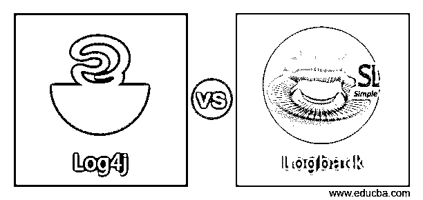

# Log4j 与 Logback

> 原文：<https://www.educba.com/log4j-vs-logback/>

## Log4j 与 Logback 的区别

下面的文章提供了 Log4j 与 Logback 的概要。Log4j 被定义为基于 java 的应用程序，具有日志记录实用程序，它是将消息记录到不同输出的 java 框架，有助于定位问题。Logback 被定义为 log4j 的后继者，它也是一个 java 框架，用于在任何基于 java 的应用程序中记录消息。一般来说，log4j 和 logback 是 java 的日志框架，用于在运行时修改配置，也可以在不同的目的地输出。log4j 有不同版本(log4j1，log4j2，lg4j3 等。)，类似于回退框架的版本是 log4j 2。因此，由于 log4j 和 logback 在性能和当前版本方面处于同等地位，log4j 已经关闭，仅使用 log4j2 和 logback，而不是 log4j 和 logback。

### Log4j 与 Logback 之间的直接比较(信息图)

以下是 Log4j 与 Logback 之间的 10 大区别:

<small>网页开发、编程语言、软件测试&其他</small>

### Log4j 与 Logback 的主要区别

让我们讨论一下 Log4j 与 Logback 之间的一些主要区别:

*   **更好的版本:**当我们比较 log4j 和 logback 的版本时，那么 log4j 比小于 1.2.1 的 logback 版本更好。随着 logback 的改进，log4j 版本与 log4j2 和 logback 版本在性能或任何特性方面都没有区别。因此，log4j 是在新版本发明之前最常用的日志记录工具。
*   **实现:**因为 log4j 是一个较旧的版本，现在新的 logback 内部机制得到了改进，在关键执行上比 log4j 快 10 倍，并且具有 log4j 不支持的较小内存占用。
*   **自动重新加载配置文件:**在 logback 中，通过使用 logback-classic 和修改来支持重新加载配置文件。在 log4j 中，这是通过 configureAndWatch 方法用 DOM configurator property configurator 完成的。尽管在 log4j 中通过 configureAndWatch 方法创建了一个单独的线程，并且该线程无法停止，因此对于 JEE 来说是不安全的，但是在 logback 中，这个 logback-classic 在 JEE 环境中运行良好，因为在扫描过程中不会创建任何线程。
*   **Root logger:** 在 logback 中，Root logger 是通过< root >元素配置的，可以支持 TRACE、INFO、DEBUG、ERROR、WARN、ALL、OFF 等级别属性。而根日志记录器是由 log4j 中的调试级别定义的。在 logback 中，不能继承 root logger 的级别，而在 log4j 中，root logger 始终是配置的 logger，可以通过子 logger 继承。请注意，在定义时，日志记录级别区分大小写。
*   **过滤器:**在 log4j 中，提供过滤功能的选项比 logback 少得多。因为在 log4j 中，直到调试级别才会进行日志记录，这将创建更多的日志记录数据，导致分析日志记录数据的复杂性并降低性能。但这不是在回退的情况下，因为我们可以在警告级别停止；客户可以在警告级别等待，而不是在调试级别进行日志记录并创建更多的日志记录信息。

### Log4j 与 Logback 比较表

我们来讨论一下 Log4j 与 Logback 的顶级对比:

| **序列号** | **Log4j** | **回退** |
| One | 这是一个日志组件，用于按照基于 java 的日志实用程序中的指示记录消息。 | 这是一个日志 java 框架，用于在基于 java 的应用程序中记录消息。 |
| Two | 这是一个工具，用于控制编辑任何存储 selenium 自动化流日志的配置文件的行为，而不会干扰应用程序。 | 这是一个用于管理和调试日志消息的错误监控和日志管理工具，因此它被认为是 log4j 的继任者。 |
| Three | 它分为 3 个不同的核心组件，例如用于与日志消息通信的 logger、目标日志消息所在的 appenders，以及用于格式化输出消息的 layout。 | 它还被划分为与 log4j 中相同的 3 个核心组件，如 logger、appenders 和 layout，其中每个组件的工作方式都与 log4j 中的相同。这个回退还有回退-核心、回退-访问、回退-经典等核心模块。 |
| Four | 这提供了各种日志记录方法，如 debug()、error()、fatal()、warn()、info()和 trace()，这些方法在日志级别上工作。 | 它还提供了各种日志记录方法，如 warn()、debug()、info()、trace()和 error()，这些方法在各自的日志级别上工作。 |
| Five | 与性能和实现的回退相比，这一点的评价较低。 | 回退提供了更快、更好的性能和实现，因为它有各种选项来灵活地归档旧日志文件和配置文件。 |
| Six | 这需要 log4j-api- 2。运行时的 x 类路径。其中这个 log4j 在 log4j2.xml 类路径中查找配置文件，而不是在 log4j.xml 中。 | 这在运行时将类路径作为 logback-classic.jar。其中在类路径中查找 logback -test.xml、logbac.groovy 或 logback.xml 中的配置文件。 |
| Seven | log4j 中的自动配置在较旧的环境中是一个相当大的问题，但是它可以检测配置的变化，并使用 monitorinterval 属性重新配置它。 | 即使应用程序正在运行，也可以使用故障排除工具和扫描参数来完成自动配置。 |
| 8. | 这就提供了 log4j appenders，常用的有 ConsoleAppender、RollingFileAppender、DailyRolligFileAppender、AsyncAppender、JDBCAppender、JMSAppender 等。其中布局与附加器一起使用来格式化任何日志事件。 | 这也提供了一些日志回溯附加器，如 ConoleAppender、RollingFileAppender、FileAppender、customAppender 等。其中，布局与附加器一起使用来格式化日志消息，这提供了满足各种应用需求的默认模式布局。 |
| Nine | When comparing the performance of apache log4j synchronous logger to logback, then log4j is 25 % much faster. | 当将回退与回退同步日志记录器进行比较时，回退的性能更差，但仅限于回退版本低于 1.2.1 的情况。因此，logback 的新版本是 log4j 的后续版本。 |
| Ten | Log4j 的同步 appender 是所有其他日志框架中最快的，但是 log4j 的异步 appender 不能解决多线程日志中的 bug。 | 对于多线程日志记录，也不推荐使用回退异步 appender，因为这也不能调试错误，而且回退同步 appender 的性能比 log4j 低。 |

### 结论

本文的结论是，这些基于 Java 应用程序的日志框架没有太大区别。只有在没有更高的回退版本时，log4j 才不如回退重要，但是现在回退被认为比 log4j 更快。因此，我们不推荐任何基于性能的 java 日志记录实用程序，因为缓冲处理程序的实现会影响它。所以在 log4j 和 logback 中并没有太大的区别。

### 推荐文章

这是 Log4j vs Logback 的指南。这里我们分别用信息图和比较表来讨论 Log4j 和 Logback 的关键区别。您也可以看看以下文章，了解更多信息–

1.  [Slf4j vs Log4j](https://www.educba.com/slf4j-vs-log4j/)
2.  [灰鲸 vs 麋鹿](https://www.educba.com/graylog-vs-elk/)
3.  [Graylog vs Splunk](https://www.educba.com/graylog-vs-splunk/)
4.  [相扑逻辑 vs Splunk](https://www.educba.com/sumo-logic-vs-splunk/)

