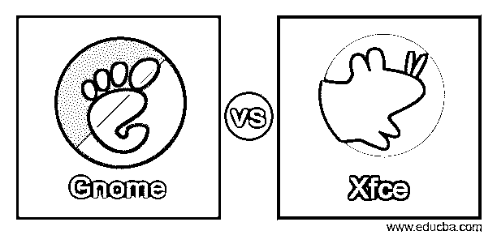

# Gnome vs Xfce

> 原文：<https://www.educba.com/gnome-vs-xfce/>

## Gnome 和 Xfce 的区别

Gnome 和 Xfce 提供了一个桌面环境，它们是开源的，用户可以免费获得；他们专注于 Unix 操作系统，他们支持所有的 Unix/ Linux 发行版，如 Debian、Ubuntu、SUSE Linux、Red Hat Enterprise Linux、Fedora 及其应用程序；由于它们吸引人的图形特征，大多数用户默认地在他们的系统中采用这些桌面环境之一(DE );这两个工具在提高最终用户的生产力和丰富用户体验方面具有竞争能力；让我们分别分析它们的优势，逐一比较它们的特点，帮助用户简化选择过程。

Gnome 简介

<small>网页开发、编程语言、软件测试&其他</small>

*   Gnome 是一个桌面应用程序，具有 Unix/ Linux 操作系统的图形界面
*   它是 GNU 网络对象模型环境的简称，但随后
*   由于目标的改变，失去了 GNU 网络身份。它更侧重于 Linux / Unix
*   操作系统发行版，并得到了开发者社区和 RedHat 的推动。
*   这个桌面的外观和感觉类似于 Windows 或 Mac，它也有匹配
*   这两个系统中的应用。这个软件带来了很多创新
*   让用户的生活变得简单。这个工具有四个版本，最新的是 Gnome 40。

Xfce 简介

*   该产品于 1996 年作为 Linux 的通用桌面环境推出
*   Xfce 最初被称为 XForms 公共环境，它失去了与 XForms 的联系，后来被重新命名为 E<u>x</u>tra<u>F</u>ine<u>C</u>computing<u>E</u>Environment。它还支持 Unix / Linux 操作系统及其应用程序，是许多用户最喜欢的桌面应用程序之一。它遵循 Unix 的理念，即一切都应该是模块化的和可重用的。

### Gnome 和 Xfce 的正面比较(信息图)

以下是 Gnome 和 Xfce 之间的 7 大区别:

### Gnome 和 Xfce 的主要区别

下面是 Gnome 和 Xfce 的主要区别:

#### 土地神

*   它有简单但有效的用户界面。
*   简单是它的 USP
*   用户在屏幕上有更多动态的工作区域。
*   它具有内置的恢复功能，可帮助用户保持工作的连续性
*   非常适合初学者浏览所有功能并进行学习。
*   它提供了一个完美的兼容平台，可以让为其他设备开发的应用程序顺利运行

#### Xfce 你好

*   由于轻量级，它可以安装在低端台式机上。
*   Xfce 外观优雅，增强了用户体验
*   它对用户非常友好，用户在 Xfce 中工作也很愉快
*   性能优于其他设计。
*   它提供了许多可定制的灵活使用的接触点。
*   用户有更多关于其后端的信息

### Gnome 与 Xfce 比较表

Gnome 和 Xfce 的比较如下:

| **侏儒** | **Xfce** |
| --- | --- |
| **1。** **电脑资源使用率** |
| Gnome 消耗更多的 CPU。对于某些选定的进程，CPU 使用率超过 10% | 与其他桌面相比，Xfce 消耗的 CPU 更少。Xfce 只使用了 1%的 CPU。低 CPU 是 Xfce 的独特卖点(USP)之一。 |
| Gnome 使用大约 800 MB 的内存。 | It uses lower memory space, unlike the other desktop software.  The memory footprint of Xfce is around 500MB of RAM.

CPU 和内存消耗的降低反映在整体性能上。

轻量级减少了加载时间，提高了用户的工作效率

 |
| **2。** **前端屏幕** |
| Gnome 中的前屏被设计成最小的干扰，并增强了用户体验。顶栏支持导航到菜单，如活动概述、应用程序、日历、系统选项、窗口列表和锁屏。屏幕的主要部分可作为用户的工作区。 | 这个屏幕看起来非常简单，没有杂乱的不需要的东西。屏幕被整齐地分为多个面板，包括应用程序启动器、访问应用程序的图标、工作区和切换多个工作区的选项。这些平板显示器可以定制。 |
| **3。** **文件管理器** |
| Gnome 中的文件管理器非常强大，它管理文件操作并维护目录。它提供了拖放功能来维护系统中文件夹内的文件和子目录。 | Thunar is used as a default file manager in most of the systems with Xfce DE. It may not have a decorative look but it is a very fast and efficient tool. It doesn’t have multi panes but it has sidebars and tabs to view multiple directories and to open any files.它提供简单且易于导航的文件处理功能。 |
| **4。** **一个窗口中多个终端仿真** |
| Gnome 使用一个名为 <u>Terminal</u> 的软件来模拟不同的终端，如 VT100、IBM3270，这些终端现在还没有投入生产。这个模拟器在图形模式下模仿并创建一个基于命令的屏幕，并连接到遗留应用程序。它可以在同一台计算机上运行，也可以通过 telnet、sh。 | 它使用 Xfce4 模拟器工具在一个屏幕上模拟多个终端。该工具操作简单，不同于其他工具，不同终端的标签可以很容易地重命名和重新排列。标签中清楚地显示了主机的名称和完整的链接。这些模拟器可以很容易地配置，它需要更少的计算机资源。 |
| **5。** **表现稳定** |
| 尽管旧版本的基因组存在一些稳定性问题，但最新版本的基因组内置了恢复功能，因此用户不会遭受任何工作损失。 | 该装置运行稳定可靠。这个工具在过去 3 年中没有重大更新，这充分证明了这一点。对于某些用户来说，这个桌面从来没有崩溃过。 |
| **6。** **模块化方法** |
| Gnome 使用默认方法，整个软件被加载到内存中 | Xfce 使用模块化的方法，它只安装项目所需的模块，其余的模块不会加载到内存中，也不会在需要时加载。 |
| 7 .**。** **配置变更** |
| Gnome 只有默认配置，顶行的动作按钮提供了一个菜单来访问各种功能 | Xfce 是一个高度可配置的 DE。设置管理器允许从屏幕上更改所有应用程序的设置，简化了用户的工作。 |

### 推荐文章

这是 Gnome vs Xfce 的指南。在这里，我们还讨论了 Gnome 和 Xfce 在信息图表和比较表方面的主要区别。您也可以看看以下文章，了解更多信息–

1.  [卢邦图诉徐本图](https://www.educba.com/lubuntu-vs-xubuntu/)
2.  [Linux Mint vs Ubuntu](https://www.educba.com/linux-mint-vs-ubuntu/)
3.  [Kali Linux 替代方案](https://www.educba.com/kali-linux-alternative/)
4.  [JavaScript vs VBScript](https://www.educba.com/javascript-vs-vbscript/)

