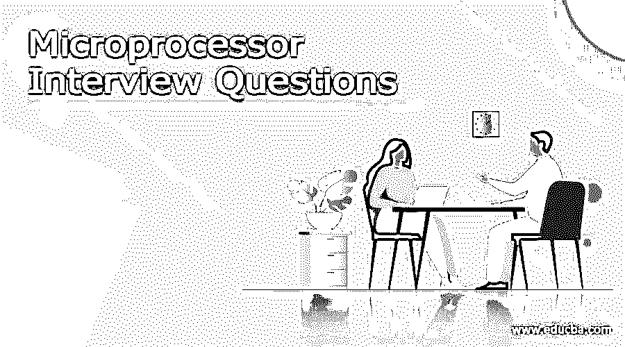

# 微处理器面试问题

> 原文：<https://www.educba.com/microprocessor-interview-questions/>

## 微处理器面试问答介绍

微处理器是制造在小芯片上的微型计算机的控制单元，能够执行 ALU(算术逻辑单元)操作并与连接到它的其它设备通信。微处理器由寄存器、控制阵列和控制单元组成。ALU 对从存储器或输入设备接收的数据进行算术和逻辑运算。寄存器数组由 B、C、D、E、H、L 等字母标识的寄存器和累加器组成。控制单元[控制计算机内的数据流](https://www.educba.com/data-mining-interview-questions/)和指令。

### 微处理器是如何工作的？

微处理器遵循一个序列:获取，解码，然后执行。指令按顺序存储在存储器中。微处理器从存储器中取出这些指令，然后解码并执行这些指令，直到到达停止指令。然后，它将二进制结果发送到输出端口。寄存器的任务是临时存储数据，ALU 执行计算功能。

<small>网页开发、编程语言、软件测试&其他</small>

### 微处理器的特点

*   **性价比:**微处理器芯片价格低廉，导致其成本低廉。
*   尺寸:这是一个小尺寸芯片，因此便于携带。
*   **低功耗:**微处理器采用金属氧化物半导体技术制造，功耗低。
*   **通用性:**微处理器是通用的，因为我们可以通过[配置软件程序](https://www.educba.com/software-engineering-interview-questions/)在几个应用中使用同一个芯片。
*   **可靠性:**微处理器中 IC 的故障率很低；因此它是可靠的。

### 微处理器的类型

*   **RISC 处理器:–**精简指令集计算机。它旨在通过简化计算机的指令集来减少执行时间。
*   **CISC 处理器:–**复杂指令集计算机。它旨在最小化每个程序的指令数，忽略每个指令的周期数。
*   **特殊处理器:–**这些处理器是为特殊用途而设计的。一些特殊的处理器如下:
    协处理器
    输入/输出处理器
    晶片机
    数字信号处理器

如果你找的是微处理器相关的工作，你需要准备 2022 年的微处理器面试题目。根据不同的职位描述，每次面试都是不同的。在这里，我们准备了重要的微处理器面试问答，帮助你面试成功。

以下是面试中经常被问到的 10 个重要的 2022 微处理器面试问题和答案。这些问题分为以下两部分:

### 第 1 部分-微处理器面试问题(基础)

这第一部分包括基本的面试问题和答案。

#### 1.什么是微处理器？

**答案:**微处理器是一个程序控制的器件，它从存储器中读取一组要执行的步骤，并执行这些步骤。

#### 2.8086 有哪些旗帜？

**回答:**以上是面试中常见的微处理器面试问题。在 8086 中，存在进位标志、奇偶标志、辅助进位标志、零标志、溢出标志、跟踪标志、中断标志、方向标志和符号标志。

#### 3.为什么晶振是时钟源的首选？

**回答:**使用晶体的主要原因是稳定性高，O 大，频率准确，始终保持恒定。

#### 4.什么是程序计数器？

**答:**程序计数器保存要执行的下一步在内存中的位置，或者在多步指令的情况下保存下一步在一组步骤中的位置。在所有情况下，随着步骤的进行，计数器加 1。此外，程序寄存器保存下一条指令的地址。

让我们进入下一个微处理器面试问题。

#### 5.什么是第 1、2、3、4 代处理器？

**答案:**采用 PMOS / NMOS/ HMOS/ HCMOS 工艺制成的处理器称为 1、2、3、4 代处理器，它包含 4/8/16/32 位。

#### 6.什么是三态逻辑？

**答案:**三态逻辑是使用的三个逻辑电平；它们是高、低、高阻态。高阻抗是电气开路条件，其中高和低是正常的逻辑电平。

### 第 2 部分-微处理器面试问题(高级)

现在让我们来看看高级面试问题。

#### 7.根据信号对中断进行分类。陈述他们的不同之处？

**答:**基于级别，信号有两种。

*   单级中断
*   多级中断

它们之间的区别如下。

*   单个中断由单个 ping 来管理，而多个引脚管理多个中断。
*   对于单中断，轮询是必要的，而对于多中断，轮询是不必要的。
*   多级中断相对来说比单级中断快。

#### 8.简单解释一下 8085 的陷阱输入？

**答案:**

*   陷印对边沿和电平都有响应。
*   陷波输入的脉冲宽度应大于正常噪声宽度。
*   当第一个陷阱从高到低转变时，第二个陷阱不再响应第二次。
*   为了防止不必要的错误触发，脉冲宽度应该比正常宽度宽。

让我们进入下一个微处理器面试问题。

#### 9.解释 Hlt 和 Hold 状态之间的区别？

**答案:**

*   当 HLT 状态被执行时，处理器停止运行；公共汽车进入三州。处理器不会给出任何形式的确认。
*   在保持的情况下，处理器进入保持状态，但总线不会被驱动至三态。
*   在其他手动保持时，状态处理器发出 HLDA 信号。这个信号可以被其他设备使用。

#### 10.简要解释获取周期中涉及的步骤？

**回答:**这是高级微处理器面试面试中问到的问题。提取周期是从内存中的特定位置检索操作码所花费的时间。

*   一般的提取周期由 3T 状态组成。
*   在第一个 T 状态中，存储在程序计数器中的存储器地址被发送到存储器。
*   在第二个 T 状态，从程序计数器中读取指定存储单元的内容。
*   在第三 T 状态，操作码通过数据总线发送到指令寄存器执行。
*   对于执行速度较慢的存储器，有等待周期的规定。

#### 11.简单解释一下 8085 中 Intr 信号变高是怎么回事？

**答:**INTR 是最低优先级，非向量，屏蔽 8085 的中断。这个 INTR 信号在许多情况下进入高状态；每当出现这种情况时，就会发生以下情况。

*   对于指令集发生的每一步，8085 检查 INTR 中断的状态，如果它已经发生。
*   在每一步完成之前，INTR 信号的状态保持为高。这条指令一完成，处理器就向 INTR 发送完成信号。
*   当 INTR 信号接收到这个完成信号时，一个新的操作码被放置在数据总线上以传送它来执行。
*   处理器接收这个新的操作码地址，将这个地址保存在堆栈上，新的中断服务子程序开始。

#### 12.CPU 增强模式源于哪里？

**回答:** Intel 的 80386 是第一款 32 位处理器，所以公司不得不向后支持 8086。所有基于 Intel 的现代处理器都运行在增强模式下，能够在实模式和保护模式之间切换，这是当前的操作模式。

#### 13.什么是微处理器及其相关部件使微处理器成为一个逻辑单元？

**答案:**最有可能的答案在于，它可以用于使所有电子设备逻辑化，无论是二极管、寄存器还是任何东西。它主要控制任何电子设备的整个逻辑单元。它具有在任何网络元件上操作的能力，事实上算术或逻辑单元组合可以执行端点连接和流线型通信。组件主要包括三个要素:

*   **寄存器数组:**这主要用于对任何寄存器中的元素进行整体访问和存储，其中一些指令以位操作的形式存储，使得整个内存分配也更加精简。它主要包含从 B、C、D、E、H、l 以分级方式组装的寄存器。
*   **控制单元:**如前所述，整个逻辑流程由该控制器控制，特别是它包括算术逻辑运算符，负责整个微处理器的行为。
*   **算术逻辑单元:**任何带有输入和输出设置的存储器都由微处理器的这个元件负责，使整个操作符合输入数据的逻辑。

#### 14.中断在任何微处理器中的意义是什么？

**答:**在任何微处理器中，中断都是至关重要的，尤其是在使用外部节点或外设生成信号时。这些外部节点或外围设备主要用于执行当前任务，启动和停止触发器有另一种用途。它主要有五个中断，分别从 5.5、6.5、INTR、7.5、陷阱和 RST 开始。

#### 15.总线在任何微处理器中的相关性是什么？

**答:**总线是任何微处理器中的常见组件，主要用于通过网络传输数据，从而建立流畅的通信。系统内的总线主要用作集中器，它包含所有捆绑在一起的线路，每二进制位一条线路用于处理。从数据总线开始，基本上有三种类型的总线，控制总线和地址总线，它们各有其重要性。

*   **地址总线:**这是一条单向总线，它包括任何二进制格式的存储器地址，使存储器以适当的输入和输出进行流动或通信。
*   **控制总线:**该总线的另一个意义在于，它主要用于使外部设备将所需的和必要的信息传送到指定的位置。
*   **数据总线:**顾名思义，它主要用于使信息流双向流动，使输入到输出的存储流单向流动或反过来也是可能的。

#### 16.为什么在微处理器内部使用寄存器？

**回答:**寄存器在微处理器中起着重要的作用，因为它在 CPU 中为存储提供了一些临时位置。然后，该寄存器用于使数据和地址操作可选。

#### 17.微处理器中子程序的相关性是什么？

**答:**子程序在微处理器中作为一系列程序使用，其中一些指令代码按照定义和管理的任务执行定义的任务。整个子例程用作任务单元，可用于多个位置的多个任务。在微处理器中主要有四种子程序，它们是:

1.  无条件调用指令
2.  带返回的条件指令
3.  条件调用指令
4.  无条件教学回报

#### 18.8086 型微处理器中接口的意义是什么？

**答:**接口充当两个实体之间的媒介，在 8086 型微处理器中也是如此，指的是两个组件相互通信和链接的路径。在 8086 型微处理器中存在两种类型的接口，一种被称为存储器接口，它能够访问存储单元，具有读写两种特权。另一种类型的接口称为 IO 接口，它表示与其他通信设备(如键盘、打印机、鼠标等)的通信。在很多方面都很有帮助。

#### 19.微处理器中的宏是什么？

**答:**任何微处理器中的宏都有一些指令集，作为一个组中的一个单元使用。宏有一个相关性，它最常用于最多 10 个指令集，但很少起作用。

#### 20.什么是与微处理器相关的存储器映射？

**答:**物理内存中的所有逻辑地址空间都是通过使用较小尺寸的微处理器传输物理内存中的逻辑地址空间来实现的，而较小尺寸的微处理器又具有一些微处理器设置以及与外部内存大小的相关性。

#### 21.微处理器中的助记符有哪些？

**回答:**基本上是任何与手术有关的缩写或首字母缩写。它用于使指令代码简单和标准化，以便在微处理器的整个网格中进行适当的编码和增强。

### 推荐文章

这是微处理器面试问题指南。在这里，我们还将讨论微处理器的定义和常见的面试问题以及答案。您也可以看看以下文章，了解更多信息–

1.  [微处理器中的寄存器](https://www.educba.com/register-in-microprocessor/)
2.  [小型机特性](https://www.educba.com/minicomputer-features/)
3.  [小型机特性](https://www.educba.com/minicomputer-features/)
4.  [微处理器 vs 微控制器](https://www.educba.com/microprocessor-vs-microcontroller/)

