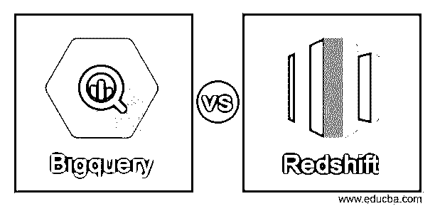

# Bigquery vs 红移

> 原文：<https://www.educba.com/bigquery-vs-redshift/>

## BigQuery 与红移的区别

BigQuery 是一个使用谷歌基础设施的 SQL 数据仓库，用户只需点击一下就能得到答案。用户对 BigQuery 拥有完全控制权，他们可以授权谁查看查询以及谁更新查询结果。因此，BigQuery 可以更快地处理由有经验的开发人员编写并由查询用户查看的所有查询。Amazon 的一个数据仓库产品称为 RedShift，它通过并行处理来减少查询运行时间。这有助于一次管理任意数量的查询，压缩率高于其他数据仓库。

### Bigquery 与 Redshift 的直接对比(信息图)

<small>网页开发、编程语言、软件测试&其他</small>

### 主要差异

*   BigQuery 和 RedShift 的性能不好比较。当我们每天都要运行查询，并且需要将这些查询存储在数据仓库中时，红移在系统中的可用节点上表现得更好。在亚马逊云的帮助下，这里可以使用单独的工具，这使得 RedShift 可以获得他们数据的图表。现在，如果我们有包含更多数据的 ML 输入，并且我们偶尔会处理它，而其他时候会发生数据争论，那么 BigQuery 是一个很好的选择，因为它对于以更快的速度给出的查询表现良好。
*   在许多情况下，两者的技术细节是不同的。BigQuery 支持各种查询，数据可以直接插入到数据仓库中，不需要对数据进行扁平化。RedShift 不支持不符合标准的 SQL 查询，在将数据上传到数据仓库进行查询之前，需要对数据进行扁平化处理。两者都支持 Update 和 delete 选项，但是在 BigQuery 中，这是很昂贵的。RedShift 支持回滚，但 BigQuery 不支持。
*   管理员需要在 RedShift 中完成从创建节点到根据系统需求为数据库分配资源的所有配置。应该定期对数据库进行管理，例如清理表中不需要的数据，并在需要时清空表。BigQuery 在配置方面很简单，因为 Google 处理所有的数据库需求，清空表是由 Google 自己完成的。数据库不需要管理员。RedShift 中需要这种手动配置，以保证所有地区的资源高可用性，不像 Google BigQuery。
*   Google Data Studio 和 BigQuery 集成在一起，用户可以创建仪表板来轻松分析数据。这可以在每秒钟内根据客户要求提供查询响应。RedShift 使用 Amazon QuickSight，并提供交互式仪表盘，以便用户可以在生成报告时直接在仪表盘中进行更改。
*   RedShift 运行需要亚马逊弹性云实例和亚马逊 S3 存储，而 BigQuery 运行需要谷歌云项目。我们可以在 S3 中直接查询，而不涉及红移中的数据，这使得工作变得容易。源数据可以从 Google Cloud Datastore 中获取，并可以使用 ETL 方法将数据插入到仓库中。

### Bigquery 与红移的比较表

| **BigQuery** | **红移** |
| Google 每月向 BigQuery 收取每 TB 20 美元的费用，但是存储和查询的费用是分开计算的。如果我们不总是运行查询，并且工作负载不可预测，这是一个可行的选择。 | 亚马逊每小时收取 0.25 美元的红移费用，其中包括在亚马逊云存储的帮助下进行存储和查询。这使得它比 BigQuery 便宜，并且我们可以降低价格，因为查询不会持续一整天。 |
| BigQuery is easy to use with very few complexities and data storage options given directly to the users. Cluster management and node allocation happen dynamically which users need not worry about. Database configuration is managed by BigQuery itself. | 用户应该负责节点分配、集群管理和数据库配置。节点取决于我们支付的费用，因此速度和存储也取决于此。有了亚马逊 S3，我们可以轻松管理存储和工作流集成。 |
| Google Cloud IAM 用于安全性，它屏蔽了 BigQuery 中的所有认证过程。此外，可以使用 OAuth 进行 B2B 身份管理，使其在系统中的第三方安全性方面更加安全。数据加密是默认设置。 | Amazon IAM 用于认证和安全，因此不会发生安全漏洞。身份验证和授权必须从数据库端完成，如果需要，我们可以使用第三方提供商进行密码身份验证。应该启用数据加密。 |
| 我们在 BigQuery 中没有服务器，用户不必担心 BigQuery 的基础设施，因为一切都在后端完成。web 服务是基于 REST 的，分析查询主要在 BigQuery 中运行。我们可以把 BigQuery 称为 Google 提供的查询服务。 | 在亚马逊 S3 存储的帮助下，红移可用于集群和节点。暂存表是在红移中完成的。领导节点接收来自不同应用程序的查询，这些查询将被发送到计算节点，工作由计算节点完成。 |
| 这里直接支持流数据，不需要第三方支持或任何其他 Google 应用程序支持。数据操作语言用于更新数据，这在查询世界中被设计为仅附加结构。 | 单独的应用程序，如亚马逊 Kinesis 用于收集，分析和处理数据到红移。用户很难处理这种数据摄取，因此可以使用亚马逊 S3 服务来完成这项工作。这里使用临时表来更新数据并将数据插入数据库。 |

### 结论

两者在很多情况下是相似的，因此在选择一个时，重要的是要看价格结构和一个应用程序提供的舒适度。推荐一个是不可能的，但是如果用户已经熟悉亚马逊 S3 并且已经进入亚马逊云体验，RedShift 是一个不错的选择。如果工作围绕 ML 展开，BigQuery 更有意义。

### 推荐文章

这是一个大查询与红移的指南。在这里，我们通过信息图和比较表来讨论 Bigquery 和 Redshift 的主要区别。您也可以看看以下文章，了解更多信息–

1.  [RxJava vs 反应器](https://www.educba.com/rxjava-vs-reactor/)
2.  [CloudTrail vs CloudWatch](https://www.educba.com/cloudtrail-vs-cloudwatch/)
3.  [Gnome vs Xfce](https://www.educba.com/gnome-vs-xfce/)
4.  [Cygwin vs Mingw](https://www.educba.com/cygwin-vs-mingw/)

