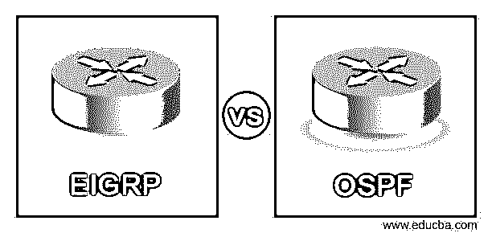

# EIGRP vs OSPF

> 原文：<https://www.educba.com/eigrp-vs-ospf/>

## 什么是 EIGRP？

EIGRP(增强型内部网关路由协议)是 Cisco 开发的距离矢量协议，采用 DUAL(扩散更新算法)。它将信息或数据从一台路由器传输到同一范围内的相邻路由器。尽管它是一个复杂的协议，但在小型和大型网络中设置和运行都很简单。EIGRP 的创建是为了解决传统距离矢量路由协议(如 IGRP 和 RIP)的缺点，这些协议很难扩展以满足网络需求。因为它结合了链路状态路由和距离矢量路由协议的功能，所以 EIGRP 被称为混合协议。EIGRP 与距离矢量路由协议一样接收来自邻居的更新。另一方面，EIGRP 维护通告路由的网络拓扑，并使用扩散更新算法(DUAL)来选择无环路由，如链路状态协议。网络中所有路由器接受网络更新所需的时间称为收敛时间。如果收敛时间短，路由器可以快速适应网络拓扑的变化。

因为 EIGRP 不传输完整的定期路由更新，所以收敛时间很快。另一方面，EIGRP 不知道所有的网络连接，必须依赖邻居的通告。

<small>网页开发、编程语言、软件测试&其他</small>

### 什么是 OSPF？

与 EIGRP 一样，OSPF(开放最短路径优先)也是一种路由协议，但它是一种开放的 IETF 标准，可以在广泛的网络中使用和部署。OSPF 协议的目标是创建一种比 RIP 具有更高可扩展性和效率的链路状态协议。OSPF 是一种无类路由系统，它还可以帮助非连续网络使用可变长度子网掩码(VLSM)。OSPF 使用 224.0.0.5 和 224.0.0.6 等组播地址发送问候和更新。还有身份验证，它有两种类型:纯文本和消息摘要算法 5。

如前所述，OSPF 使用 Dijkstra 算法通过构建最短路径树(SPT)来生成路由。每台路由器都以可理解的方式在链路状态广告中显示自身以及到其邻居的链路，从而允许 OSPF 基于来自最短路径树的数据来布局拓扑。

### EIGRP 与 OSPF 的面对面比较(信息图)

以下是 EIGRP 与 OSPF 的 10 大区别:

### EIGRP 和 OSPF 的主要区别

i. EIGRP 是一种全面的距离矢量路由系统，使用触发式更新和增量式更新。在这种情况下，触发更新表示路由器不会传送更新，除非发生变化。此外，由于增量更新，路由器将只中继已更改的信息，而不是网络的所有信息。另一方面，OSPF 是一种类似于地图的链路状态路由协议，它存储了给定区域内所有路由的所有信息。每当区域中发生变化时，该区域中的所有路由器都必须重新计算它们的数据库和路由。这使得 OSPF 比 EIGRP 对 CPU 的要求更高，而且因为它需要在数据库中存储路由信息，所以也需要更多的 RAM。

二。与 OSPF 相比，EIGRP 在向后兼容旧路由器方面更胜一筹。

三。OSPF 需要严格的区域规划，而 EIGRP 则不需要；事实上，它是多供应商环境的理想选择。

四。就收敛时间而言，EIGRP 更快，因为它采用 DUAL 算法，该算法选择最佳路径和备用最佳路径。如果最佳路径失败，它会自动切换到另一条最佳路径。然而，OSPF 采取了不同的技术，这导致了更长的收敛时间。

动词 （verb 的缩写）OSPF 比 EIGRP 具有更高的可扩展性，因为 EIGRP 很难实现并且是特定于供应商的，因此不可能从一个供应商转移到另一个供应商。另一方面，OSPF 是一种开放的标准和简单的协议，允许网络有效地扩展。

六。EIGRP 是唯一允许不均衡路径负载平衡的协议，而 OSPF 缺乏这种能力。

七。随着 OSPF 在传统系统中的广泛应用，它为服务提供商和数据中心提供了更好的支持。它还改善了路由信息的共享。

### EIGRP 和 OSPF 的差异表

| **Sr 号** | **EIGRP** | **OSPF** |
| 1. | 它代表增强型内部网关协议。 | 它代表开放最短路径优先 |
| 2. | EIGRP 的协议类型是混合的 | OSPF 的协议类型是链路状态。 |
| 3. | EIGRP 的内部管理距离为 90，外部管理距离为 170。 | OSPF 的行政距离是 110。 |
| 4. | EIGRP 中使用的算法是双距离矢量。 | OSPF 使用的算法是 Dijkstra 链路状态。 |
| 5. | 它对内存和 CPU 的要求较低。 | 它对内存和 CPU 的要求更高。 |
| 6. | 它没有分层设计 | 它有一个分层的设计 |
| 7. | 这很容易实现，但是没有提供自动总结 | 它的实现很复杂 |
| 8. | EIGRP 中的环路预防是水平分割和双重的 | OSPF 的环路预防完全了解拓扑结构 |
| 9. | EIGRP 中的总结和过滤发生在网络的任何地方 | OSPF 中的总结和过滤只发生在 ABR 或 ASBRs 上 |
| 10. | EIGRP 中的路由度量是可靠性、带宽、负载以及延迟的组合。 | OSPF 的路由度量是接口带宽 |

### 结论

当比较 EIGRP 和 OSPF 时，我们可以看到 EIGRP 更复杂，而 OSPF 更简单，因为它只使用开销作为度量。这两种协议的主要区别在于，当相邻路由形成时，EIGRP 只交换一次完整的路由信息，然后它只跟踪修改。

### 推荐文章

这是 EIGRP 与 OSPF 的对比指南。在这里，我们分别通过信息图和比较表来讨论 EIGRP 和 OSPF 的主要区别。您也可以看看以下文章，了解更多信息–

1.  [EIGRP 面试问题](https://www.educba.com/eigrp-interview-questions/)
2.  什么是 EIGRP？
3.  [QGIS vs ArcGIS](https://www.educba.com/qgis-vs-arcgis/)
4.  [Nginx vs Tomcat](https://www.educba.com/nginx-vs-tomcat/)

