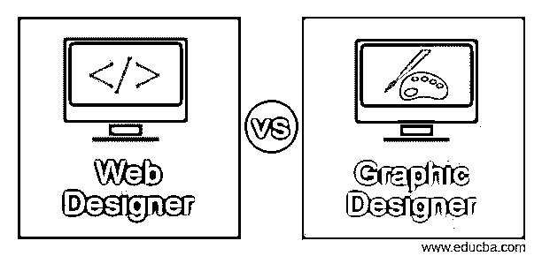

# 网页设计师 vs 平面设计师

> 原文：<https://www.educba.com/web-designer-vs-graphic-designer/>

## 网页设计师和平面设计师的区别

*   网页设计师是技术和创意人员，他们负责从零开始建立一个新网站或重新设计已经创建的网站。
*   他们能够认识到使一个网站有用和平静使用的过程，但同时，他们也明白需要什么来创造一个艺术上取悦消费者的网站。
*   另一方面，众所周知，图形设计师是图形设计和艺术行业内的专业人士，他们收集运动图形、图像或印刷字体，作为设计的一部分。
*   他们制作的图形最初用于出版、印刷或电子媒体，有时是宣传册和广告，有时是插图、排版、网页设计和用户界面。

### 网页设计师和平面设计师的直接比较(信息图)

以下是网页设计师和平面设计师的 13 大区别:

<small>网页开发、编程语言、软件测试&其他</small>

### 网页设计师与平面设计师对比表

| **网页设计师** | **图形设计师** |
| 一个网页设计师担心的是设计的所有部分如何作为一个系统共同发挥作用。 | 平面设计师专注于创意和艺术。 |
| 作为网页设计师，有时他们必须与网页开发人员一起工作，也可能是任何前端开发团队，他们将设计转化为功能代码。 | 图形设计师通过创建一个适合一个方孔的方钉，在混凝土规范内工作。 |
| 网页设计师包括它的网站，网页，行动按钮，用户界面设计，或 UX 设计形式的起源。 | 平面设计包括其在印刷形式的起源，如杂志，印刷材料，或儿童书籍。 |
| 网页设计是一个活跃的媒介，它对加载时间和文件大小感到担忧。 | 平面设计只有一个时间来维持文件大小，那就是当他们试图将大的促销横幅放入他们的粉盒背面时。 |
| 然而，网页设计者需要考虑文本如何在多个屏幕和多个浏览器中显示。 | 图形设计人员可能会实现好看的字体，而不必担心它在最终交付品中的表现，直到印刷商重视这个名称。 |
| Descent web 设计人员致力于制造一种可以接受所有孔的钉，不管孔的形状或大小，不需要包装或无视设计。 | 图形设计者在实际条件下通过创建一个可以容纳一个方孔的方钉来发挥作用。 |
| 网页设计是一个动态的媒介，具有适应性和修改的灵活性和力量。 | 然而，平面设计是永久的，因为一旦任何设计被印刷出来，就不能再改变了。 |
| Web designer 允许网页成为交互式导航页面、点击按钮、播放视频或动画。 | 相比之下，图形设计师的交互性更差，我们可以查看或触摸，但不能改变设计或导航。 |
| 该网站需要不断变化的定期维护，客户可以聘请任何更新或帮助。 | 当设计准备好并打印出来后，它就完成了，但是如果需要任何修改，那么就应该重印或在邮件上分发新版本的图形，这可能会很昂贵。 |
| 作为一名自由职业者，网站设计者可以通过学习如何使用 Webflow 或 CMS 等工具创建定制网站来选择为网站开发添加服务。 | 平面设计师可能会与制造艺术家一起工作，帮助清理和组织最终用于印刷制作的文件。 |
| 在网页设计中，RGB 颜色模式因其特殊的成像模式而被使用，这种模式强调模拟数据结构之间的联系。 | 由于平面设计依赖于印刷，它基本上使用 CMYK 色彩模式，这种模式强调视觉流和影响导向，如横幅设计等。 |
| 作为物质媒介的信息载体是屏幕。信息量是由所用材料的大小决定的。 | 作为物质媒介的信息载体是布或纸。信息量依赖于 HTML，无限信息量。 |
| 所创建的网页设计或网站并不适合所有年龄段的人。 | 平面设计受到不同年龄层的认可。 |

### 网页设计师和平面设计师的主要区别

以下几点提到了网页设计师和平面设计师的一些关键区别:

*   平面设计师和网页设计师之间有一个主要的区别——技术专长。因为，网页设计者需要熟悉 CSS，HTML，如何在网页上构建设计，以及处理诸如加载时间和文件大小的限制。然而，图形设计师通常能够定制设计，消除太多的限制。
*   平面设计师和网页设计师都需要有基本的知识和对设计基础的理解，保持更新版本的设计趋势，能够为客户解决任何创意问题，应该与客户就设计布局和字体风格进行良好的沟通，应该对设计决策有清晰的表达，最重要的是自学和专注。
*   图形设计师包含了很多与网页设计师相似的技能。他们都应该知道排版，构图和布局的规则，以及调色板。但是体面的网页设计师会关心这些功能是如何标记虚拟可用性和交互性的。
*   一个网页设计师可能会和一个图形设计师一起工作，使用图像和图形等视觉工具，但是作为一个网页设计师，可以接受所有这些部分的组织，以创建一个全面的交互式设计，这在某种程度上是可操作的。
*   如果我们谈论图形，那么与网页设计相比，图形设计包括更多的表现，特别是对于产品网站。
*   平面设计依赖于印刷材料和媒体，而网页设计涉及后端开发、网络信号、服务器应用程序和少数其他第三方资产维护。

### 结论

*   平面设计师有能力将技术和艺术结合在一起，通过图像、印刷页面和网页布局来联系思想。在这里，他们可以考虑各种设计特点，以实现增强或艺术效果。
*   网页设计师的主要任务是通过网站的视觉效果、规划设计、布局、应用元素、目标受众、满足客户、颜色、字体风格以及目标市场来创建网页。他们获得了独特的人格，比如艺术、创造力、直觉、表现力和敏感性。

### 推荐文章

这是网页设计师和平面设计师的指南。在这里，我们讨论网页设计师和平面设计师的主要区别，分别用信息图和比较表。您也可以看看以下文章，了解更多信息–

1.  [网络钓鱼与域名欺诈](https://www.educba.com/phishing-vs-pharming/)
2.  [QGIS vs ArcGIS](https://www.educba.com/qgis-vs-arcgis/)
3.  [Nginx vs Tomcat](https://www.educba.com/nginx-vs-tomcat/)
4.  [Figma vs InVision](https://www.educba.com/figma-vs-invision/)

