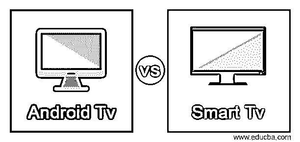

# 安卓电视 vs 智能电视

> 原文：<https://www.educba.com/android-tv-vs-smart-tv/>

## Android 电视与智能电视的区别

以下文章提供了 Android 电视与智能电视的概要。与 Android 电视相比，智能电视包含许多功能，这些功能对智能电视的要求更高。另一方面，Android tv 有时会限制许多功能，例如限制某些应用程序的可访问性，因此没有给最终用户留下多少选择。与 android 相比，智能电视有时会变得更加复杂，尽管互联网接入和 google play 直接下载等许多选项为智能电视提供了优势。与像普通安卓手机一样下载的安卓电视不同，智能电视提供了更多的功能。

### Android 电视与智能电视的面对面比较(信息图)

以下是安卓电视与智能电视的 7 大区别:

<small>网页开发、编程语言、软件测试&其他</small>

### Android 电视与智能电视的主要区别

Android 电视和智能电视也存在某些关键差异，在比较和提出用户需求和供应关系时，需要强调这两者。

*   智能电视是一个正常的框架，电视自带一系列内置应用，如网飞、亚马逊 Prime 和许多其他应用。
*   与智能电视相比，Android tv 对操作系统进行了限制，允许它安装和使用大多数基于 google play 商店的应用程序。
*   如今，人们想要更多的功能和谷歌助手，在这种情况下，使用电视的推荐选项是 android tv。
*   假设需要打开空调或微波炉的开关，那么在这种情况下，直播和家庭访问应用程序的内置功能是必不可少的。
*   在电信领域和电视行业，有一个特定的要求，其中一些品牌可能无法满足上述要求，因为它们不支持许多 android 操作系统，如三星和 LG TV。
*   三星 android tv 有这样的限制，就像需要找到并熟悉 Tizen 操作系统一样。除了这个品牌，其他品牌很容易支持所有像索尼，松下等。
*   虽然 Android 和智能电视有相似之处，但无论是市场需求还是最终用户的看法和要求，这些微小的差异仍然会产生许多整体差异。
*   智能电视具有可靠性，需要提供更多面向功能的电视，以满足最终用户的需求。
*   另一方面，Android tv 试图缓解前面提到的问题，通过使用 google play 商店解决并增强了这个问题，Google play 商店几乎可以提供所有内容，包括使用手机和相同软件进行更新和控制。
*   智能电视和 android 电视几乎相同，但不同之处在于 android 支持一些智能电视不支持的应用程序和功能，因此整个决策过程是一个复杂的过程，需要理解和努力。
*   在 android 和智能电视之前，普通电视也出现了，这使得这种人工干预更具创新性，对最终用户更具吸引力，使其完全用户友好。
*   这些是一些关键的差异，但还存在更多的差异，这些差异来自于已经作为电视的一部分存在的应用程序的捆绑包，以便于访问和使用。

### 安卓电视与智能电视对比表

我们来讨论一下安卓电视和智能电视的顶级对比:

| **安卓电视** | **智能电视** |
| 安卓电视提供了很多选择，但由于其可操作性的限制，不如智能电视。 | 智能电视提供了增强的功能和互联网连接，这使得整个场景的可用性和可访问性大大增强。 |
| Android tv 为更可靠且习惯与 Android 操作系统交互的用户增加了优势。 | 另一方面，智能电视可以访问互联网，因此它可以像普通桌面一样工作，还可以访问更多选项。 |
| 安卓电视确实有功能，但限制是它只能从谷歌商店下载软件和组件，所以这些应用程序也需要像普通的安卓手机一样更新。 | 另一方面，智能电视可以访问并连接到普通互联网，这反过来提供了许多额外的优势，只需连接，然后轻松地使用其他内置应用程序，如网飞或任何东西。 |
| 另一方面，Android tv 有大量的应用程序库，可以使用连续而坚固的固件，但需要连续的应用程序更新，这让最终用户失去了耐心。 | 智能电视很简单，有一个增强的用户友好的界面，但在 android 电视上却不是这样。 |
| Android tv 由 google tv 组成，这使得它更倾向于像 google music 和 google play 这样的应用程序可用性，从而改善整体终端用户体验。 | 与 Android 电视相比，智能电视还提供了一种整体电视环境，从零开始设置整个环境没有太大的困难，这与其他 Android 电视不同。 |
| 智能电视和安卓电视都有一定的缺点，因此当谈到安卓电视时，如果没有先验知识或之前没有与用户界面进行交互，优势是繁琐的界面。 | 智能电视也有一些缺点，就像网络上有很多应用程序一样，需要更频繁地更新系统。 |
| 对于 Android 电视制造商来说，制造商数量较少，谷歌相关应用或软件的可用性有限。 | 另一方面，智能电视制造商正在通过同时提供越来越多的功能和可访问性来获取和主导市场。 |

### 结论

android 电视和智能电视都为最终用户提供了大量的设施和可用性。智能电视确实有能力支持 android 电视也提供的许多功能，但这取决于最终用户的口味和要求。两者在技术上具有相同的功能和可访问性，但仅仅是功能，还有许多其他功能将作为电视的一部分。

### 推荐文章

这是安卓电视 vs 智能电视的指南。在这里，我们分别通过信息图和对比表来讨论 Android Tv 和智能电视的主要区别。您也可以看看以下文章，了解更多信息–

1.  [iPhone vs Android](https://www.educba.com/iphone-vs-android/)
2.  [Linux vs Android](https://www.educba.com/linux-vs-android/)
3.  [Dropbox vs iCloud](https://www.educba.com/dropbox-vs-icloud/)
4.  [Kivy vs Flutter](https://www.educba.com/kivy-vs-flutter/)

