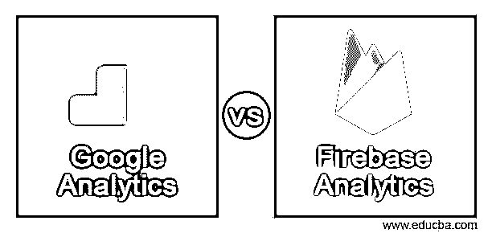
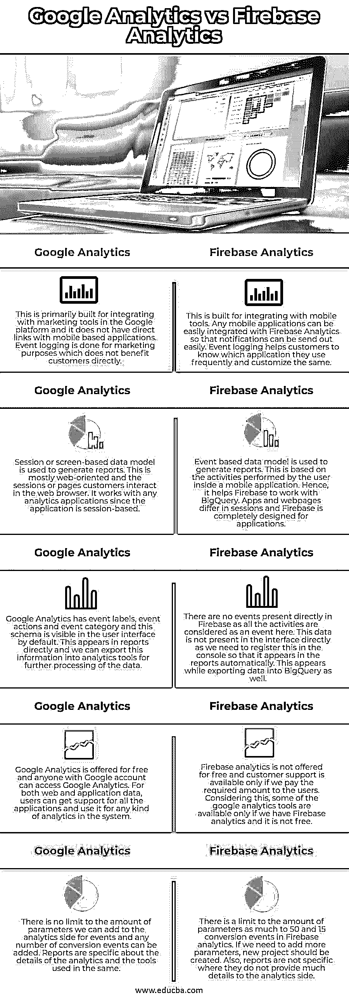

# 谷歌分析 vs Firebase 分析

> 原文：<https://www.educba.com/google-analytics-vs-firebase-analytics/>

## Google Analytics 与 Firebase Analytics 的区别

下面的文章提供了 Google Analytics 和 Firebase Analytics 的概要。谷歌提供的一项网络分析服务叫做谷歌分析(Google Analytics ),通过在网页中运行 JavaScript 来跟踪和报告网站流量，从而为营销目的的统计工具提供帮助。可以访问任何数量的数据，这有助于了解用户如何与不同的网站进行交互。谷歌提供的一个分析引擎被称为 Firebase analytics，用于了解 Android 和 iOS 应用程序的客户行为。捕获所有事件，并考虑用户要求的值得注意的事件，以便可以容易地进行更改。

### Google Analytics 与 Firebase Analytics 的面对面比较(信息图表)

以下是 Google Analytics 与 Firebase Analytics 之间的 5 大区别:

<small>网页开发、编程语言、软件测试&其他</small>

### Google Analytics 与 Firebase Analytics 的主要区别

让我们讨论一下 Google Analytics 与 Firebase Analytics 之间的一些主要差异:

*   如果我们需要为任何用例将页面发送到分析，我们应该将 JavaScript 代码合并到网页中，以便它将被发送到 Google Analytics。移动分析也可以在谷歌分析中完成，截图或活动被发送到谷歌分析。Firebase 最初是为了管理 iOS 和 Android 中的应用程序而创建的。Firebase Analytics 是后来引入的，用于管理 iOS 和 Android 中所有应用程序的分析工作。
*   考虑到我们在 Firebase 和 Google Analytics 中都使用了 iOS 和 Android 应用程序。在 Firebase 中，数据是在项目级别上考虑的，因此整个数据都在一个数据集中。如果我们需要访问任何属于 iOS 或 Android 的数据，我们可以直接使用该项目。通过 Firebase Analytics，可以在系统的项目级别查看整体指标。使用 Google Analytics，我们必须为 iOS 和 Android 应用程序设置一个属性，以便通过应用程序模式发送它，或者我们可以通过 web 浏览器发送它，而无需为应用程序设置任何属性。因此，Google Analytics 比 Firebase Analytics 更具界面灵活性。
*   Google Analytics 和 Firebase Analytics 几乎在所有平台上都提供支持。任何可以在 iOS 和 Android 应用程序中配置的应用程序也可以使用 Firebase 进行配置。这包括任何 OTT 平台或任何消息应用程序。如果 Android 或 iOS 不支持该应用程序，则很难使用 Firebase 从该应用程序中获取分析细节。谷歌分析是这方面的大师，它可以用于任何有关 iOS 和 Android 的应用程序。此外，网络浏览器是连接所有应用程序的另一个选项。
*   搜索引擎优化、点击付费和内容制作是谷歌分析中使用的营销技术形式。可以注意到关于客户的任何数据，并且可以在网页中进行必要的改变，从而可以在网页或应用中直接进行营销，而不需要太多的客户识别。这有助于增加任何特定项目的销售。事件、用户属性、转换和受众是 Firebase analytics 中用于管理应用程序并根据用户需求进行定制的主要属性。基于此可以创建更好的应用程序，最终将在分析工具中产生更好的结果。这种数据收集有助于监控客户，然后完全根据他们的需求开发应用程序。

### Google Analytics 与 Firebase Analytics 对比表

让我们讨论一下 Google Analytics 与 Firebase Analytics 之间的主要比较:

| **谷歌分析** | **Firebase 分析** |
| 这主要是为了与谷歌平台中的营销工具集成而构建的，它与基于移动的应用程序没有直接联系。事件记录是出于营销目的，不会让客户直接受益。 | 这是为与移动工具集成而构建的。任何移动应用程序都可以轻松地与 Firebase Analytics 集成，以便轻松发送通知。事件记录有助于客户了解他们经常使用的应用程序，并对其进行定制。 |
| 基于会话或屏幕的数据模型用于生成报告。这主要是面向 web 的，客户在 web 浏览器中与会话或页面进行交互。它适用于任何分析应用程序，因为该应用程序是基于会话的。 | 基于事件的数据模型用于生成报告。这是基于用户在移动应用程序中执行的活动。因此，它有助于 Firebase 与 BigQuery 一起工作。应用程序和网页在会话方面有所不同，Firebase 完全是为应用程序设计的。 |
| Google Analytics 有事件标签、事件操作和事件类别，默认情况下，该模式在用户界面中可见。这直接出现在报告中，我们可以将这些信息导出到分析工具中，以便进一步处理数据。 | Firebase 中没有直接出现的事件，因为这里所有的活动都被视为一个事件。这些数据不会直接显示在界面中，因为我们需要在控制台中注册这些数据，以便自动显示在报告中。将数据导出到 BigQuery 时也会出现这种情况。 |
| 谷歌分析是免费的，任何拥有谷歌账户的人都可以访问谷歌分析。对于 web 和应用程序数据，用户可以获得对所有应用程序的支持，并将其用于系统中的任何类型的分析。 | Firebase Analytics 不是免费提供的，客户支持只有在我们向用户支付所需金额时才可用。考虑到这一点，一些谷歌分析工具只有在我们有 Firebase analytics 时才可用，而且它不是免费的。 |
| 我们可以添加到事件分析端的参数数量没有限制，可以添加任意数量的转换事件。报告具体说明了分析的细节以及分析中使用的工具。 | 在 Firebase analytics 中，参数数量限制为 50 和 15 个转换事件。如果我们需要添加更多的参数，应该创建一个新的项目。此外，报告并不具体，因为它们没有向分析方提供许多详细信息。 |

### 结论

这两种分析工具各有优势，因此我们可以同时利用这两种工具。我们可以在系统中安装 Firebase 和 Google analytics，以便可以在 Google Analytics 中创建一些报告。如果分析完全基于应用程序，我们可以继续使用 Firebase。

### 推荐文章

这是谷歌分析与 Firebase 分析的指南。这里我们分别讨论信息图和比较表的主要区别。您也可以看看以下文章，了解更多信息–

1.  [Dropbox vs Google drive](https://www.educba.com/dropbox-vs-google-drive/)
2.  [Echo vs Google Home](https://www.educba.com/echo-vs-google-home/)
3.  [甲骨文 vs 谷歌](https://www.educba.com/oracle-vs-google/)
4.  [网络钓鱼与域名欺诈](https://www.educba.com/phishing-vs-pharming/)

