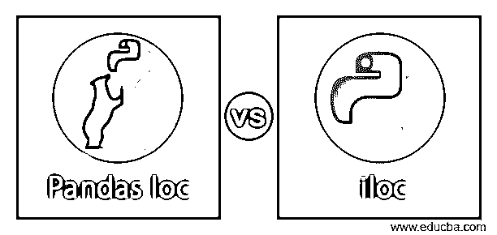
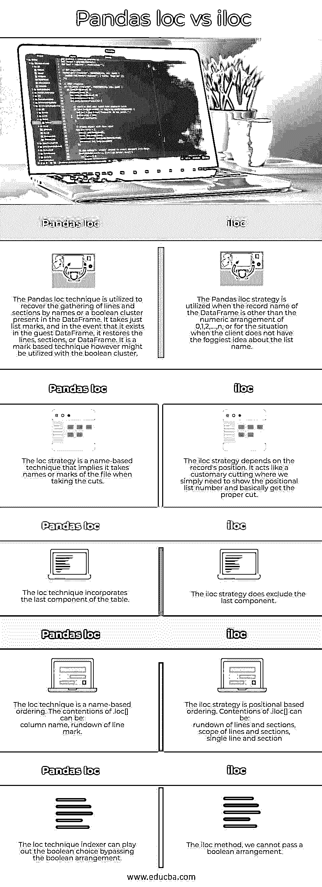

# 熊猫 loc vs iloc

> 原文：<https://www.educba.com/pandas-loc-vs-iloc/>

## Pandas loc 与 iloc 的区别

熊猫 loc 与 iloc 的信息切割策略。总的来说，信息切片意味着检查您的信息索引。这两种技术在记录确定策略中占有一席之地，记录确定策略用于为信息集合的每一行设置标识符。排序可以采用显式名称，这些名称可以是一个数字，也可以是由客户端确定的其他值。

### Pandas loc 与 iloc 的直接对比(信息图)

以下是熊猫 loc 和 iloc 之间的主要区别

<small>网页开发、编程语言、软件测试&其他</small>

### Pandas loc 和 iloc 的主要区别

现在，我们通过下面给出的不同示例来了解各种关键差异:

#### 示例#1

在 Pandas 中使用 loc 功能

`import pandas as pd
info = pd.DataFrame({'Company' : ['Honda', 'Maruthi', 'Mercedes', 'Audi', 'BMW', 'Porsche', 'Hyundai', 'Tesla', 'Tata'],  'Year' : [2001, 2002, 2003, 2004, 2005, 2006, 2007, 2008, 2009], 'Drive' : [25000, 26000, 27000, 28000, 29000, 31000, 33000, 34000, 36000], 'City' : ['Bangalore', 'Chennai', 'Hyderabad', 'Trivandrum', 'Mysore', 'Coimbatore', 'Shimoga','Hampi',  'Hassan'], 'Miles' :  [11, 12, 13, 14, 15, 16, 17, 18, 19]})
print(info.loc[(info.Company == 'BMW') & (info.Miles > 13)])`

**输出:**

在上面的程序中，我们首先将 panda 的库作为 pd 导入，然后定义数据帧并为数据帧中的所有值赋值。在定义了 dataframe 之后，我们在这里使用 loc 函数来标识特定公司 BMW 的行，然后标识它的 miles，它应该大于 13。这样，程序就实现了，输出如上面的快照所示。

Loc 是基于标记的信息选择策略，这意味着我们需要传递我们需要选择的线或线段的名称。与 iloc 不同的是，此战略包含了该系列的最后一个组件。loc 可以确认与 iloc 不同的布尔信息。利用 loc 策略可以执行许多活动。

#### 实施例 2

在 Pandas 中使用 iloc 功能

`import pandas as pd
info = pd.DataFrame({'Company' : ['Honda', 'Maruthi', 'Mercedes', 'Audi', 'BMW', 'Porsche', 'Hyundai', 'Tesla', 'Tata'],  'Year' : [2001, 2002, 2003, 2004, 2005, 2006, 2007, 2008, 2009], 'Drive' : [25000, 26000, 27000, 28000, 29000, 31000, 33000, 34000, 36000], 'City' : ['Bangalore', 'Chennai', 'Hyderabad', 'Trivandrum', 'Mysore', 'Coimbatore', 'Shimoga','Hampi',  'Hassan'], 'Miles' :  [11, 12, 13, 14, 15, 16, 17, 18, 19]})
print((info.iloc[[1, 3, 5, 7]]))`

**输出:**

在上面的程序中，我们首先将 panda 的库作为 pd 导入，然后定义数据帧。定义完 dataframe 后，我们使用 iloc 函数显示多行多列，这样程序就实现了，输出如上面的快照所示。

iloc 是一种基于记录的选择策略，这意味着我们需要传递整个数字文件来选择显式的线或段。这种策略确实排除了与 loc 不同的最后一个组件。iloc 不确认与 loc 不同的布尔信息。

### Pandas loc 与 iloc 对比表

以下是 pandas loc 与 iloc 的对比表

| **熊猫馆** | **熊猫 iloc** |
| Pandas loc 技术用于通过数据帧中存在的名称或布尔聚类来恢复线和段的集合。它只接受列表标记，如果它存在于客户数据帧中，它就恢复行、段或数据帧。这是一种基于标记的技术，但是也可以与布尔聚类一起使用。 | 当数据帧的记录名不是数字排列 0，1，2…时，使用 Pandas iloc 策略。，n，或者在客户对列表名没有任何概念的情况下。 |
| loc 策略是一种基于名称的技术，这意味着它在进行切割时会获取文件的名称或标记。 | iloc 策略取决于记录的位置。它的行为就像一个习惯性的切割，我们只需要显示位置列表编号，基本上就可以得到合适的切割。 |
| loc 技术合并了表的最后一个组件。 | iloc 策略不包括最后一个部分。 |
| The loc technique is name-based ordering. The contentions of .loc[] can be:列名，划线。 | iloc 策略是基于位置的排序。的争论。iloc[]可以是:

*   [line segment outline],
*   Line segment range,
*   Single line segment

 |
| loc 技术索引器可以绕过布尔排列完成布尔选择。 | 在 iloc 方法中，我们不能传递布尔排列。 |

### 结论

因此，我想以陈述 python 的 Pandas 库对于数字信息的控制是有价值的，并且在 AI 领域中被广泛使用来结束我的演讲。它包含许多适当运作的策略。loc 和 iloc 就是这些策略之一。这些被用于从熊猫数据帧中截取信息。它们有助于从数据帧中有利地确定信息。它们用于根据一些条件分离信息。这两种策略的工作原理在车辆的示例数据集中进行了说明。

### 推荐文章

这是关于熊猫 loc 和 iloc 的指南。在这里，我们通过信息图和比较表来讨论 Pandas loc 与 iloc 的主要区别。您也可以看看以下文章，了解更多信息–

1.  [Wrike vs Asana](https://www.educba.com/wrike-vs-asana/)
2.  [石墨 vs 格拉法纳](https://www.educba.com/graphite-vs-grafana/)
3.  [大型机 vs 服务器](https://www.educba.com/mainframe-vs-server/)
4.  [特雷罗 vs 规划师](https://www.educba.com/trello-vs-planner/)

