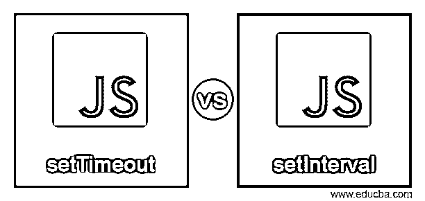
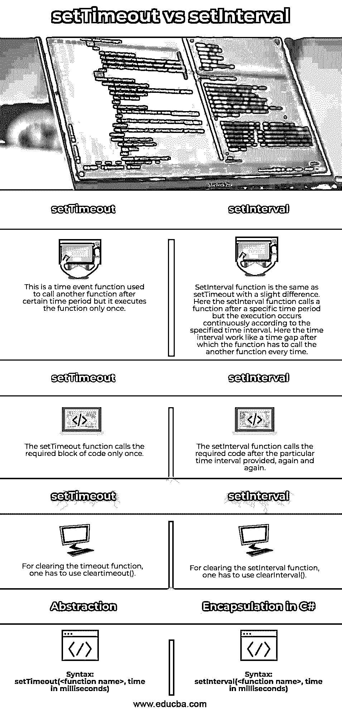

# setTimeout 与 setInterval

> 原文：<https://www.educba.com/settimeout-vs-setinterval/>

## setTimeout 和 setInterval 的区别

下面的文章提供了 setTimeout 和 setInterval 的概要。JavaScript 有两个主要的计时事件，分别是 setTimeout 和 setInterval。JavaScript 的窗口对象允许在特定的时间间隔执行代码。时间间隔被称为时间事件。JavaScript 中使用的两个主要方法是 setTimeout 和 setInterval。setTimeout 的主要工作是在等待一段时间后执行函数。另一方面，SetInterval 主要用于在特定时间间隔后执行一个函数。这两个时间事件函数之间的主要区别在于，超时函数只在特定时间段后执行一次。另一方面，setInterval 函数会在特定的时间间隔后继续使用。

### setTimeout 和 setInterval 的比较(信息图)

以下是 setTimeout 与 setInterval 之间的 4 大区别:

<small>网页开发、编程语言、软件测试&其他</small>

### setTimeout 和 setInterval 的主要区别

让我们讨论 setTimeout 和 setInterval 之间的一些主要区别:

#### 1.设置超时

settimeout 是用作 setTimeout()的函数。它用于在特定时间段后执行定义的代码块，setTimeout 函数在指定时间后只执行一次代码块。一旦时间过去，它就不会再调用代码了。

setTimeout 函数采用以下参数:

*   首先，它需要有一个函数或一个指向另一个函数的引用，该函数定义在完整代码的某个地方。
*   它需要一个以毫秒为单位表示时间间隔的数字，其中 1000 毫秒等于 1 秒。这个时间间隔表示程序执行某个代码块必须等待的时间。如果用 0 秒来代替该值，那么该函数将尽可能快地运行。
*   运行时，不能向函数传递任何值或多个值。
*   在时间间隔的位置中指定的时间并不确保该功能将在该时间之前执行。但是，这是函数可以执行的最小时间。一旦主线程上的堆栈变空，就调用这些函数中要传递的回调。
*   如果我们将代码写成 setTimeout(fn，0)，那么一旦堆栈变空，代码就会被执行，而不是立即执行。如果代码 setTimeout(fn，0)被执行，那么在运行一个从 1 到 100 亿的循环后，回调在几秒钟后被执行。
*   例如，如果我们执行以下代码:

`Let Join = setTimeout (() => { alert (‘Congratulations, you have joined EDUCBA’);}, 5000);`

在这里，浏览器将等待至少 5 秒钟，然后它将调用匿名函数，随后是警告消息，“祝贺你，你已经加入 EDUCBA”。

*   函数不必总是匿名的。我们可以将任何函数名放在那里，并在完整代码的任何地方定义函数。当然，我们必须用 setTimeout()传递对代码的引用。

**举例:**

**代码:**

`// Here we would put a function name
let Join = setTimeout(function Ackowledgement() {
alert('Congratulations, you have joined EDUCBA ');
}, 5000);
// The function is defined here
function Acknowledgement() {
alert(' Congratulations, you have joined EDUCBA ');
}
let Join = setTimeout(Acknowledgement, 5000);`

如果必须从超时以及对事件的响应中调用函数，这种使用 setTimeout 的方法会很有用。此外，它还有助于保持代码整洁，即使在多行代码回调超时的情况下。

#### 2.设置间隔

*   如果我们必须在规定的时间后只运行一次代码，setTimeout()是一个非常好的方法。然而，如果一个函数必须在一段时间间隔后被反复调用，这就不是一个好方法。
*   setInterval()的作用来了。setInterval()与 setTimeout()的工作方式相同，但略有不同。不同之处在于，现在代码必须在指定的时间间隔后反复运行。我们甚至可以传递函数执行所需的任何参数集，作为 setInterval()方法的参数。
*   这里我们将看到一个例子。在本例中，该函数将通过使用 toLocaleTimeString()提取时间字符串来创建 Date()对象。然后它会在用户界面上显示日期。现在，通过使用 setInterval()，该函数将每两秒钟运行一次，它将充当一个数字时钟，每秒钟更新一次。

**代码:**

`function Time() {
let x = Date();
let time = date.toLocaleTimeString();
document.getElementById('demo').textContent = time;
}
const createWatch = setInterval(Time, 2000);`

*   setInterval()也返回一个值，这个值可以在需要删除间隔时使用，就像 setTimeout()一样。
*   如果我们想永远运行一个任务，那么 setInterval()就是我们的解决方案，除非我们阻止它运行。我们还有一种方法来停止 setInterval()方法，以防止一旦系统超出执行函数的能力或者任务已经完成时出现连续错误。可以用同样的方法来做；超时被停止。方法是将 setInterval 方法返回的标识符传递给 clearInterval()方法。
*   如果我们递归地使用 setTimeout()，那么每次迭代都必须计算不同的时间间隔，以便向即将到来的迭代移动。

### setTimeout 与 setInterval 对照表

让我们讨论 setTimeout 和 setInterval 之间的主要比较:

| **设置超时** | **设定间隔** |
| 这是一个时间事件函数，用于在特定时间段后调用另一个函数，但它只执行该函数一次。 | SetInterval 函数与 setTimeout 相同，只是略有不同。在这里，setInterval 函数在特定的时间段之后调用一个函数，但是执行是根据指定的时间间隔连续发生的。在这里，时间间隔就像一个时间间隙，在此之后，函数每次都必须调用另一个函数。 |
| setTimeout 函数只调用所需的代码块一次。 | setInterval 函数在提供的特定时间间隔后调用所需的代码，一次又一次。 |
| 要清除超时功能，必须使用 cleartimeout()。 | 要清除 setInterval 函数，必须使用 clearInterval()。 |
| **Syntax:****setTimeout( <函数名>，时间单位为毫秒)** | **Syntax:****setInterval( <函数名>，时间单位为毫秒)** |

### 结论

根据上面的文章，我们了解了时间事件的两个功能:setTimeout 和 setInterval。根据我们的要求，我们讨论了它们之间的主要区别以及如何使用 setTimeout 和 setInterval。

### 推荐文章

这是 setTimeout vs setInterval 的指南。这里我们分别讨论信息图和比较表的主要区别。您也可以看看以下文章，了解更多信息–

1.  [Java vs PHP](https://www.educba.com/java-vs-php/)
2.  [核心 Java vs Java](https://www.educba.com/core-java-vs-java/)
3.  [Java vs Java EE](https://www.educba.com/java-vs-java-ee/)
4.  [Java vs Node JS](https://www.educba.com/java-vs-node-js/)

