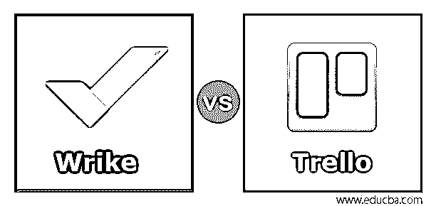
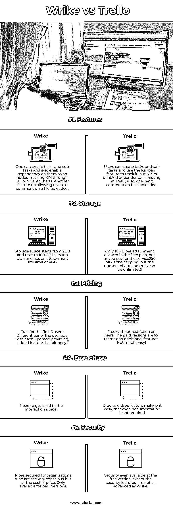

# wrike vs trello

> 原文：<https://www.educba.com/wrike-vs-trello/>

## Wrike 和 Trello 的区别

从项目管理工具的角度来看，在您阅读本文时，我们假设您在 Wrike 和 Trello 之间徘徊。既然您正在研究项目管理工具，我们假设您正面临着一次管理太多项目的困难。这个场景肯定是真实的。你不是唯一一个感到一次管理许多项目的痛苦的人，并且渴望一种工具来减轻一些重复的任务和一些与提醒相关的任务。这是项目管理工具市场上的两个大玩家，它们受到许多不同类型的知名组织的信任，这些产品以其用户友好的界面和全面的功能集而闻名。所以，让我们在他们之间安排一场比赛，看看谁是赢家。在本主题中，我们将了解 Wrike vs Trello。

### Wrike 和 Trello 的对决(信息图)

以下是 Wrike 和 Trello 之间的主要区别。

<small>网页开发、编程语言、软件测试&其他</small>

### Wrike 与 Trello 的主要区别

在 Wrike 和 Trello 之间的战斗中，我们将在不同的基础上比较这两种工具，并根据每种类型的表现对它们进行评估，并在评估结束时判定获胜者。最后，我们会看看哪种工具胜出，并了解是以微弱优势还是以较大优势胜出。

比较两个竞争者的第一个类型是特征。在这里，我们将讨论 Wrike 和 Trello 各自引入项目管理的特性。尽管这两种工具的基线特性是完全相同的，因为它们都是为了解决项目管理的问题，但是一些额外的特性使它们有所不同，这就是我们在这里要讨论的。Wrike 允许你创建任务和子任务。创建后，可以将它们分配给人员，还可以创建依赖关系。这些依赖关系将确保需要完成一个任务才能开始下一个任务，从而让您可以轻松地监视计划的进度。在功能列表中，Wrike 通过定制的校对功能为用户提供了对文件和视频点的评论。相反，特雷罗有一个看板。人们可以创建任务和子任务，但是 Trello 缺乏依赖管理，除了任务可以用不同的颜色或标签进行标记。Trello 缺少评论文件的功能！所以，在这一轮结束时，我们会给 Wrike 先进的功能集加分！

工具竞争的下一个领域是存储。对于 Wrike，存储空间从 2GB 开始，在其顶级计划中上升到 100 GB，并有 4GB 的附件大小限制。相反，Trello 的免费计划每个附件只有 10MB 的限额，但是当你为服务付费时，限额是 250 MB，但是附件的数量可以是无限的！对于这一轮，这仅仅是从组织的用户角度来看，因此我们称之为竞争者之间的平局。

第三种类型是关于价格。Wrike 为 5 名用户提供免费使用，并发布该计划从每个用户每月 9.8 美元开始，随着层级的不断增加，越来越多的独家功能开始解锁。另一方面，Trello 只对一些功能提供免费选项，没有用户限制。当你付钱的时候，限制就消失了！成为付费用户后，您可以使用所有功能。所以，这一轮，将是特雷诺！

第四类是易用性。从 Wrike 开始很简单。您有一个简单的注册流程，然后邀请您的同事进行协作，最后设置协作工作区。虽然使用起来很简单，但需要用户花时间来适应。Trello 只需要几分钟就能弄清楚，从那以后你就不需要任何文档了。只需使用拖放，就这么简单！这一轮是以特雷罗的名义。

第五轮是在安全和隐私方面，这对于大量处理知识产权的组织来说是最重要的！Wrike 提供了一个全面的安全功能列表，保护您免受网络犯罪。但同样，它仅在企业计划中可用，在定价方面远远高于企业计划。这种安全性包括 SAML 2.0、审计报告、TLS v1.2 加密，以及符合 EU-美国隐私保护条例！Trello 甚至在免费计划中提供基本的安全性，随着我们转向付费计划，有更多的安全功能，如 Google SSO、受限域邀请等等。这一轮将是一场艰苦的比赛，因为 Trello 甚至以免费的价格提供安全保障，但 Wrike 提供的安全水平太严格了。因此，在网络犯罪的时代，对于所有有安全意识的人来说，我们会在这一轮给 Wrike 一个分数。

### Wrike vs Trello 对比表

为了便于理解，让我们通过一个比较表来看看 Wrike 和 Trello 之间的更多差异:

| 型 | wrike | 特雷罗 |
| **特性** | 用户可以创建任务和子任务，还可以通过内置的甘特图将对它们的依赖作为一个附加的跟踪 KPI。另一个功能是允许用户评论上传的文件。 | 用户可以创建任务和子任务，并使用看板功能来跟踪它们，但是 Trello 中缺少启用相关性的 KPI。还有，不能评论上传的文件。 |
| **存储** | 存储空间从 2GB 开始，在其顶层计划中增加到 100 GB，附件大小限制为 4GB | 在免费计划中，每个附件只允许有 10MB，但是当你为服务付费时，250 MB 是上限，但是附件的数量可以是无限的！ |
| **定价** | 前 5 名用户免费。不同等级的升级，每个升级都提供附加功能。有点贵！ | 免费，对用户没有限制。付费版本是为团队和附加功能。不贵！ |
| **易用性** | 需要习惯互动空间。 | 拖放功能使之变得简单，甚至不需要文档。 |
| **安全** | 对于有安全意识的组织来说更安全，但代价是价格昂贵。仅适用于付费版本 | 除了安全功能之外，免费版的安全性也不如 Wrike 先进 |

### 结论

总之，通过上面我们看到的两个竞争者之间的斗争，我们看到他们之间有一个平局，现在由用户来决定哪一个最适合他们正在处理的行业类型。Wrike 是为所有那些想要更好的安全功能，需要高上传容量以及酷的功能，并且不介意多花点钱的人准备的！但是对于那些想保持简单并且不需要太多功能的人来说，Trello 可以完成这个任务。非常适合视觉思考者！此外，Trello 的一个额外优势是，除了桌面和云之外，该功能甚至可用于移动设备！

### 推荐文章

这是 Wrike vs Trello 的攻略。在这里，我们讨论 Wrike 和 Trello 的主要区别，用信息图和比较表进行面对面的比较。您也可以看看以下文章，了解更多信息–

1.  [GitLab vs 吉拉](https://www.educba.com/gitlab-vs-jira/)
2.  [吉拉 vs 特雷罗](https://www.educba.com/jira-vs-trello/)
3.  [Django vs Rails](https://www.educba.com/django-vs-rails/)
4.  [CDMA vs GSM](https://www.educba.com/cdma-vs-gsm/)

