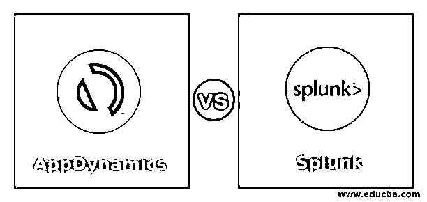
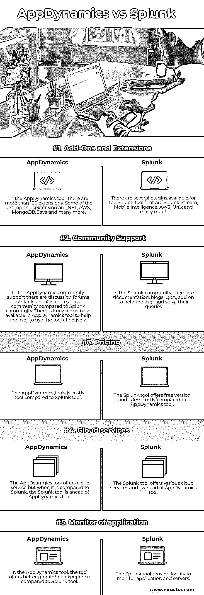

# AppDynamics 与 Splunk

> 原文：<https://www.educba.com/appdynamics-vs-splunk/>

## AppDynamics 与 Splunk 的区别

AppDynamics 与 Splunk 相比，AppDynamics 被定义为用于监控应用程序中进行的事务的工具。该工具主要用于生产环境，帮助向开发人员提供完整的事务细节。AppDynamics 工具的另一个用途是监控应用程序。另一个工具是 Splunk 工具，它也用于监控应用程序性能。用户完全有权监控性能并采取适当的措施。下一节将提到这两种工具之间的一些差异。

### AppDynamics 与 Splunk 的直接对比(信息图表)

以下是 AppDynamics 和 Splunk 之间的主要比较。

<small>网页开发、编程语言、软件测试&其他</small>

### AppDynamics 与 Splunk 的主要区别

让我们研究一下 AppDynamics 和 Splunk 之间的一些重要差异:

#### 应用程序监控

这两种工具都用于应用程序监控。但是当我们比较这两种工具时，更好的软件是 AppDynamics。与 Splunk 工具相比，AppDynamics 工具提供了更好的应用程序监控体验，并且易于使用。AppDynamics 工具中有一个内置功能，可以检测网络服务器上自动出现的应用程序，并监控服务器的性能。在 AppDynamics 工具中，可以在粒度级别完成监控过程。在 Splunk 工具中，机器学习算法用于检测模式，然后检测应用程序中的性能问题。可以使用 Splunk 工具计算当前数据使用量，并预测与应用程序性能相关的问题。

#### 云监控

随着组织转向云服务，始终需要监控云基础架构。应用程序监控中使用的所有平台都需要具备监控云基础架构的功能。这两种工具都能够提供这种功能来支持云服务监控。在 AppDynamics 工具中，用户可以实时监控云服务性能。用户还可以监控吞吐量和交易量。另一方面，在 Splunk 工具中，用户可以管理云服务、混合服务以及从一个位置到另一个位置的云缓解。当遇到任何性能问题时，用户可以借助 Splunk 工具进行故障排除。Splunk 工具具有高级功能，用户可以监控云资源消耗的成本，并据此规划未来需求，因此它使 Splunk 工具领先于 AppDynamics 工具，因为 Splunk 工具中没有该功能。

#### 服务器监控

在现代网络时代，监控服务器是一项基本要求，因为许多组织关心服务器的健康状况，并确保它们始终可用。为此，Splunk 和 AppDynamics。AppDynamics 工具提供了检查服务器健康状况的工具，还可以监控性能并确保它们都连接良好。一旦发现任何问题，都可以立即解决。Splunk 工具还提供了确保服务器健康并报告任何问题(如果存在)的工具。该工具还能够测量延迟问题和负载，以便可以轻松解决问题。这两个工具都提供了一个仪表板，用户可以在其中查看 CPU 使用情况和日志数据。统计数据以图表的形式显示，这样可以更好地了解服务器的性能。该图还显示了 CPU % & ROI %。Splunk 工具的主要目的是确保服务器始终可用。因为 Splunk 工具提供了各种功能，但 AppDynamics 工具仍然提供了比 Splunk 工具更好的体验。

#### 自动发现

当我们在自动发现的基础上比较 AppDynamics 工具和 Splunk 工具时，AppDynamics 工具始终占据上风。AppDynamics 工具提供了自动发现和显示用户之间存在的可视连接的工具。应用程序的完整网络可以很容易地显示在 AppDynamics 工具中。另一方面，Splunk 没有这项功能。用户看不到完整的网络，也看不到 AppDynamics 用户在其中拥有此功能。

#### 社区支持

社区对任何产品的支持对于提升应用程序的性能都非常重要。社区支持有助于更好地理解产品，也有助于提高监控技能。在 AppDynamic 社区支持中，有论坛可用，与 Splunk 社区相比，它是一个更活跃的社区。AppDynamics 工具中有一个知识库，可帮助用户有效地使用该工具。在 Splunk 社区中，有文档、博客、问答、插件来帮助用户并解决他们的疑问。当我们在活跃性的基础上比较两个工具社区时，AppDynamics 工具领先于 Splunk，但是当我们在更好的社区支持的基础上比较时，Splunk 社区工具具有更好的结果。

### AppDynamics 与 Splunk 对比表

下面是对比表:

| **因子** | **AppDynamics** | **Splunk** |
| **附件和扩展** | 在 AppDynamics 工具中，有超过 130 个扩展。扩展的一些例子是。NET、AWS、MongoDB、Java 等等。 | Splunk 工具有多个可用的插件，包括 Splunk Stream、Mobile Intelligence、AWS、Unix 等等 |
| **社区支持** | 在 AppDynamic 社区支持中，有论坛可用，与 Splunk 社区相比，它是一个更活跃的社区。AppDynamics 工具中有一个知识库，可帮助用户有效地使用该工具。 | 在 Splunk 社区中，有文档、博客、问答、插件来帮助用户并解决他们的疑问 |
| **定价** | 与 Splunk 工具相比，AppDyanmics 工具是一种昂贵的工具。 | Splunk 工具提供免费版本，与 AppDynamics 工具相比成本更低。 |
| **云服务** | AppDynamics 工具提供云服务，但与 Splunk 相比，Splunk 工具领先于 AppDynamics 工具。 | Splunk 工具提供各种云服务，领先于 AppDynamics 工具。 |
| **应用程序监视器** | 在 AppDynamics 工具中，与 Splunk 工具相比，工具提供了更好的监控体验。 | Splunk 工具提供了监控应用程序和服务器的工具。 |

### 结论

AppDynamics 工具和 Splunk 工具都是用于监控应用性能的强大工具，如果用户想要最佳的监控体验，AppDynamics 工具始终是完美的解决方案。与 Splunk 工具相比，AppDynamics 提供了更好的用户体验。在这两种工具中选择合适的工具完全取决于用户需求和使用该工具的应用程序类型。

### 推荐文章

这是 AppDynamics 与 Splunk 的对比指南。在这里，我们讨论 AppDynamics 与 Splunk 之间的区别、主要差异和比较表。您也可以浏览我们的其他相关文章，了解更多信息——

1.  [什么是 Splunk 工具？](https://www.educba.com/what-is-splunk-tool/)
2.  [如何安装 Splunk](https://www.educba.com/install-splunk/)
3.  [Splunk 替代品](https://www.educba.com/splunk-alternatives/)
4.  [Splunk 开源了吗？](https://www.educba.com/is-splunk-open-source/)

