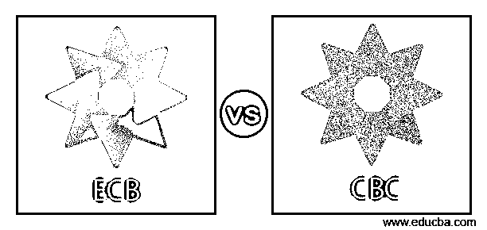

# 欧洲央行 vs 加拿大央行

> 原文：<https://www.educba.com/ecb-vs-cbc/>

## ECB 与 CBC 的区别

ECB 和 CBC 是算法模式，两者都使用分组密码。分组密码是一种一次加密一个文本块的技术，解密也是一次加密一个文本块。算法模式是分组密码的一系列基本算法步骤和来自先前步骤的某种反馈的组合。ECB 代表电子密码本，而 CBC 代表密码块链接。ECB 适合加密小消息，而使用 CBC 我们可以加密大消息。在这个话题中，我们将学习 ECB 和 CBC。

### ECB 是什么？

ECB(电子码本)是最简单的操作模式。在这种算法模式中，在发送方站点，纯文本消息被分成每个 64 位的子块。然后每个子块被独立加密。为了加密所有块，使用相同的密钥并生成密文。在接收方，输入的密文被分成每个 64 比特的子块，然后用于加密的相同密钥被用于解密密文块并生成相应的明文块。由于相同的密钥用于加密所有块，如果明文块在原始消息中重复，则相应的密文也将重复。因此，欧洲央行被用来传递小信息。

<small>网页开发、编程语言、软件测试&其他</small>

### 什么是 CBC？

CBC (Cipher Block Chaining)模式适用于分组密码，它确保即使明文块重复，也会为相应的明文块生成不同的密文。为了实现这一点，CBC 使用了反馈机制。明文消息被分成每个 64 位的子块，然后第一个明文块和 IV 使用 XOR 合并，然后使用密钥加密以产生密文。然后，使用 XOR 将密文的第一个块和明文的第二个块组合起来，然后使用密钥进行加密，对所有块继续进行相同的操作。相同的密钥用于所有块。

在接收方，使用用于加密的相同密钥对密文的第一个块进行解密，然后使用 XOR 将结果和 IV 相结合，并生成纯文本块。第二密文块也使用相同的密钥解密，然后使用 XOR 将结果与第一密文块组合，并生成第二明文块。对所有块都是如此。

### 欧洲央行与加拿大央行的直接对比(信息图表)

以下是欧洲央行和加拿大央行的主要区别。

### ECB 和 CBC 的主要区别

*   ECB 代表电子密码本，而 CBC 代表密码块链接
*   ECB 用于传输单个值，而 CBC 模式用于文本认证块
*   在 ECB 中，加密的每个密文块独立于其他密码块，而在 CBC 中，每个密文块依赖于相应的当前输入明文以及先前的明文块
*   ECB 既不使用 IV 因子也不执行 XOR 运算，而 CBC 同时使用 IV 因子和 XOR 运算。电子密码块使用反馈机制，而密码块链接使用反馈机制。
*   如果明文块在原始消息中重复，则 ECB 为相应的明文块生成相同的密文块，而 CBC 为相应的明文块生成不同的密文块。
*   在 ECB 模式下，破译密文的机会更容易，因此它仅用于加密小消息，而在 CBC 模式下，破译密文的机会相当艰难，它可用于加密大消息。

### ECB 和 CBC 的比较表

下面是比较表，列出了欧洲中央银行和中央银行的区别。

| **Sr 号** | 欧洲央行 | **CBC** |
| One | ECB 代表电子代码簿 | CBC 代表密码块链接 |
| Two | 它用于以安全的方式传输单个值 | 它用于加密文本认证块。 |
| Three | 它适用于加密小消息 | 它适用于加密大消息。 |
| Four | 在 ECB 模式下，很容易解码密文。 | 在 CBC 中，攻击者很难破译密文。 |
| Five | 如果明文块在原始消息中重复，相应的密文块也将在加密消息中重复 | 如果明文块在原始消息中重复，CBC 将为重复的明文块生成不同的密文块。 |
| Six | 欧洲央行没有利用反馈机制 | CBC 利用反馈机制。 |
| Seven | 在 CBC 中，密文的每个块都是独立于其他块的 | 在 CBC 中，每个密文块都依赖于相应的当前输入明文块以及前一个明文块 |
| Eight | ECB 不使用 IV(初始化向量) | CBC 使用 IV(初始化向量)。 |
| Nine | ECB 不执行 XOR 运算 | CBC 执行异或运算。 |

### 结论

在本文中，我们已经了解了什么是 EBC 和 CBC，以及它们之间的主要区别。我们希望这篇文章对您有所帮助。

### 推荐文章

这是欧洲央行与加拿大央行的对比指南。在这里，我们通过信息图表和比较表来讨论 ECB 和 CBC 的主要区别。您也可以看看以下文章，了解更多信息–

1.  [UMTS vs LTE](https://www.educba.com/umts-vs-lte/)
2.  [鲍尔 vs npm](https://www.educba.com/bower-vs-npm/)
3.  [GNSS vs GPS](https://www.educba.com/gnss-vs-gps/)
4.  [RAML vs Swagger](https://www.educba.com/raml-vs-swagger/)

