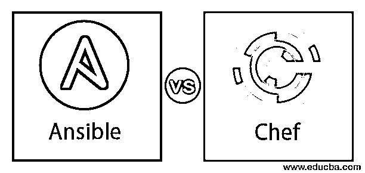

# Ansible vs 厨师

> 原文：<https://www.educba.com/ansible-vs-chef/>

## **ansi ble vs Chef 简介**

DevOps 软件开发技术中有广泛的配置管理(CM)工具。Ansible 和 Chef 就是这样的 CM 工具，让 DevOps 专业人员和系统管理员可以同时管理多台服务器。这些工具用于更轻松有效地执行您的日常任务。在本文中，我们将比较两个最受欢迎的 DevOps 工具，Ansible 和 Chef。这些工具有助于将应用程序和包同时部署到多个服务器上，并重复自动执行任务。Ansible 和 Chef 都是为更轻松地配置、部署和管理服务器而构建的。

### **什么是** Ansible？

*   Ansible 是其母公司 Ansible Works 在 2012 年推出的。
*   Ansible 是一种信息技术自动化工具，可用于配置系统、部署软件和编排高级任务，如连续部署和几乎无停机更新。
*   Ansible 用于自动化应用部署、配置管理、云供应、服务内和多节点协调、任务执行和其他 IT 任务。
*   与其他配置管理工具相比，Ansible 非常易于使用、轻量级且部署速度快。
*   Ansible 完全使用 Python 编程语言构建，只需要 Python 库进行配置。
*   相比之下，Chef 需要对 Ruby 有全面的了解。
*   Ansible 将困难的任务转化为可重复的剧本。
*   Ansible 的控制机器必须是 Unix 或 Linux 主机。
*   Ansible 可以运行在几乎所有的云服务提供商上，如亚马逊 Web 服务、谷歌云平台、微软 Azure、VMware、IBM Cloud 等。

### 厨师是什么？

*   该厨师是由其母公司 OpsCode 于 2009 年推出的。
*   chef 是旧的配置管理工具 Puppet 的继承者，这种工具很难使用和理解。
*   厨师比 Ansible 老，比 Ansible 有点难用和理解。
*   Chef alike Puppet 是使用 Ruby 编程语言构建的。
*   Chef 的命令行界面(CLI)使用基于 Ruby 的领域特定语言(DSL)。
*   chef 是一个强大的自动化工具，可以将基本功能转换成代码。
*   chef 习惯于在任何环境(无论是云环境还是混合环境)中自动配置、部署和管理整个网络的基础架构，而不管其规模如何。
*   Chef 遵循主代理架构，也有一个主服务器。
*   主服务器应该由在 Chef 安装期间负责的工作站控制。
*   安全套接字外壳(ssh)被刀具用来从各自的工作站安装各种代理。
*   主服务器对受管节点的身份验证是使用证书完成的。
*   Chef 还可以在几乎所有的云服务提供商上运行，如亚马逊网络服务、谷歌云平台、微软 Azure、VMware、IBM Cloud 等。

### Ansible 和 Chef 之间的直接差异(信息图表)

下面是 Ansible 和 Chef 的主要区别。

<small>网页开发、编程语言、软件测试&其他</small>

### **关键**差异**责任** vs **主厨**

**我们来讨论一下 Ansible 和 Chef 的一些主要区别:**

*   Ansible 是配置管理(CM)过程的一个简单得多的方法。
*   Ansible 的配置文件称为剧本，而 Chef 的配置文件称为食谱。
*   Ansible 的剧本易于理解和使用。
*   Ansible 有一个无代理的模型，不像 Chef。而 Chef 遵循主服务器架构。这使得 Ansible 的安装比厨师简单得多。
*   Chef 有一个主服务器和多个客户端实例，Ansible 在服务器上只有一个主服务器。
*   Chef 中的所有配置都经过测试，并存储在一个名为 Workstation 的附加组件中。
*   Ansible 使用安全套接字外壳(ssh)连接登录客户端机器。
*   Ansible 使用 OpenSSH 实现通过 SSH 网络管理远程连接。
*   亚马逊 Web 服务、谷歌云平台、微软 Azure、VMware、IBM Cloud 等大多数云平台都支持 SSH 联网。
*   这使得 Ansible 可以更快地部署，从而使它更加简单易用。
*   出于业务目的，Ansible Premium 提供了一个非常易于使用的控制面板，用于管理访问控制、监视正在运行的作业以及查看服务器状态。
*   Chef 的使用需要非常好的基于 Ruby 的领域特定语言(DSL)知识，这对于使用和理解来说非常困难。
*   Ansible 可以使用简单的命令从命令行运行。Ansible 使用另一种标记语言(YAML)来管理配置，这种语言更像普通英语，易于理解。
*   Ansible 每个节点收费 100 美元，而 Chef 每年收取 137 美元的自动化费用。
*   当主服务器宕机时，Ansible 和 Chef 的工作原理类似，即它会在备份服务器上工作。
*   Chef 和 Ansible 具有相似的可伸缩性。
*   Ansible 和 Chef 都可以在 Windows 和 Linux 或 Unix 平台上很好地工作。

### Ansible 与 Chef 对比表

对比表解释如下:

| **比较** | **可回答的** | **厨师** |
| 建立 | 它可以很容易地设置和安装 | 它的设置和安装相当复杂 |
| 有效性 | 这很容易得到 | 它也很容易获得 |
| 配置语言 | 它是在 Python 平台上编写的，支持更像普通英语的 YAML 命令 | 它是用 Ruby 编写的，支持复杂难懂的 Ruby DSL |
| 体系结构 | 它遵循单一服务器架构 | 它遵循主服务器架构 |
| 易于管理 | 它提供了高度的易管理性 | 它的管理有点复杂 |
| 可量测性 | 它是高度可扩展的 | 它也是高度可扩展的 |
| 配置 | 安全套接字外壳(SSH)系统用于节点配置 | Chef 服务器由主 Chef 服务器配置，Chef 客户端由客户端机器配置 |
| 客户端配置 | 它不需要任何虚拟机来进行客户端配置 | 它有一个工具，工作站来配置客户端机器 |
| 互用性 | 它在 Windows 和 Linux 或 Unix 上运行良好，具有很高的互操作性 | 它在 Windows 和 Linux 或 Unix 上运行良好，具有很高的互操作性 |
| 证明文件 | 它是新的，没有好的文档 | 它是旧的，并有适当的文件 |
| 配置分布 | 节点上的配置分发是通过推和拉过程完成的 | 节点上的配置分发仅通过拉取过程来完成 |
| 安全性 | 它是高度安全的安全套接字外壳(SSH) | 没那么安全 |
| 定价(年度) | 每 100 个节点 10000 美元 | 每 100 个节点 13700 美元 |

### **结论**

Ansible 和 Chef 都是当今市场上最流行的配置管理(CM)工具。两者各有利弊。在 Ansible 和 Chef 之间根据各自的需求和方便程度进行选择，这是开发者或企业的决定。

### 推荐文章

这是 Ansible vs Chef 的指南。这里我们讨论 Ansible vs Chef 的介绍，主要区别和比较表。您也可以浏览我们推荐的其他文章，了解更多信息——

1.  Ansible 是免费的吗？
2.  什么是 Ansible？
3.  [詹金斯 vs 哈德森](https://www.educba.com/jenkins-vs-hudson/)
4.  [ROLAP vs MOLAP vs HOLAP](https://www.educba.com/rolap-vs-molap-vs-holap/)

