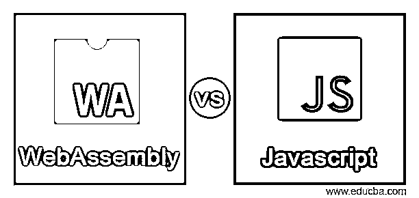

# WebAssembly vs Javascript

> 原文：<https://www.educba.com/webassembly-vs-javascript/>

## WebAssembly vs Javascript 简介

Webassembly vs Javascript 的定义是，Webassembly 是一种新型代码，它具有紧凑的二进制代码格式，可以在现代 web 浏览器上运行，它就像一种低级汇编语言，允许程序和它们的宿主环境之间的交互，而 Javascript 是一种脚本语言，可以在客户端和服务器端的 web 开发中使用，它允许我们制作动态和有吸引力的网页， 它的功能可能会在提交之前检查一个 web 表单，并确保它的所有字段都已填充。

### WebAssembly 与 Javascript 的直接比较(信息图表)

以下是 WebAssembly 与 Javascript 之间的 10 大区别:

<small>网页开发、编程语言、软件测试&其他</small>

### Webassembly 与 Javascript 的比较表

| **序号** | **网络组装** | **Javascript** |
| 1. | 它由 W3C、Mozilla、微软、谷歌、苹果开发。 | 然而，它是由网景公司开发的。 |
| 2. | 在网页浏览器中，它有更快的加载时间，因为它只需要加载已经编译好的文件。 | 然而，加载 JavaScript 比 webassembly 慢，因为浏览器需要加载所有的。js”文件，这些文件是叙述性的。 |
| 3. | webassembly 中代码的执行速度比 Javascript 快。 | 然而，Javascript 中代码的执行速度较慢。 |
| 4. | 它不是一种编程语言。 | 它是一种编程语言。 |
| 5. | Webassembly 允许在浏览器上执行用 c 或 c++编写的应用程序，它提供了一个运行在 Javascript 环境顶层的虚拟机。 | 然而，它不是为支持本地应用程序而设计的，也不是为面向基础设施而设计的，以符合其目标。 |
| 6. | 它通过小型二进制格式来传递输出。 | 其中 Javascript 以人类可读的格式交付其输出。 |
| 7. | 只是更快了。 | 但是它非常灵活。 |
| 8. | 这使得可以查看、调试和手工编写代码，因为它是强类型的。 | 另一方面，它是动态类型的，因为它不需要在使用变量之前显式声明变量。 |
| 9. | 它被设计为独立地在其环境以及其他环境中执行和集成。 | 其中它主要用于验证，允许执行复杂的动作，也允许不同网站之间的交互。 |
| 10. | 它的目的是在网页上实现高性能的应用程序。 | 然而，这为网站增加了动态和互动的元素，而这正是 webassembly 的目的。 |

### Webassembly 与 Javascript 的主要区别

*   **性能和加载时间:**

在 Javascript 中，当我们调用它内部的浏览器时，它的文件首先被下载，然后被解析，之后，源代码在解析器的帮助下被转换成字节码，在浏览器中，Javascript 引擎执行代码，Javascript 引擎非常强大，因此与 webassembly 相比，性能和加载时间非常快。

*   **编码:**

我们可以很容易地用 Javascript 编写代码，我们编写的代码是人类可读的格式，可以保存在。js 文件格式，当我们想在浏览器中使用它时，我们需要使用一个标签，如

*   **执行:**

webassembly 中代码的执行速度仅比 Javascript 中代码的执行速度慢 20%，webassembly 的执行速度比 JavaScript 快， 如果我们有一些包含函数的源代码，那么首先需要对其进行解析，然后将所有字符串转换为标记，并生成抽象语法树。当生成抽象语法树时，V8 将直接进入机器码，然后机器码生成，然后我们必须编译函数。没有必要尝试提高速度，相反， 在编译过程中，web assembly 已经进行了优化，因此不需要解析，而且我们有一个优化的二进制文件，它可以直接挂钩到后端，然后生成机器代码，在前端，所有的优化都由编译器完成，这意味着 web assembly 的执行比 JavaScript 更有效，因为它在这个过程中有几个步骤。

*   **内存管理:**

在 JavaScript 中，可以进行内存分配，当变量已被创建且内存未被使用时，它会释放内存并将该内存添加到垃圾收集中，而 webassembly 将内存存储在保存相关数据的数组缓冲区中，通过使用 Javascript API，我们可以在 webassembly 中分配内存， 它以数组的形式存储内存，称为平面内存模型，这种模型很容易理解，有助于执行，但它的计算非常复杂，需要更多的时间，而且它不支持垃圾收集，因为内存不能重用，所以在这种情况下内存被浪费了，所以我们可以说这是 webassembly 的缺点。

*   **调试:**

Javascript 以人类可读的格式提供输出，它可以很容易地进行调试，我们还可以在 Javascript 代码中添加断点，并且在浏览器中，它的代码可以很容易地进行调试，而在 webassembly 中，代码是文本格式的，可以很容易地阅读，但很难进行调试，在浏览器中，Firefox 将允许我们查看 webassembly 的代码。wat "格式，它不允许在"中添加断点。它的“wat”文件，将来它可能是可用的。

### 结论

在本文中，我们得出的结论是，web assembly 的性能是 web 的低级字节码，它比 Javascript 更快更高效，加载时间和执行时间也比 JavaScript 更快，正如我们在比较中看到的那样，web assembly 可能会取代 JavaScript。

### 推荐文章

这是一个 WebAssembly vs Javascript 的指南。这里我们分别用信息图和比较表来讨论 WebAssembly 和 Javascript 的主要区别。您也可以看看以下文章，了解更多信息–

1.  [Lua vs JavaScript](https://www.educba.com/lua-vs-javascript/)
2.  [Dart vs JavaScript](https://www.educba.com/dart-vs-javascript/)
3.  [CSS vs JavaScript](https://www.educba.com/css-vs-javascript/)
4.  [JSP vs JavaScript](https://www.educba.com/jsp-vs-javascript/)

