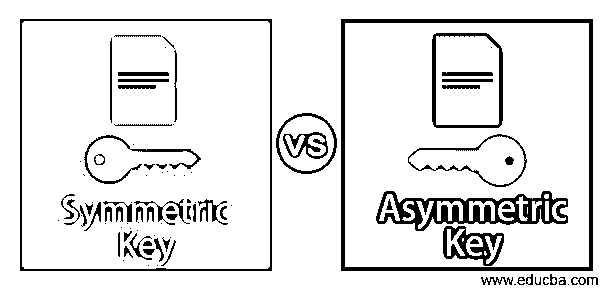

# 对称密钥与非对称密钥

> 原文：<https://www.educba.com/symmetric-key-vs-asymmetric-key/>

## 对称密钥和非对称密钥的区别

数据保护，尤其是现代通信网络的数据保护，已经成为一个巨大的问题，留下的漏洞可能会被利用来造成灾难性的后果。本文介绍对称和非对称加密中使用的两种常见加密方法，以加强通信安全性。理论上，继续讨论的最佳方式是从基础开始。因此，我们将看看算法的定义和密码学中的关键概念，然后深入讨论关键部分。在本主题中，我们将学习对称密钥和非对称密钥。

### 什么是对称密钥？

对称加密是一种常见的加密形式。这也是两种方法中最简单的一种。对称加密是使用一个所有各方都知道的“对称码”的隐藏密钥来实现的密钥用于加密信息和解码信息。发送方在消息发送之前使用这个密钥，接收方用它来解码编码的信件。

<small>网页开发、编程语言、软件测试&其他</small>

这是一个非常简单的过程，因此不需要太多时间。传输大量数据时，最好使用对称密钥。对称加密的一个很好的例子恰好是凯撒密码。AS、RC4、3DES、DES、Blowfish、QUAD 用于对称加密的现代方法。

### 什么是非对称密钥？

非对称加密是一种现代而复杂的加密方式。复杂，因为它需要两个加密密钥来实施数据保护。这些密钥被称为公钥。顾名思义，所有想要发送消息的人都可以使用公钥。另一方面，公钥的所有者保管着私钥。

可访问密钥对要转发的信息进行加密。它使用一种特殊的算法。接收者拥有的秘密密钥然后解密它。这两个过程基于相同的算法。

### 对称密钥与非对称密钥的直接比较(信息图表)

下面是对称密钥和非对称密钥之间的主要区别

### 对称密钥与非对称密钥的密钥差异

以下是对称密钥与非对称密钥之间的一些差异:

1.  对称加密使用单个密钥进行消息加密和解密。然而，在非对称加密中，发送方使用公共加密密钥和私有解密密钥。
2.  与对称编码算法相比，非对称算法的执行速度较慢。这是由于非对称加密藻类更复杂和繁重的计算负担。
3.  最广泛使用的对称编码算法是 3DES、DES、RC4 和 AES。相比之下，最流行非对称加密算法是 Diffie-Hellman 和 RSA。
4.  非对称加密通常用于交换密钥，但是对于传输大量数据，可以使用对称加密。
5.  对称和非对称加密广泛用于许多应用中。安全套接字层(SSL)和加密传输层安全(TLS)协议是这种混合系统的常见示例，它们被构建来确保因特网上的受保护通信。不幸的是，SSL 协议现在被认为是危险的，它们的使用将停止。相比之下，所有主要的网络浏览器都发现 TLS 协议是安全的，并且被广泛使用。

### 对称密钥与非对称密钥对照表

现在，让我们在下表中进行比较

| **对称密钥** | **非对称密钥** |
| 对于解密和加密，只有一个密钥可用。 | 加密一个和解密另一个需要两个密钥。 |
| 密文大小小于或等于原文。 | 密文大小等于或大于原始纯文本。 |
| 它用于存储大量数据。 | 它用于传输少量信息。 |
| 对称密钥存储在相应的应用程序中，如果找到，可以用来伪造软件许可证 | 非对称密钥不允许攻击者为他人伪造许可证。 |
| 它唯一提供的就是匿名。 | 这保证了机密性、真实性和不可否认性。 |
| 对称加密是一个简单的过程，因为与非对称加密相反，只需要一个密钥就可以执行所有操作。 | 这是一个非常复杂的活动，因为输入来自单独的密钥加密和解密。 |
| 由于它们的简化性质，这两种操作都可以非常容易地进行。 | 因为两个不同的密钥被加密和解密，并且匹配它们的过程使其成为相当慢的方法。 |

### 结论

想象一个游戏，两个人(不对称对对称)试图抓住对方。每当被捕获的人遇到跑步者时，他/她的步伐会加快，以免被捕获。这正是目前在网络安全领域发生的事情。开发人员在这种情况下开发新的算法，以保持不断改进的网络犯罪分子。科技行业的消费者也必须接受最新的发展。因此，在本文中，我们已经了解了什么是对称密钥和非对称密钥，以及它们之间的密钥差异。

### 推荐文章

这是对称密钥和非对称密钥的指南。这里我们用信息图和比较表来讨论对称密钥和非对称密钥的区别。您也可以看看以下文章，了解更多信息–

1.  [主键 vs 外键](https://www.educba.com/primary-key-vs-foreign-key/)
2.  [CDMA VS LTE](https://www.educba.com/cdma-vs-lte/)
3.  [LTE 与 WIFI](https://www.educba.com/lte-vs-wifi/)
4.  [Yammer vs Slack](https://www.educba.com/yammer-vs-slack/)

