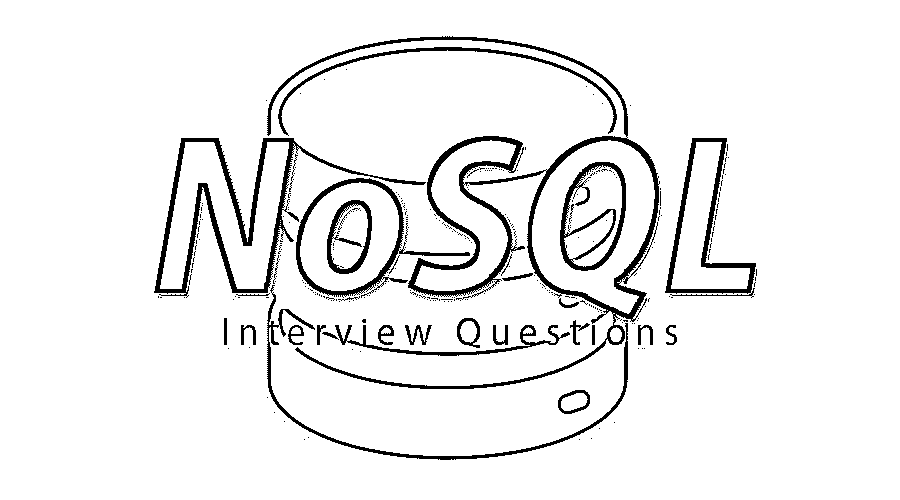

# NoSQL 面试问题

> 原文：<https://www.educba.com/nosql-interview-questions/>

## NoSQL 面试问答介绍

NoSQL 代表“不仅仅是 SQL”。NoSQL 是为大型数据集设计的。这些数据库是灵活的，因为它们存储和处理非结构化、半结构化的数据，这些数据在 RDBMS 的处理中是不用户友好的。NoSQL 帮助处理实时网络应用中的大数据。大型组织如谷歌、亚马逊、脸书等都在使用 NoSQL 数据库来处理他们庞大的数据集。

如果你想找一份与 NoSQL 相关的工作，你需要准备 2022 年 NoSQL 的面试问题。虽然每个面试都是不同的，工作范围也是不同的，但我们可以帮助你解决 NoSQL 面试中的问题和答案，这将帮助你在面试中取得成功。

<small>网页开发、编程语言、软件测试&其他</small>

以下是 NoSQL 面试问题和答案的列表。这些问题分为以下两部分:

### 第 1 部分-NoSQL 面试问题(基础)

这第一部分包括基本的 NoSQL 面试问题和答案。

#### 1.你说的 NoSQL 是什么意思？

**答案:**

NoSQL 代表“不仅是 SQL”，但它也是由于传统数据库的一些限制和挑战而演变的。NoSQL 数据库旨在处理大型分布式数据集。NoSQL 数据库高度灵活；它们允许我们存储和处理非结构化和半结构化的数据，而这些数据是使用关系数据库系统(RDBMS)无法轻松处理的。这些数据库基本上用于处理[实时](https://www.educba.com/real-time-analytics/) web 应用中的大数据。

#### 2.NoSQL 有什么特色？

**答案:**

以下是 NoSQL 的一些特色:

*   **灵活性:** NoSQL 提供了存储结构化、半结构化或非结构化数据的灵活性，这与只允许结构化数据的关系数据库不同。
*   **动态模式:**在 NoSQL，不需要模式定义；这解决了修改模式的问题，其中一个表已经存在大量数据集，并且需要向同一个表中添加新列。
*   **分片:**分片是指将数据分割成更小的数据库，以便更快地访问数据。这个特性存在于 NoSQL 的数据库中，允许我们以最快的速度从服务器获取数据。
*   **通用:**用户可以根据需要定制 NoSQL 数据库。
*   **扩展:** NoSQL 数据库横向扩展；因此，它们的管理成本更低。

让我们转到下一个 NoSQL 面试问题。

#### 3.什么是 CAP 定理？它如何适用于 NoSQL 系统？

**答案:**

这是 NoSQL 在面试中经常被问到的面试问题。CAP 定理指出，分布式架构的应用程序有三个基本要求:

*   **一致性:**任何操作执行前后，数据库中的数据必须一致。例如，在更新操作之后，每个用户都应该看到相同的数据。
*   **可用性:**系统应始终启动并运行；不应该有停机时间。
*   **分区容忍度:**即使服务器之间的通信不可靠，系统也应该工作。
    从理论上讲，不可能同时达到这三个要求。CAP 定理允许分布式系统遵循这些要求中的任意两个。因为分区容差对于分布式数据库是强制性的。因此，我们只剩下 CP(一致性，分区容差)和 AP(可用性，分区容差)。
    AP 系统的一些例子有迪纳摩、[、卡珊德拉](https://www.educba.com/hbase-vs-cassandra/)、简单数据库、CouchDB。
    CP 系统的一些例子有大表、超表、 [Mongo DB](https://www.educba.com/how-to-build-web-applications-using-mongodb/) 、 [HBase](https://www.educba.com/hbase-vs-cassandra/) 。

#### 4.解释区别:RDBMS vs NoSQL？

**答案:**

NoSQL 上空的 RDBMS】

*   更适合结构化和有组织的关系数据。
*   通过规范化组织数据
*   使用结构化查询语言(SQL)，简单易学。
*   维护数据完整性
*   数据及其关系存储在不同的表中。
*   ACID 合规性，即要么提交所有事务，要么不提交任何事务
*   纵向扩展/垂直扩展

【RDBMS 上的 NoSQL:

*   更适合非结构化和不可预测的数据
*   处理[大数据](https://www.educba.com/big-data-vs-data-science/)
*   没有预定义的模式
*   管理成本更低
*   横向扩展/水平扩展
*   基础交易
*   高性能、可用性和可扩展性

### 第 2 部分-NoSQL 面试问题(高级)

现在让我们来看看高级 NoSQL 面试问题。

#### 5.传统 RDBMS 的主要挑战是什么？

**答案:**

以下是 RDBMS 系统面临的一些主要挑战:

*   **未针对横向扩展进行优化:** RDBMS 系统未针对横向扩展进行优化。
*   **不能处理非结构化数据:** RDBMS 系统不能处理无模式数据(半结构化或非结构化)
*   **昂贵:**使用 RDBMS 系统进行数据分析的许可费用很高。
*   **无法处理高速数据接收:** RDBMS 系统是为稳定的数据保留而设计的。

NoSQL 系统的发展是为了克服上述所有挑战。

#### 6.有哪些不同类型的 NoSQL 数据库？

**答案:**

有五种不同类别的 NoSQL 数据库:

*   **文档数据库:**文档数据库包含许多不同的键值对。一个集合包含多组文档，每个文档可以包含不同的或异构的字段。文档数据库也支持嵌套文档。用户可以向文档添加自定义字段(动态数据)。考虑下面的例子:

`Collection
{
personName:”Mr. X”
person phone:”1234”
personAddress:”Andheri”
}`

一些 NoSQL 文档数据库有 [Mongo DB](https://www.educba.com/hadoop-vs-mongodb/) ，Couch DB 等。

*   **列数据库:**在列数据库中，数据存储在按列分组的单元格中，而不是以行的形式。这使我们能够快速检索和访问数据。列族包含无限数量的可在运行时动态创建的列。
    NoSQL 的一些列数据库有 Google 的 Big Table，Apache Cassandra，HBase。
*   **键值存储:**存储键值对的哈希表。Hashtable 包含一个 bucket，它是一组逻辑键。哈希表中的键可以是自动生成的或合成的，而值可以是字符串、JSON 或 BLOB 等。考虑下面的例子，其中键是一个城市，值是该城市的地址。

| **键** | **值** |
| “孟买” | { "印度马哈拉施特拉邦孟买的安德赫里" } |
| “博帕尔” | { "印度中央邦博帕尔新市场" } |
| “浦那” | { "印度马哈拉施特拉邦浦那市哈达普萨尔" } |

一些 NoSQL 的键值存储有:
Redis，CouchBase Server，Amazon 的 Dynamo

*   **缓存系统:**这些类似于键值对。它们将频繁访问的数据存储在内存中，以便快速检索和访问。
    例如:Redis 和 Memcache
*   **图形数据库:**基于图形的数据库被设计用来存储关于数据网络的信息。这些最适合连接的数据。这些数据库用边和节点来表示数据。边连接具有某种关系的节点，节点存储数据。
    NoSQL 图形数据库之一是 Neo4J。

让我们转到下一个 NoSQL 面试问题。

#### 7.NoSQL 与大数据有何关联？

**答案:**

NoSQL 数据库的设计考虑了“大数据”需求。由于固定的模式模型不会将它们绑定在一起，这使得它们适用于当今存在大量非统一数据(大数据)的业务需求。

#### 8.能否用 NoSQL 的一个基地解释一下交易支持？

**答案:**

CAP 定理指出，分布式系统不能同时实现所有三个属性:一致性、可用性和分区容差。基本系统放弃了一致性，同时保持另外两个。尽管存在物理网络分区，基本系统仍能很好地工作，并始终允许客户端进行读写。

*   **基本代表:**
    基本可用
    软态
    最终一致性

### 推荐文章

这是 NoSQL 面试问答列表的指南。在这里，我们列出了最有用的 8 组面试问题，以便求职者能够轻松应对面试。您也可以阅读以下文章，了解更多信息——

1.  [PHP 面试问题](https://www.educba.com/php-interview-questions/)
2.  [SharePoint 面试问题](https://www.educba.com/sharepoint-interview-questions/)

