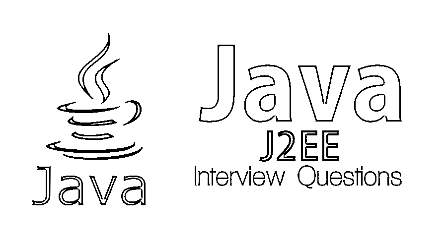

# J2EE 面试问题

> 原文：<https://www.educba.com/j2ee-interview-questions/>

## J2EE 面试问答介绍

你终于在 J2EE 找到了你的[梦想工作](https://www.educba.com/what-is-j2ee/)，但是想知道如何破解 2022 年 J2EE 的面试，以及 J2EE 的面试问题可能是什么。每次面试都不一样，工作范围也不一样。牢记这一点，我们设计了最常见的 J2EE 面试问题和答案，以帮助你在面试中取得成功。

以下是 J2EE 面试中经常被问到的问题:这些顶级面试问题分为以下几个部分:

<small>网页开发、编程语言、软件测试&其他</small>

### 第 1 部分-J2EE 面试问题(基础)

这第一部分包括基本的 J2EE 面试问题和答案。

#### 1.什么是 J2EE？命名其组件和客户端类型。

**答案:**
J2EE 代表 Java 2 企业版。它的功能包括开发多层基于 web 的应用程序。这个平台由一组服务、协议和 API 组成。

**组件有:**

*   **客户端层组件:**这些是在客户端机器上执行的组件
*   Web 层组件:这些组件在 J2EE 服务器上执行。
*   **业务层组件:**它们在 J2EE 服务器上执行
*   企业级系统软件:它们在 EIS 服务器上执行。

**J2EE 客户端类型:**

*   应用程序客户端
*   小应用程序
*   使用 Java web start 技术的支持 Java web 的客户端
*   基于移动信息设备配置文件(俗称 MIDP 技术)的无线客户端

#### 2.struts 上的 MVC 是什么？

**回答:**
MVC，[俗称](https://www.educba.com/what-is-mvc/)模型-视图-控制器，可以详细描述。

*   **模型:**模型用于将系统的内部工作表示为单个实体或多个 Java bean 实体
*   **视图:**通常情况下，Java 视图是使用 JSP (Java Server Pages)技术构建的。
*   **控制器:**这是一个处理器，负责接收客户端请求，并根据请求发送新的用户界面集。框架中的主要组件是“ActionServlet”servlet 类。

让我们继续下面的 J2EE 面试问题。

#### 3.什么是 ORM 及其好处？

**答案:**
这些都是 J2EE 面试中问的基本问题。 [ORM 代表](https://www.educba.com/what-is-orm/)对象关系映射。java 类中的对象与关系数据库表进行映射，使用元数据来描述数据库和对象之间的映射。它将数据从一个对象转换到另一个对象。好处包括:

*   **可维护性:**这确保了 ORM 生成的所有代码都经过了良好的测试，修改功能只是开发人员能做的事情。
*   **生产力:**它最终使用自动代码创建减少了数据级访问编码的时间，这是基于定义的[数据模型工具](https://www.educba.com/data-modeling-tools/)
*   **性能:**ORM 生成的代码用于管理应用程序的数据访问需求。我们不需要创建任何数据访问代码；目前的一个是优化，以加快数据访问过程。
*   **厂商独立性:**ORM 生成的代码是独立于厂商的。这样做是为了增加应用程序的可移植性。

#### 4.解释 save()、Saveorupdate()、load()、get()等重要方法？

**答案:**
hibernate 中使用了 save()方法，用来存储数据库中的对象。重复记录的检查也在插入之前进行。
另一方面，save 或 update()用于使用标识符更新对象。一旦标识符值为空，就可以直接调用 save()方法。
当对象在缓存和数据库中都不可用时，load()抛出异常。它不返回空值。
当对象在数据库或缓存中不可用时，使用 get()，它返回一个空值。

#### 5.春天是什么？解释它的优势和 spring 框架的好处。

**答:**
[Spring 是一款](https://www.educba.com/what-is-spring-framework/)开源的基于 Java 的应用，旨在降低企业应用开发的复杂性。它基于反转控制或依赖注入设计模式。

**使用 Spring 进行应用开发的优势如下:**

*   POJOs(普通旧 Java 对象)的创建已经完成，这有助于开发重用现有的组件。
*   可以通过提高应用程序开发生产率来降低开发成本。
*   依赖注入提高了应用程序的可测试性。
*   它用于通过减少代码耦合来提高可维护性。
*   对应用服务器的需求被最小化，并在企业服务上工作。

**使用 Spring 框架的好处:**

*   Spring 框架允许以一种更有效的方式组织中间层对象。
*   属性初始化很容易。
*   组件测试简单
*   轻型容器
*   Spring framework 提供了在任何架构层的任何运行时环境中配置管理服务的可能性。

### 第 2 部分-J2EE 面试问题(高级)

现在让我们来看看高级 J2EE 面试问题。

#### 6.描述一下 Servlet？

**答:**
servlet 是服务器端组件，用来为创建服务器端程序提供强大的机制。servlets 在许多协议的设计中都是可用的。Servlet 也是独立于平台和服务器的。servlet 中最常用的协议是 HTTP。servlet 也是一个纯 Java 对象。

#### 7.Servlet 生命周期的不同阶段是什么？

**回答:**
[servlet 生命周期的不同阶段](https://www.educba.com/servlet-life-cycle/)是:

*   **类加载阶段:** web 容器用于加载 servlet 类文件(*。类)
*   **实例化阶段:**调用默认的无参数构造函数，servlet 类被实例化。
*   **初始化阶段:**在 servlet 的生命周期中，init()方法在这个阶段只被调用一次。Servlet 配置通常分配给 servlet。
*   **请求处理阶段:**这是 servlets 花费最多时间的阶段。Servlets 通过调用 service()为各种请求提供服务。
*   **移除阶段:**销毁函数用于调用 servlet 销毁。垃圾收集稍后进行。

让我们继续下面的 J2EE 面试问题。

#### 8. [JSP](https://www.educba.com/jsp-interview-questions/) 标签有哪些不同的类型？

**答案:**
JSP 标签有四种不同的类型:

*   指令
*   申报
*   公式
*   剧本

#### 9.解释一下[EJB](https://www.educba.com/what-is-ejb/)的基本和子类型？

**答案:**
这些是高级 J2EE 面试中问的问题。EJB 的两个主要类型和[子类型是:](https://www.educba.com/ejb-interview-questions/)

**—会话 bean:**

*   有状态会话 beans
*   无状态会话 beans

**–实体 bean:**

*   Bean 管理的持久性
*   容器管理的持久性
*   消息驱动的 beans

#### 10.什么是 JSP 指令？

**答:**
它是一种向 web 容器提供关于 JSP 文件的元数据信息的机制。不同类型的 [JSP 指令](https://www.educba.com/jsp-directives/)有:

*   页面指令
*   包含指令
*   Taglib 指令

### 推荐文章

这引导了 J2EE 面试问题和答案的列表。这里我们列出了十个最有用的面试问题，这样求职者可以很容易地通过面试。您也可以阅读以下文章，了解更多信息——

1.  [JSF 面试问题](https://www.educba.com/jsf-interview-questions/)
2.  [熊猫面试问题](https://www.educba.com/pandas-interview-questions/)
3.  [EIGRP 面试问题](https://www.educba.com/eigrp-interview-questions/)
4.  [手机测试面试问题](https://www.educba.com/mobile-testing-interview-questions/)

