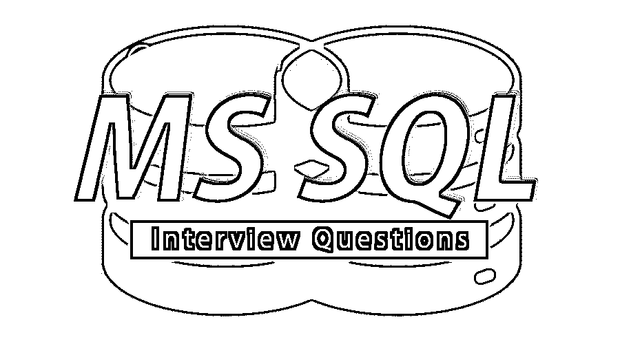

# MS SQL 面试问题

> 原文：<https://www.educba.com/ms-sql-interview-questions/>

## MS SQL 面试问题介绍

如果是找 MS SQL 相关的工作，需要准备 2022 MS SQL 面试题。根据不同的职位描述，每次面试都是不同的。在这里，我们准备了重要的 MS SQL 面试问答，帮助你面试成功。这篇 2022 MS SQL 面试问题的文章将呈现 10 个最重要和最常被问到的 MS SQL 面试问题。这些面试问题分为以下两部分:

### 第 1 部分–MS SQL 面试问题(基础)

第一部分包括基本的面试问题和答案:

<small>网页开发、编程语言、软件测试&其他</small>

#### Q1。什么是 SQL？描述一下 SQL 在 RDBMS 中的重要性？

**答案:**

SQL 是一种结构化查询语言。SQL 用于与数据库通信。SQL 是 RDBMS (关系数据库管理系统)的[心脏。它是用于执行关系数据库中所有操作的语言。当您用 SQL 向 RDBMS 发出命令时，RDBMS 会解释您的命令并采取必要的措施。](https://www.educba.com/what-is-rdbms/)

#### Q2。SQL 和 PL/SQL 有什么区别？

**答案:**

| **SQL** | **PL/SQL** |
| 它是一种结构化查询语言。 | 它是过程语言，是 SQL 的扩展。 |
| 在 SQL 中，一次可以执行一个命令。 | 在 pl/SQL 中，可以一次执行多行代码。 |
| 在 SQL 中，使用 DDL(数据定义语言)、DML(数据操作语言)来执行命令。 | 在 pl/SQL 中，您可以编写包含过程、函数、包等的多行代码。 |
| [SQL 命令](https://www.educba.com/sql-commands-update/)可以在 pl/SQL 中使用。 | Pl/SQL 不能在 SQL 中使用。 |
| An example of SQL is:`Select * from Table_name where condition` | An example of pl/SQL is:`BEGIN
dbms_output.put_line (‘HELLO EDUCBA WORLD’);
END;
/` |

#### Q3。SQL 的主要组成部分是什么？

**答案:**

SQL 的主要组成部分有 DDL，DML，DCL(数据控制语言)，TCL(事务控制语言)。

**数据定义语言:**表格是存储数据的唯一方式；所有的信息都必须以表格的形式排列。假设您想在数据库中存储公司的一些信息(名称、城市)。要存储这些，您需要创建一个表；您可以使用“表格”命令创建表格。

**代码:**

`Create table company (name char (10), city char (10));`

使用 DDL，您还可以改变或删除对象。

**数据操作语言:** DML，顾名思义，允许你操作现有表中的数据。您可以使用 DML 对表进行许多操作，如插入、更新、删除。

*   向表中添加行

**代码:**

`Insert into company values (‘XYZ’, ‘Sydney’);`

*   更新表中的数据

**代码:**

`Update company set city = ‘Melbourne’ where name = ‘XYZ’`

**数据控制语言:**

*   **DCL:** 这允许您控制对数据的访问。
*   **授予:**授予一个或多个用户操作的权限。
*   **撤销:**撤销 grant 语句赋予的访问权限。

**事务控制语言:** TCL 包括提交、回滚、保存指向数据。

#### Q4。delete 和 truncate 命令有什么区别？

**答案:**

*   DELETE 命令可用于从特定表中删除行，WHERE 子句可用于条件。提交和回滚功能可以在 delete 语句之后的 delete 命令上执行。
*   TRUNCATE 用于从表中删除所有行。当使用 Truncate 操作时，它不能回滚。

#### Q5。编写一个 SQL 查询，在不使用 TOP/limit 关键字的情况下从表中查找第三高的薪金？

**答案:**

`Select salary from EDUCBA_Employee E1 WHERE 2 = (Select count (Distinct (E2\. salary))
from EDUCBA_EMPLOYEE E2 where E2\. salary > E1\. salary`

#### Q6。你将如何在 SQL 中执行模式匹配操作？

**答案:**

LIKE 运算符用于模式匹配，它有两种用法。

*   **%:** 匹配零个或多个字符。

**代码:**

`Select * from employee where name like ‘X%’`

*   **_(下划线):**只匹配一个字符。

**代码:**

`Select * from employee where name like ‘XY_’`

#### Q7。编写一个查询来获取以元音结尾的雇员姓名？

**答案:**

**代码:**

`Select EMP_ID, EMP_NAME from EDUCBA_EMPLOYEE where EMP_NAME like '%[aeiou]'`

#### Q8。如何将行从一个表复制到另一个表？

**答案:**

INSERT 命令将用于通过从另一个表中复制向一个表中添加一行。在这种情况下，使用子查询代替 VALUES 子句。

### 第 2 部分–MS SQL 面试问题(高级)

现在让我们来看看高级面试的问题和答案。

#### Q9。WHERE 子句和 HAVING 子句的区别是什么？

**答案:**

HAVING 子句只能与 SELECT 语句一起使用。HAVING 子句与 [GROUP BY 子句](https://www.educba.com/group-by-clause-in-sql/)一起使用，如果不使用 GROUP BY 子句，则 HAVING 子句的行为类似于 WHERE 子句。HAVING 子句仅与 GROUP BY 命令一起使用，而 WHERE 子句应用于 FROM 子句之后、查询中 GROUP BY 函数的一部分之前的每一行。

#### Q10。你将如何得到一个名字，工资，并把工资四舍五入到千？

**答案:**

**代码:**

`SELECT FIRST_NAME, SALARY, ROUND (SALARY, -3) FROM EDUCBA_EMPLOYEE;`

#### Q11。显示员工的名字和经历？

**答案:**

**代码:**

`SELECT FIRST_NAME, HIRE_DATE, FLOOR((SYSDATE-HIRE_DATE)/365) FROM EDUCBA_EMPLOYEE;`

#### Q12。在将每个名字的第一个字母转换为大写字母，其余字母转换为小写字母后，编写一个查询来获取名字和姓氏？

**答案:**

**代码:**

`SELECT INITCAP(FIRST_NAME), INITCAP(LAST_NAME) FROM EDUCBA_EMPLOYEE;`

#### Q13。是否显示姓氏第三位后包含字符“b”的员工的名字长度？

**答案:**

**代码:**

`SELECT FIRST_NAME, LAST_NAME FROM EDUCBA_EMPLOYEE WHERE INSTR(LAST_NAME,'B') > 3;`

#### Q14。如果现有工资低于 6000，是否将员工 115 的工资更改为 8000？

**答案:**

**代码:**

`UPDATE EDUCBA_EMPLOYEE SET SALARY = 8000 WHERE EMPLOYEE_ID = 115 AND SALARY < 6000;`

#### Q15。你如何将一个新员工插入到具有所有必需细节的员工中？

**答案:**

**代码:**

`INSERT INTO EDUCBA_EMPLOYEE (EMPLOYEE_ID, FIRST_NAME, LAST_NAME, EMAIL, PHONE_NUMBER, SALARY) VALUES (207, 'ANGELA', 'SNYDER','ANGELA','215 253 4737’, 12000);`

#### Q16。显示五月份加入的员工？

**答案:**

**代码:**

`SELECT * FROM EDUCBA_EMPLOYEE WHERE TO_CHAR (HIRE_DATE, 'MON’) = 'MAY';`

#### Q17。SQL 中的“TRIGGER”是什么意思？

**答案:**

当对特定表执行插入、更新或删除命令等操作时，触发器允许您执行 SQL 查询。

### 推荐文章

这是一个 MS SQL 面试问题和答案的列表，以便候选人可以轻松地解决这些 MS SQL 面试问题。您也可以阅读以下文章，了解更多信息——

1.  [12 大 SQL 面试问题](https://www.educba.com/sql-interview-questions/)
2.  [NoSQL 面试问题](https://www.educba.com/nosql-interview-questions/)
3.  [云计算面试问题](https://www.educba.com/cloud-computing-interview-questions/)
4.  [人工测试面试问题](https://www.educba.com/manual-testing-interview-question/)

