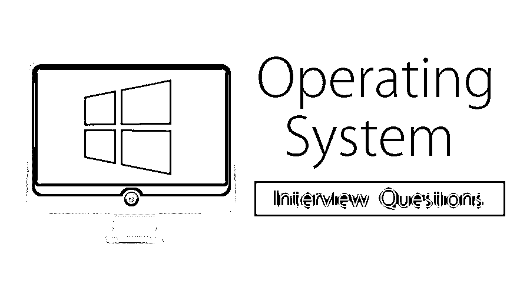

# 操作系统面试问题

> 原文：<https://www.educba.com/os-interview-questions/>

## 面试问答介绍

操作系统是任何计算机系统中最重要的部分。没有操作系统，用户和系统就不能交互。操作系统充当这两者之间的接口。它使系统能够平稳运行。有不同种类的操作系统，如视窗操作系统、Linux、Unix 等。，它们有自己的特征来区分彼此。操作系统有不同的安装和使用过程。

现在，如果你想找一份与 OS 相关的工作，你需要准备 2022 年的 OS 面试问题。每个面试都不同于不同的职位描述，但是，为了顺利通过面试，你需要对操作系统有一个清晰的了解。在这里，我们准备了重要的操作系统面试问题和答案，将有助于你在面试中取得成功。

<small>网页开发、编程语言、软件测试&其他</small>

以下是面试中经常被问到的 10 个重要的操作系统面试问题和答案。这些问题分为以下两部分:

### 第 1 部分–操作系统面试问题(基础)

第一部分包括基本的操作系统面试问题和答案。

#### 1.解释引导程序和引导系统的过程。

**答案:**
通过加载内核来启动计算机系统的过程称为引导系统。每当用户第一次登录系统时，必须运行一个初始程序。指导系统初次运行的程序是引导程序。该程序存储在只读存储器或 EEPROM(电可擦除可编程只读存储器)中。引导程序将定位内核并将其加载到主存中，然后程序将开始执行。

#### 2.什么是流程和流程表？解释流程经历的不同状态。

**答案:**
一个进程可以称为正在执行的程序。一个 web 浏览器，一个运行的 shell 脚本都可以被认为是一个进程。操作系统的工作就是管理所有这些进程。它还为所有进程分配一定的时间。操作系统还会分配各种资源来处理计算机内存和磁盘。为了与所有这些进程同步，操作系统维护一个进程表。该表包含每个进程的信息，列出了资源、正在使用的进程以及进程的当前状态。

这些过程可以有三种状态:

*   **正在运行:**当一个进程拥有了执行所需的所有资源，并且还获得了操作系统使用处理器的许可时，这个进程就处于这种状态。一次只能有一个进程处于运行状态。
*   **就绪:**进程在等待操作系统允许使用处理器时，处于就绪状态。
*   **等待:**剩余的进程可以处于等待状态，可以是等待某个外部事件发生或用户输入。

让我们进入下一个操作系统面试问题。

#### 3.什么是 RAID，它有哪些不同的级别？

**答案:**
RAID 代表独立磁盘冗余阵列。为了提高整体性能，数据被冗余存储并在需要时使用。

以下是不同的 RAID 级别:

*   **RAID 0—**无容错的条带化磁盘阵列
*   **RAID 1—**镜像和双工
*   **RAID 2—**记忆式纠错码
*   **RAID 3–**位交错奇偶校验
*   **RAID 4–**块交叉奇偶校验
*   **RAID 5–**块交叉分布式奇偶校验
*   **RAID 6—**P+Q 冗余

#### 4.有哪些不同类型的操作系统？

**答案:**
操作系统有五种类型:

*   批处理操作系统

所有的作业都是一次提交的，并且以特定的顺序执行，没有任何优先权，这意味着除非这些作业完成，否则不能执行任何作业。

*   多道程序操作系统

这是批处理操作系统的一个扩展，在批处理操作系统中，主存可以同时有几个作业，它们将在特定的时间以特定的顺序执行。

*   多任务操作系统

这个操作系统使用户能够在一个处理器上同时执行多个任务。在这种情况下，CPU 以非常快的速度切换进程，并且是并行的。

*   多处理操作系统

这是一种用户可以在多处理器系统上同时执行多个进程的能力。这同时利用了多个 CPU。

*   实时操作系统

这里为每项工作分配了特定的时间，它通常是与军事行动、卫星等相关的关键应用。

### 第 2 部分–操作系统面试问题(高级)

现在让我们来看看高级操作系统面试问题。

#### 5.解释内核的不同种类。

**答案:**

我们有三种重要的内核类型，命名为:

*   **单片内核:**

它可以被认为是一个完全成熟的内核，提供所有正在运行的服务。

示例:UNIX

*   **微核:**

它是一个带有有限服务的内核，运行着一些重要的服务。

例如:QNX-实时操作系统

*   **混合内核:**

它结合了单片和微内核的特点。

例如:微软 NT 内核

#### 6.解释流程的不同部分。

**答案:**
一个流程主要有四个环节。它们如下:

*   **堆栈:**包含局部变量，返回地址
*   **堆:**通过 malloc、calloc、realloc 动态分配内存
*   **数据:**包含全局和静态变量。
*   **代码或文本:**包含代码、程序计数器和处理器寄存器的内容。

**Note:** Stack and the Heap section are extendible; that is, the stack can grow down, and the heap can grow up. It is in the same order as mentioned above.

让我们进入下一个操作系统面试问题和答案。

#### 7.有哪些不同类型的调度算法？

**回答:**
以上是面试中被问到的高级 OS 面试问题。不同类型的调度算法如下:

*   **先来先服务(FCFS):** 先来流程先服务。
*   **循环调度(RR):** 每个进程都有一定的时间
*   **最短作业优先(SJF):** 执行时间最短的流程优先
*   **优先级调度(ps):** 一个称为(nice value)的优先级值用于选择进程。它的值从 0 到 99。0 是最大值，99 是最小值。

#### 8.列出调度程序的不同性能指标。

**答案:**

*   **CPU 利用率:**CPU 做有用工作(即不空闲)的时间百分比。100%完美。
*   **等待时间:**这是一个流程轮到执行所花费的时间。
*   **吞吐量:**单位时间内完成的工序数。
*   **响应时间:**这是从提交流程到获得有用的输出所经过的时间。
*   **周转时间:**这被认为是从提交流程到流程完成所经过的时间。

#### 9.僵尸进程是什么？

**答:**
僵尸进程是已经完成并处于终止状态，但在进程表中有其条目的进程。它表明资源被进程占用，并且不是自由的。

#### 10.什么是颠簸？

**答案:**
当处理器大部分时间都在交换页面而不是执行指令时，就会发生系统颠簸。

### 推荐文章

这是操作系统面试问题和答案列表的指南。这里我们列出了最有用的 10 组面试问题，这样求职者就能轻松应对面试。您也可以阅读以下文章，了解更多信息——

1.  [大一新生 Java 面试问题](https://www.educba.com/java-interview-questions/)
2.  [10 个优秀 Tableau 面试问题](https://www.educba.com/tableau-interview-questions/)
3.  [重要的 Cognos 面试问题](https://www.educba.com/cognos-interview-questions/)
4.  [Hadoop 管理员面试问题](https://www.educba.com/hadoop-admin-interview-questions/)

