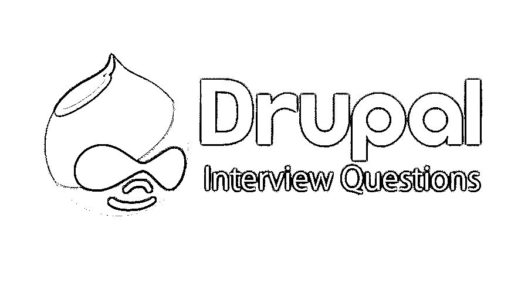

# Drupal 面试问题

> 原文：<https://www.educba.com/drupal-interview-questions/>

## Drupal 面试问答介绍

[Drupal 是一个](https://www.educba.com/what-is-drupal/)开源的[内容管理系统](https://www.educba.com/best-ecommerce-sites/)。它也被称为内容管理框架、博客软件和社区。它是由 Dries Buytaert 开发或创建的。Drupal 发布于 2000 年，它的最新版本是 8.5。[支持类 Unix 和 windows](https://www.educba.com/windows-interview-questions/) 操作系统。是用 PHP 写的[。它有多种语言版本。Drupal 架构基于一种软件架构模式，这种模式被称为表示抽象控制(PAC ), PAC 遵循模型视图控制器。Drupal 主要用作灵活且功能丰富的内容管理系统。](https://www.educba.com/php-interview-questions/)

以下是在面试中经常被问到的 11 个重要的 Drupal 面试问题和答案。这组问题分为以下两部分:

<small>网页开发、编程语言、软件测试&其他</small>

*   [第 1 部分 Drupal 面试问题(基础)](#1)
*   [第二部分 Drupal 面试问题(高级)](#2)

### 第 1 部分——Drupal 面试问题(基础)

第一部分涵盖了基本的 Drupal 面试问题和答案。

#### 1.简单解释一下 Drupal 中的‘核心’？

**回答:**
Drupal 使用术语“核心”，这提供了其特性和功能的广泛范围。Drupal 基于核心模块、核心主题、自动更新通知、数据库抽象和可访问性。核心模块提供不同的功能，如高级搜索、书籍、博客、评论、多级菜单系统、多站点支持、多用户内容创建、安全和新更新、工作流工具、用户配置文件、静态访问和日志记录。核心主题将为网站和博客提供不同的感觉和外观。

#### 2.Drupal 中的 Node 和 Block 是什么？

**回答:**
在 Drupal 中，如果有任何新的故事或页面、论坛话题等。被称为节点。节点模块负责添加、删除和编辑任何网站内容。一条信息(块)可以显示在一个特定的位置，这个位置称为区域。区域就像左边栏，页眉，页脚等。基于配置设置，块可以适合任何区域。

让我们转到下一个 Drupal 面试问题。

#### 3.解释 PDO？

**答案:**
PDO 简称 [PHP 数据对象](https://www.educba.com/php-data-object/)。这是访问数据库的一致方式。它帮助开发人员以更简单的方式编写代码。它就像一个使用统一 API 的数据访问层。Drupal 提供了一个数据库抽象层，帮助开发人员轻松地使用多数据库服务器。它用于保留 SQL 的语法和[功能，并处理复杂的功能。它为使用安全检查和良好实践的动态查询提供了一个定义的接口。这个过程是在 PDO 数据库 API 的顶层开发的。](https://www.educba.com/cheat-sheet-sql/)

#### 4.Drupal 有什么特点？

**回答:**
以上是面试中常见的 Drupal 面试问题。下面列出了主要功能:

*   易于开发和管理的网站。
*   开源且容易获得。
*   高度灵活，创造性和有效的网站展示。
*   它可以用于多种语言。
*   性能更好。
*   更安全。
*   易于编辑和更好的支持。

#### 5.解释一下 Drupal 中的响应式主题？

**答:**
这是开发网站的一种方式，允许网站兼容不同的显示器尺寸、屏幕分辨率和平台，如电脑、平板电脑和移动设备。该网站一旦用 Drupal 开发，就可以用于任何平台。像这样的主题给每个平台一个站点的外观，不需要做任何额外的事情。

#### 6.解释一下 Drupal 中缓存的工作原理？

**答案:**
借助缓存，加快网页加载的网站性能。不同的类型有:

*   页面缓存:–
    *   如果启用，它可以用于匿名用户。
    *   它使得整个 HTML 页面能够存储在数据库中，减少了查询的次数。
*   块缓存:–
    *   当块由视图创建时，可以设置视图中块的缓存设置。
    *   使用 block_cache_altermodule 为每个块设置此值。
    *   如果已启用，将使用块缓存设置。
*   最短缓存生存期:–
    *   清除页面缓存之前的时间量。
    *   每次 cron 运行时，页面缓存都会被清除。
*   缓存页面的过期时间:-
    *   适用于浏览器缓存这样的永恒机制。
    *   该设置仅在页面缓存打开时有效。

### 第 2 部分——Drupal 面试问题(高级)

现在让我们看看高级的 Drupal 面试问题。

#### 7.简单解释一下 Drush，Drupal weight，Drupal Cron？

**答案:**
Drush 是 Drupal 的 UNIX 脚本接口。这是一个命令行 shell。它主要只对那些主要使用命令行工具的人有帮助。
Drupal weight 告知处理块或节点的块或节点的特定功能和显示的优先级或顺序。
Drupal Cron 习惯于在特定的日期和时间间隔自动执行命令或脚本。

#### 8.解释一下 Drupal 的缺点？

**答案:**
缺点是:

*   Drupal 与其他软件不兼容。
*   Drupal 没有用户友好的界面。
*   与其他内容管理系统相比，它的性能较低。
*   安装和修改需要很好的平台知识。
*   用 Drupal 开发网站，需要很多知识。
*   它有很高的学习曲线。
*   Drupal 会产生更多的服务器负载，并且无法通过缓慢的互联网连接打开。

#### 9.定义补丁并解释如何在 Drupal 中应用？

**答:**
补丁是一个文件，它包含一组文件或另一组文件之间的差异列表。在 Drupal 中，借助补丁，可以对 Drupal 核心进行添加、删除等代码更改。这种差别是以结构化的、标准的方式产生的，它指的是程序对主文件或原始文件的另一个副本进行修改。

让我们转到下一个 Drupal 面试问题。

#### 10.主题钩子用在哪里，那个文件有什么用？

**答案:**【template.php】主题文件夹中的 T2。这个 php 文件用于覆盖其他主题函数。这个文件必须以[打开 PHP 标签](https://www.educba.com/php-tag-in-html/)开始。应该通知 PHP 模板覆盖基本列表中没有列出的主题函数。这是最流行的 Drupal 面试问题，也是面试中经常被问到的问题。

#### 11.WordPress 和 Drupal 的区别？

**答案:**
WordPress 和 Drupal 的区别在于:

| **序列号** | **WordPress** | **Drupal** |
| One | [WordPress 有一个](https://www.educba.com/what-is-wordpress/)前置控制器架构。 | Drupal 有表示抽象控制架构。 |
| Two | WordPress 是用 PHP 编写的，也是基于 MySQL 的。 | Drupal 是使用 PHP 的 symphony 框架用 PHP 编写的 |
| Three | WordPress 没有多语言版本 | Drupal 有多种语言版本。 |
| Four | WordPress 已经被用于小型网站或应用程序。 | Drupal 更适合基于内容的大型网站。 |
| Five | WordPress 主题和插件确实有助于更好的定制。 | Drupal 提供的定制功能较少。 |
| Six | WordPress 用户界面更加人性化。 | 与 WordPress 相比，Drupal 用户界面不够友好。 |

### 推荐文章

这是 Drupal 面试问题和答案列表的指南。这里我们列出了最有用的 11 组面试问题，这样求职者就可以轻松应对面试了。你也可以看看下面的文章来了解更多。

1.  [WordPress 面试问题](https://www.educba.com/wordpress-interview-questions/)
2.  [Drupal Web 开发](https://www.educba.com/drupal-web-development/)
3.  [PHP 面试问题](https://www.educba.com/php-interview-questions/)
4.  [AJAX 面试问题](https://www.educba.com/ajax-interview-questions/)

