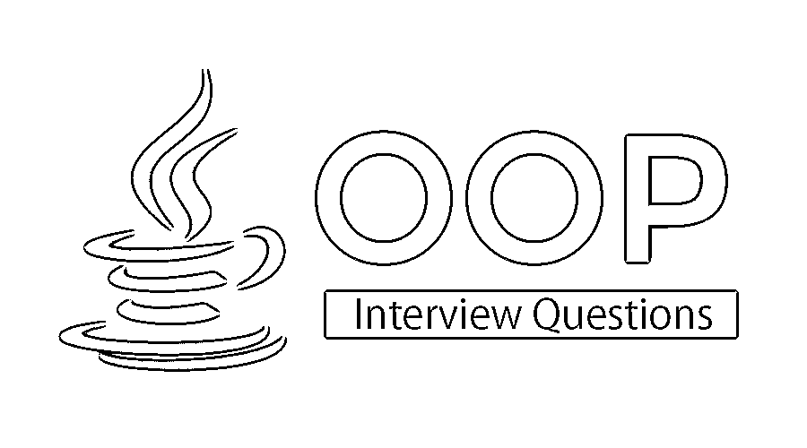

# OOP 面试问题

> 原文：<https://www.educba.com/oop-interview-questions/>

## OOP 问答介绍

OOP(面向对象编程)是一种编程范式，它包含对象和字段来保存实现业务逻辑的数据和方法。每个对象都可以根据它们的访问级别修饰符进行交互。面向对象的范例基于类和对象，其中对象是类的实例，可以用不同的方式创建。有不同的面向对象编程语言，如 C++、C#、PHP、Ruby、Java、Python 等。面向对象编程技术的主要特征是抽象、封装、继承和多态。大多数动态编程语言都是基于 OOPs 原则的。

现在，如果你想找一份与 OOP 相关的工作，你需要准备 2022 年 OOP 的面试问题。每个面试都不同于不同的职位描述，但是，为了通过面试，你需要对 OOP 有一个很好的清晰的了解。在这里，我们准备了重要的 OOP 面试问答，帮助你在面试中取得成功。这些 OOP 面试问题分为以下几个部分:

<small>网页开发、编程语言、软件测试&其他</small>

以下是 2022 年 OOP 面试的 10 个重要问题和答案:

### 第 1 部分——OOP 面试问题(基础)

这第一部分涵盖了基本的 OOP 面试问题和答案。

#### 1.OOP 的核心概念是什么？

**答案:**
OOP 的核心概念是抽象、封装、继承和多态。抽象是通过隐藏代码的实现，在单独的私有方法中定义代码，从而隐藏复杂逻辑的过程。需要使用的任何功能都可以通过使用其方法标识符来调用，以获得结果。

封装的概念只不过是一个类，用于隐藏保存数据的字段和执行基于访问修饰符可以访问的功能的方法。多态性是指根据数据类型或参数多次定义相同方法的过程。有两种类型的多态性，称为运行时多态性和编译时多态性。

#### 2.OOP 中的类是什么？

**答案:**
面向对象编程中的一个类，理论上叫做一个对象的模板或蓝图。其类类型的对象将具有与类的实现中定义的属性相同的属性。一个对象总是一个类的特定实例。一个类可以有不同的子类和超类。一个类可以是子类，也可以是父类，这取决于它的声明。子类可以拥有其超类拥有的所有属性，而超类不能拥有子类的属性。另一个类可以扩展一个类，它将被称为父类。

让我们进入下一个 OOP 面试问题和答案。

#### 3.OOP 中的构造函数是什么？

**答案:**
构造函数是一种通过初始化对象的状态来调用对象创建过程的方法。理想情况下，构造函数的名字应该是类的名字，并且可以根据编程语言的类型而变化。构造函数不能有任何返回类型。

#### 4.OOP 中的析构函数是什么？

**答案:**
这是面试中最常见的 OOP 面试问题。析构函数是一种当对象被销毁或其作用域即将结束时调用的方法。将根据所使用的编程语言显式或隐式调用该方法。在 C++中，需要调用析构函数，而在 Java 中，不需要，垃圾收集机制会处理它。

#### 5.OOP 中的抽象类是什么？

答:
一个抽象类用来定义至少一个抽象方法，但是不能从中创建对象。使用抽象类创建的类称为派生类。抽象类不会在其基类中包含实现代码。如果一个抽象类被强制实例化一个对象，编译错误将被抛出。

### 第 2 部分–OOP 面试问题(高级)

现在让我们来看看高级 OOP 面试问题。

#### 6.OOP 中的多重继承是什么？

**答案:**
多重继承是单个类对多个类的行为进行扩展的过程。当运行时决定哪个类的行为必须被执行时，它产生了一个不明确的情况。 [C++](https://www.educba.com/c-plus-plus-interview-questions/) 支持多重继承，而 Java 不支持。模糊和复杂的问题产生了一个菱形问题，定义为在扩展多个类时扩展哪个父类。

#### 7.OOP 中的静态和动态绑定是什么？

**答:**
静态绑定也叫早期绑定，发生在编译时，而[动态绑定](https://www.educba.com/dynamic-binding-in-java/)叫晚期绑定，发生在运行时。静态绑定的一个例子是方法重载，而动态绑定是方法重写。静态、最终和私有方法的绑定过程总是在编译时完成，而重写是在运行时完成的。绑定重载方法的过程称为静态，而被重写的方法称为动态。

让我们进入下一个 OOP 面试问题和答案。

#### 8.OOP 中什么是运算符重载？

**答案:**
运算符重载有时被称为 ad-hoc 多态性，它被定义为不同的运算符会基于运算符的放置和参数而具有不同的机制。在运算符重载中，编程语言的语义被重新定义，这通常是不推荐的。在 Java 编程语言的情况下，创建者决定不使用这个特性，因为 Java 主要是一种生产语言。

#### 9.OOP 中的异常处理是什么？

**回答:**
以上是 OOP 面试中被问到的常见问题。异常处理是大多数面向对象编程语言中都有的特性，它被定义为在程序流执行过程中处理异常的过程。执行的流程应该根据所引起的异常的结果而改变。对于大多数编程语言，如 C++、Java 等，异常处理的一般模块包括 try、catch 和 throw。在 try 块中会放置需要执行的代码，catch 块会处理异常，抛出的块如果处理不了会返回异常的类型和错误。这是处理应用程序以保护工作应用程序流程的最安全的方式。

#### 10.OOPS 技术有什么好处？

**答:**
OOPS 概念的主要好处是模块化、可扩展性、简单性、可重用性、可维护性、可修改性等。可以降低编程的复杂度，并且可以使编码结构清晰。不同的复杂功能可以通过应用程序中不同的类和实现方法来分离。可重用性特性在任何需要的时候提供代码中的微小变化，这提供了对代码变化或功能变化的适应性。

不同类的对象可以在不同的实现类中重用，以完全使用它们的功能。如果以一种有组织的方式维护代码，维护过程会变得更容易。

### 推荐文章

这是 oop 面试问题和答案列表的指南。这里我们列出了最有用的 10 组面试问题，这样求职者就能轻松应对面试。您也可以阅读以下文章，了解更多信息——

1.  [C# OOP 面试问题](https://www.educba.com/c-sharp-oop-interview-questions/)
2.  [Hadoop 管理员面试问题](https://www.educba.com/hadoop-admin-interview-questions/)
3.  [Node.js 面试问题](https://www.educba.com/node-js-interview-questions-and-answers/)
4.  [Sqoop 面试问题](https://www.educba.com/sqoop-interview-questions/)

