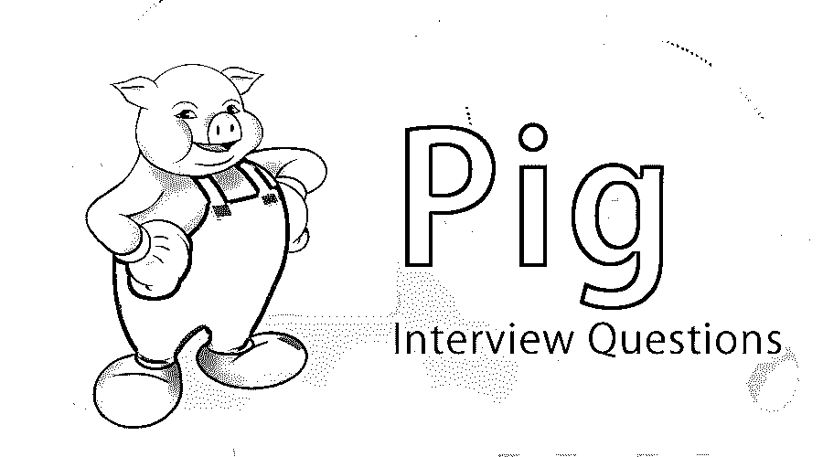

# 猪面试问题

> 原文：<https://www.educba.com/pig-interview-questions/>

## 猪面试问答介绍

Apache Pig 是一个高级平台，用于创建在 Hadoop 上运行的程序[。猪的语言被称为猪拉丁语。Pig 是用 Java 编写的，它是由雅虎研究院和 Apache 软件基金会开发的。它的首次发布发生在 2008 年 9 月 11 日。在 Pig 准备工作面试。我相信你想知道最常见的 2021 猪面试问题和答案，这将有助于你轻松破解猪面试。](https://www.educba.com/hadoop-admin-interview-questions/)

以下是在你的救援中的顶级猪面试问题和答案列表。这些面试问题分为以下两部分:

<small>网页开发、编程语言、软件测试&其他</small>

*   [第 1 部分 Pig 面试问题(基础)](#1)
*   [第二部分 Pig 面试问题(高级)](#2)

### 第 1 部分 Pig 面试问题(基础)

这第一部分包括基本的面试问题和答案。

#### Q1。Map-Reduce 和 Pig 有什么区别？

**答案:**
Map Reduce 是一种编译语言，Map-reduce 的代码效率较高，Pig 是一种代码效率较低的脚本语言。

#### Q2。猪里的包是什么意思？

**答案:**
元组的集合被称为猪的一个袋子。

#### Q3。Pig 中有哪些复杂的数据类型？

**答案:**
地图、元组、包是 Pig 的复杂数据类型。

#### Q4。猪的扁平是什么？

**答案:**
当我们想要从一个 tuple 或者 bag 中的数据中去除嵌套的时候，那么我们使用 Flatten。

#### Q5。假设我们有一个文件名为 abc.csv，属性为 id、name、year、rating、duration。你将如何把这个文件上传给一只猪？

**答案:**
movies = LOAD ' path of ABC . CSV '使用猪存储('，')作为(id，名称，年份，评分，时长)；

#### Q6。PigLatin 和 HIVEQL 有什么区别？

**答案:**
HIVEQL 是声明式语言，PigLatin 是过程式邮件。

让我们转到下一个猪面试问题。

#### Q7。猪身上的内袋和外袋是什么意思？

**答案:**
袋子里面的关系称为内袋，正常的关系称为外袋。

#### Q8。群和共群的区别是什么？

**答案:**
分组运算符用于对单个关系中的数据进行分组，COGROUP 用于进行分组和连接中的关系。

#### Q9。COUNT 和 COUNT_STAR 有什么区别？

**回答:**
当我们在对一个包中的一个元素进行计数时，COUNT 函数对 NULL 值不起作用，但是 COUNT_STAR 会考虑 NULL 值。

#### Q10。Apache Pig 中有哪些可用的诊断操作符？

**答案:**
转储运算符，描述运算符，解释运算符，说明运算符。

#### Q11。UNION 和 SPLIT 运算符是什么意思？

**答:**
通过使用联合运算符，我们可以合并两个或多个关系的内容，而拆分运算符用于将单个关系分成两个或多个关系。

#### Q12。如何从关系 R 中得到前 10 个元组？

**答案:**
利用 TOP()函数。

让我们转到下一个猪面试问题。

#### Q13。猪和蜂巢有什么相似之处？

**回答:**
Pig 使用 Pig Latin[Hive](https://www.educba.com/hive-interview-questions/)使用 HiveQL 都将命令转换成 [MapReduce 作业](https://www.educba.com/mapreduce-interview-questions/)。

#### 问题 14:Apache Pig 支持哪些不同类型的 JAVA UDF 函数？

**答案:**
代数、Eval、过滤函数是 UDF 函数的类型。

#### Q15。在 HDFS 目录中有一个包含 1000 条记录的 movies.txt 文件。您只想查看 movies.txt 文件中的前 10 条记录。你会怎么做？

**回答:**
首先你要加载关系名为 movie 的 movies . txt:
movies = LOAD ' path of movies . txt '使用猪存储('，')作为(属性)；
结果=限制员工 10

### 第 2 部分 Pig 面试问题(高级)

现在让我们来看看高级面试问题。

#### Q16。用户如何在 Pig 中与 Hadoop 交互？

**答案:**
通过使用咕哝壳

#### Q17。Pig 支持多行命令吗？

**答案:**
是的

#### Q18。pigstats 包中的所有统计类是什么？

**Answer:**
PigStats, JobStats, OutputStats, InputStats.

#### Q19。什么是 UDF？

**答:**
不是内置运算符，但可以通过编程创建函数来调出功能的函数。

#### 问题 20。解释猪拉丁文区分大小写吗？

**答案:**
关系的函数和名字在猪拉丁文中是区分大小写的，但是一个名字或者关键字和参数是不区分大小写的。

#### 问题 21。猪的咕噜声是什么？

**答:**
Grunt 是一个命令终端，是一个交互的 shell，我们在这里给 Pig 下命令。

#### 问题 22。Pig 编程对 MapReduce 的要求是什么？

**答案:**
MapReduce 是一个执行引擎。

让我们转到下一个猪面试问题。

#### 问题 23。什么是猪发动机？

**答:**
pig 引擎提供运行 pig 程序的执行环境。它将 pig 操作转换为 MapReduce 作业。

#### 问题 24。猪的处决方式有哪些？

**回答:**
本地模式:Pig 操作将在单个 JVM 中执行。
MapReduce 模式:将在 Hadoop 集群中执行。

#### 问题 25。猪有哪些不同的评估功能？

**答案:**
AVG、CONCAT、MAX、MIN、SM、SIZE、COUNT 是不同的 EVAL 猪函数。

#### 问题 26。你说的装载和储存在猪里是什么意思？

**答:**
这些是在 hdfs 中加载和存储数据的操作符。

让我们转到下一个猪面试问题。

#### Q27。小猪有哪些数学功能？

**答案:**
ABS、ACOS、LOG、ROUND、CBRT、SORT 是 Pig 中可用的数学函数。

#### 问题 28。distinct 关键字在 Pig 中做了什么？

**答案:**
[截然不同的关键词从记录中删除](https://www.educba.com/distinct-keyword-in-sql/)重复的关键词。例如:
movies= LOAD 'path of abc.csv '使用 Pig Storage('，')作为(id，名称，年份，评分，时长)；
New_movies= distinct(id，名称，年份，评分，时长)；

#### 问题 29。Pig 中的原始数据类型是什么意思？

**答案:**
Int、Long、Float、Double、Char 数组、Byte 数组是 Pig 中的原始数据类型。

#### Q30。猪里面的一个元组是什么意思？

**答案:**
数据所在字段的有序集合称为元组。

### 结论

如果你正在准备 Hadoop 相关的工作，你必须为此做好准备，因为这个话题将在面试中发挥重要作用。上面分享的猪面试问题，会帮你准备好猪的基础和理论，但是必须要有动手的猪。它将帮助你建立信心和先进的知识。

### 推荐文章

这是一份关于 Pig 面试问题和答案的指南，以便候选人可以轻松地解决这些面试问题。在这里，我们涵盖了基本和高级猪面试问题。您也可以阅读以下文章，了解更多信息——

1.  [阿帕奇猪面试问题](https://www.educba.com/apache-pig-interview-questions/)
2.  [C++面试问题](https://www.educba.com/c-plus-plus-interview-questions/)
3.  [星火面试试题](https://www.educba.com/spark-interview-questions/)
4.  [黄瓜面试问题](https://www.educba.com/cucumber-interview-questions/)

