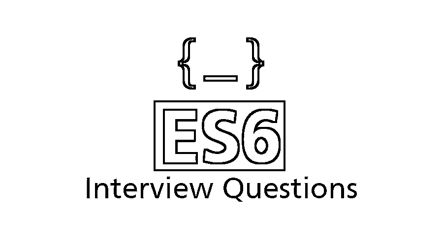

# ES6 面试问题

> 原文：<https://www.educba.com/es6-interview-questions/>

## ES6 面试问答介绍

如果是找 ES6 相关的工作，需要准备 2022 年 ES6 面试题。每个面试都不同于不同的职位描述，但是，为了顺利通过面试，您需要对 ES6 流程有一个清晰的了解。在这里，我们准备了重要的 ES6 面试问题和答案，将帮助您在面试中取得成功。

ES6 被称为 ECMAScript，版本 6 于 2015 年发布。ECMAScript 被定义为由 ECMAScript international 标准化的脚本语言。ECMAScript 是主要被称为 JavaScript 的语言的专有名称。它主要被用作客户端服务器脚本语言。它已经发布了很多特性，使得语言更加灵活和广泛。ES6 仍然没有得到所有浏览器的支持。

<small>网页开发、编程语言、软件测试&其他</small>

这些问题分为以下两部分:

### 第 1 部分 ES6 面试问题(基础)

第一部分包括基本的 ES6 面试问题和答案。

#### Q1。定义 ES6，提到 ES6 的新特性？

**答案:**
ES6 的定义参见引言部分。以下是列出的新功能:

*   常量(不可变变量)
*   辖域
*   箭头功能
*   扩展参数处理
*   模板文字
*   扩展文字
*   模块
*   班
*   增强型正则表达式
*   增强的对象属性。
*   解构分配
*   符号类型
*   迭代程序
*   发电机
*   地图/套装& WeakMap/WeakSet
*   类型化数组
*   内置方法
*   承诺
*   元编程
*   国际化和本地化。

#### Q2。你如何使用 ES6，或者在项目中使用 ES6 的最佳方式是什么？

**答案:**
如前所述，所有的浏览器都不支持 ES6，所以要使用 ES6 脚本，我们需要将其转换成所有浏览器都支持的 ES5 脚本。为了转换成 ES6 之前的脚本，我们需要像 Babel 这样的 transpilers。Babel 是用于此目的的流行 javascript transpiler，允许 ES-6 代码转换成 ES-5 脚本以支持所有浏览器。

让我们转到下一个 ES6 面试问题。

#### Q3。ES6 中有哪些常量？

**答案:**
常量也称为不可变变量。这意味着常量变量的值不能改变。声明时分配的值保持不变。例如 const X= 5.0，这里 X 的值每次都保持为 5，不可更改。

#### Q4。什么是块范围的变量和函数？

**答案:**
这是面试中常见的 ES6 面试问题。变量和函数被定义为无限块。这意味着可以在定义或声明变量和函数的地方使用它们。如果我们在任何函数块中声明了变量和函数，它们的作用域将仅限于那个函数；它们在块/功能之外是不可访问的。“Const”关键字不能更改变量值。“let”关键字允许变量值被重新赋值；它可以在 for 循环或数组中。

#### Q5。简单解释一下箭头函数？

**答:**
箭头函数支持表达式体和语句体，返回表达式的值，使语法更有表现力。箭头函数也有词汇“this”特性。箭头(= >)被用作语法的一部分。词法上，这是在编写函数的地方声明或定义的。它属于词汇范围的范畴；词法范围可以访问其父范围内的变量。

### 第 2 部分–ES6 面试问题(高级)

现在让我们来看看高级 ES6 面试问题和答案。

#### Q6。解释一下 Webpack 和使用 Webpack 的好处？

**答案:**
Webpack 用于捆绑可以在浏览器中使用的 javascript 文件。Webpack 处理应用程序并构建一个依赖图来映射项目需求的每个模块并生成包。它允许你运行巴别塔托管的环境。使用 web pack 的优点是它将多个模块和包捆绑到一个 JavaScript 文件中。它集成了开发服务器，这有助于更新代码和资产管理。

#### Q7。解释一下默认参数值，Rest 参数，Spread 运算符？

**答:**
默认参数值用于用默认值初始化函数。参数的值可以是空值、数字或函数。
rest 参数用于检索调用函数的所有参数。这意味着我们可以分别推送不同类别的商品。rest 参数使用 rest 参数将参数组合成单个数组参数。
spread 运算符是由…提供的，然后变量名已被提供。例如，扩展运算符的“…X”语法。它已经被用于操作 ES6 中的对象和数组，并将可枚举属性从一个对象复制到另一个对象。

让我们转到下一个 ES6 面试问题。

#### Q8。解释一下国际化和本地化？

**答:**
这些 API 是 JavaScript 的标准 API，有助于不同的任务，如排序、数字格式化、货币格式化、日期和时间格式化。

*   **Collation:** 用于在一组字符串内进行搜索，并对一组字符串进行排序。它由区域设置参数化，并能识别 Unicode。
*   **数字格式:**数字可以使用本地化分隔符和数字分组进行格式化。包括的其他内容有样式格式、编号系统、百分比和精度。
*   **货币格式化:**数字可以主要用货币符号格式化，有本地化的分隔符和数字分组。
*   **日期和时间格式:**已经用本地化的分隔符和顺序进行了格式化。格式可以是短、长以及其他参数，如地区和时区。

#### Q9。什么是解构作业，并简要解释？

**答案:**
这是在面试中经常被问到的 ES6 面试问题。析构赋值用于将变量集合绑定到相应的值。它主要是指使用模式来提取一个对象的部分。析构赋值有不同的形式，如数组匹配、对象匹配、速记符号、对象匹配、深度匹配、对象和数组匹配、默认值、参数上下文匹配和软故障析构*。*有的解释为:

*   **数组匹配/对象匹配，速记符号/对象匹配，深度匹配:**在赋值过程中，将数组直观灵活地转化为单个变量。
*   **对象和数组匹配:**对象和数组的析构很简单，定义了默认值。

#### Q10。简单解释一下类、模块和代理？

**答:**
类是基于面向对象编程的 OOP 风格。类声明使得模式更容易使用。它支持继承、基类访问、静态方法和构造函数。

*   **模块:**它定义了流行的 javascript 模块加载器的模式。它支持在没有全局名称空间的情况下从模块导出值或向模块导入值。它支持将值标记为默认导出值和最大-最小值。
*   **代理:**它支持对象创建，并为宿主对象提供各种各样的行为。它可以用于日志记录、分析等。

### 推荐文章

这是 ES6 面试问题和答案列表的指南，以便候选人可以轻松地解决这些 ES6 面试问题。在本帖中，我们研究了 ES6 面试中经常被问到的问题。您也可以阅读以下文章，了解更多信息——

1.  [MySQL 面试问题–最常被问到的问题](https://www.educba.com/mysql-interview-questions/)
2.  [猪面试问题](https://www.educba.com/pig-interview-questions/)
3.  [Redux 面试问题-有用问题](https://www.educba.com/redux-interview-questions/)
4.  [网页设计面试问题](https://www.educba.com/web-design-interview-questions/)
5.  [ES6 vs ES5:差异](https://www.educba.com/es6-vs-es5/)
6.  [MySQL vs SQL Server:特点](https://www.educba.com/mysql-vs-sql-server/)
7.  [MySQL 与 MSSQL:优势](https://www.educba.com/mysql-vs-mssql/)
8.  [MySQL vs MongoDB:有什么特点](https://www.educba.com/mysql-vs-mongodb/)
9.  [SQL Server 面试问题最佳指南](https://www.educba.com/sql-server-interview-questions/)

