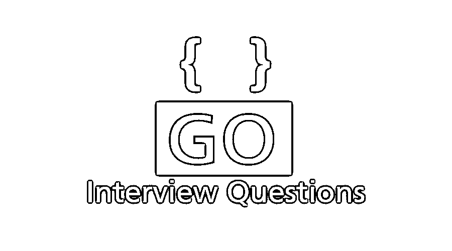

# 去面试问题

> 原文：<https://www.educba.com/go-interview-questions/>

## Go 面试问答介绍

在这篇 Go 面试问题的文章中，我们将提出一些关于流行编程语言 Go 的非常重要且经常被问到的 Go 面试问题。Go 是由 Google 创建的，它的语法类似于 c，是一种静态类型的语言。像 C 一样，go 支持垃圾收集和动态类型能力。它具有类型安全和许多高级内置类型；其中一些是可变长度数组和键值映射。此外，它还有一套丰富的标准库。Go 语言的一些最重要的特性如下:-

*   它支持一种叫做环境的东西，适应模式。
*   就编译时间而言，尽可能快。
*   它通过 goroutines、channels 和 select 语句构建了并发支持和轻量级流程。
*   Go 支持接口和类型嵌入。

现在，如果你想找一份与围棋相关的工作，那么你需要准备 2022 年的围棋面试题。每个面试都不同于不同的职位描述，但是，要通过面试，你需要对围棋有一个清晰的了解。在这里，我们准备了重要的 Go 面试问答，帮助你面试成功。

<small>网页开发、编程语言、软件测试&其他</small>

以下是 2022 Go 面试中常见的 10 个重要问题和答案。这些问题分为如下几个部分:

### 第 1 部分-面试问题(基础)

现在让我们来看看基本的面试问题和答案。

#### Q1。什么是 Go 语言，它有什么好处？

**答:**
Go 被认为是一种主要为服务器设计的通用语言。它是一种强静态类型的语言。它为垃圾收集提供了内置的支持。它也支持并发编程。程序主要是用叫做包的东西来构造的。它对依赖关系的有效管理是一个很好的特性。它使用传统的编译和链接模型。这个编译和链接模型用于生成可执行的二进制文件。
**好处:**在引言部分上面的要点中提到。

#### Q2。解释一下你对 Go 语言中静态类型变量声明的理解？

**答:**
静态类型变量声明为编译器提供了信心，即除了至少一个与其声明类型的给定名称一起存在的变量之外，没有其他变量。这有助于编译器进行进一步的编译，而不需要变量的完整细节。通常，Go 中一个变量的意义是在编译的时候。在程序链接的时候，Go 编译器需要一个正式的变量声明。

#### Q3。围棋中有哪些方法？

**答案:**
Go 语言支持特殊类型的函数。这些被称为方法。在方法声明语法中，有一个叫做“接收器”的东西，用来表示函数容器。上面定义的接收器可以用来调用一个使用“.”表示的操作符的函数.

#### Q4。解释一下什么是字符串文字？

**答案:**
这些都是面试中问的基本围棋面试问题。当一系列字符连接在一起时得到的字符串文字表示一个字符串常量。

在 Go 语言中，字符串有两种形式:–

*   **原始字符串文字类型:**在这种情况下，这种文字的值是在反引号“”之间的字符序列。字符串文字的值是由引号之间的不间断字符组成的字符串。
*   **解释的字符串文字类型:**用双引号表示，这是标准语法。在这种情况下，双引号中可能不包含换行符的内容通常构成了文本值。

#### Q5。解释什么是 Go 程序中的包？

**答案:**
所有的围棋程序都是由包组成的。在包中开始运行的程序称为 main。

### 第 2 部分-面试问题(高级)

现在让我们来看看高级面试的问题和答案。

#### Q6。用 GO 语言定义你对工作空间的理解？

**回答:**
通常，工作区是保存所有 Go 源代码的地方。工作区是系统层次结构中的一个目录，它在根位置包含三个附加目录。

*   src——它包含组织成包的 GO 源文件
*   pkg–包含包对象和
*   bin–包含可执行的命令

src、pkg 和 bin 是组织源代码的文件夹结构。

#### Q7。围棋的优势在哪里？

**答案:**

*   围棋编译速度非常快。
*   Go 有并发支持。
*   函数是 Go 的一级对象。
*   GO 支持垃圾收集。
*   字符串和映射是这种语言的固有特性。

让我们进入下一个面试问题。

#### Q8。讲解围棋中的一个套路？用什么方法阻止 goroutine？

**答:**
一个 goroutine 是一个与其他函数以并发方式运行的函数。要停止 go 例程，将 go routine 作为信号通道传递；当您想要停止 goroutine 时，可以使用该信号通道将新值推入程序。goroutine 在发现信号时会立即定期轮询该频道；它存在。

#### Q9。解释“For”循环的语法？

**答案:**
Go 语言中 for 循环的语法是:–
`for loop [condition |( initial; increment; condition) | Range] {
Define statements;
}`
**解释:–**for 循环中的控制流——

*   如果条件可用，则 for 循环执行，直到条件为真；这一步和其他语言一样。
*   When(初始；增量；条件)可用，则首先执行上述单元步骤。这一步允许声明和初始化任何循环控制变量。如果出现分号，则不需要在此处放置语句。此后，对条件进行评估。如果条件为真，则执行循环的主体。
    在 for 循环的主语句正确执行后，程序的控制流跳转回下一行，这是一个增量语句。该语句什么也不做，但是它更新任何循环控制变量。如果条件后面有分号，如果需要，此语句可以留空。现在再次检查下一个条件，然后进行评估。如果条件为真，则循环再次运行，并且该过程重复自身，即，一般方法是首先运行循环体，然后执行增量步骤，然后再次执行条件。这一直持续到条件变为假并且循环终止。
*   如果给定了一个范围，那么 for 循环将对该范围内的每个值运行。这些都是面试中经常被问到的 Go 面试问题。

#### Q10。在 Go 语言中，一个参数可以通过多少种方式传递给一个已定义的方法？

**答:**
在 Go 中调用函数时，有两种方法可以将参数传递给函数，比如:–

*   **通过值调用:**这个方法的工作原理是将一个参数的实际值复制到函数的形参中。因此，对函数内部参数的更改不会对参数产生影响。
*   **通过引用调用:**这个方法的工作原理是将实参地址复制到形参中。该地址在函数中用于访问调用中使用的给定参数。这意味着以这种方式进行的参数更改会影响自变量。

### 推荐文章

这是 Go 面试问题和答案列表的指南，以便候选人可以轻松解决这些面试问题。在本帖中，我们研究了面试中经常被问到的顶级面试问题。您也可以阅读以下文章，了解更多信息——

1.  [Junit 面试问题](https://www.educba.com/junit-interview-questions/)
2.  [棱角 2 面试问题](https://www.educba.com/angular-2-interview-questions/)
3.  [Java EE 面试问题](https://www.educba.com/java-ee-interview-questions/)
4.  [哎呀，Java 面试问题](https://www.educba.com/oops-java-interview-questions/)

