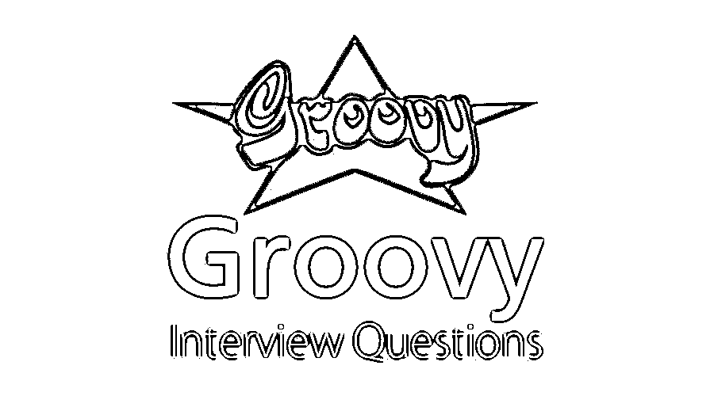

# 绝妙的面试问题

> 原文：<https://www.educba.com/groovy-interview-questions/>

## Groovy 面试问答介绍

Groovy 是一种基于 Java 平台的面向对象编程语言。它与 Java 语法兼容，来自 Apache 软件家族。它是静态和动态语言，类似于 Python、 [Ruby 或 Perl](https://www.educba.com/perl-vs-ruby/) 。Groovy 既可以用作[编程语言，也可以用作脚本语言](https://www.educba.com/programming-vs-scripting/)。它与 JVM 字节码兼容，并且与 Java 代码和库通信良好。语法类似于 Java，都使用花括号。它支持诸如闭包、多行字符串格式和嵌入字符串的表达式等功能。Groovy 的主要优势在于通过注释触发的 AST 转换。

大多数有效的 Java 文件也可以使用 Groovy 文件。这两种语言确实很相似，但是 Groovy 代码更紧凑，因为它不需要 Java 需要的许多元素。由于这种相似性，如果 Java 程序员首先从熟悉的 Java 语法开始，然后继续学习 Groovy 编程概念和语法，那么 Groovy 对他们来说是很容易学习的。

<small>网页开发、编程语言、软件测试&其他</small>

现在，如果你要找与 Groovy 相关的工作，你需要准备 2022 年的 Groovy 面试问题。每个面试都不同于不同的职位描述，但是，为了顺利通过面试，您需要对 Groovy 有一个清晰的了解。在这里，我们准备了重要的 Groovy 面试问题和答案，这将有助于你在面试中取得成功。

在这篇 2022 年的 Groovy 面试问题文章中，我们将呈现 10 个最重要的 Groovy 面试问题。这些问题将帮助学生围绕 Groovy 建立他们的概念，并帮助他们赢得面试。

### 第 1 部分——常规面试问题(基础)

第一部分包括基本的面试问题和答案:

#### 1.你对 Groovy 中瘦文档的概念有什么理解？

**答:**
文档单薄指缺乏适当的或详细的文档。许多面向对象语言都有这个问题。Groovy 程序员经常抱怨缺乏关于项目或代码的详细文档。文档在范围上是有限的，并且没有关于复杂过程和运行时错误的信息或者信息非常少。

#### 2.列出 Groovy 的一些优点。

**答案:**
由于 Groovy 是一种用于 JVM 的面向对象编程语言，所以相当有用。groovy 的优势如下:

*   它的语法类似于 Java 语言的语法。
*   因为它是基于 Java 的，所以它拥有丰富的 Java 库集合。
*   它是完全面向对象的。
*   它可以很容易地与现有的接口集成。
*   Groovy 代码是可重用和可分配的。
*   Groovy 支持运算符重载。
*   使用 Groovy 的映射声明，数组、范围和正则表达式都是可能的。
*   它确保对象的有效导航。

#### 3.描述 Groovy 编程语言的局限性？

**答案:**
局限性列举如下:

*   它比许多其他面向对象编程语言要慢一点。
*   比其他语言需要更多的内存。
*   Groovy 启动时有点慢。
*   Java 依赖性是一个因素。如果不了解 Java，Groovy 可能很难学。
*   它的文档很薄。

让我们转到下一个很棒的面试问题。

#### 4.提及 Groovy JDK 提供的重要功能。

**回答:**
groovy JDK 提供的一些重要特性如下:

*   文字集合:-在 Groovy 中，文字语法及其初始化是简单易读的，而在 Java 中，这些是困难而繁琐的。
*   Groovy Beans 属性:–Java 缺乏直接的语法支持，尽管它基于 JavaBeans 的结构概念。在 Groovy 中，一个字段可以被声明为一个属性，也可以被声明为一个普通的属性，它也可以访问相同的属性。
*   这个特性从一开始就在 groovy 中出现了。它就在它的收藏框架里。
*   JDK 增强:–最新版本的 Groovy 还引入了许多操作符、类和其他方法。

#### 5.解释一个字符串在 Groovy 中是如何表达的？

**答案:**
一个 groovy 字符串叫做 Gstring。

*   Groovy 字符串支持双引号；对于常规字符串，使用单引号。
*   G-string 可能包含 Groovy 表达式，如${}
*   也可以应用方括号语法。例如:charAt(i)

### 第 2 部分-常规面试问题(高级)

这第一部分包括高级面试问题和答案。

#### 6.解释 groovy 中对闭包和侦听器的需求。

**答:**
Groovy 中的闭包定义为开放的匿名代码块，它接受参数并返回一个可以赋给变量的值。因此，闭包引用了在周围作用域中声明的变量。Groovy 不支持匿名内部类。借助闭包，可以确定内联侦听器。在 groovy 中，侦听器闭包被用作侦听器适配器。

#### 7.提供 Groovy 和 Java 的重要区别？

**答案:**
Java 和 Groovy 的重要区别如下:—

*   Groovy 中的包和类在应用程序启动或代码执行时默认导入；显式地不需要使用 import 语句。
*   在 Java 中，方法是在编译时选择的，而在 Groovy 中，方法是在运行时根据参数类型选择的。
*   在 Groovy 中，{} block 是为闭包保留的。因此，不能用这种语法构建数组文本。
*   类似于 Java，省略字段上的修饰符不会改变包私有字段。
*   Groovy 不支持自动资源管理或来自 Java 7 的 ARM 块。
*   Groovy 不支持 Java 8 lambdas。它被认为是匿名内部类。

#### 8.解释用 GroovyDoc 怎么写评论？

**答案:**
jhujnu 8 类似于多行注释，GroovyDoc 注释也是多行的，但是有一点不同。注释以/**开头，以*/结尾。

这些意见涉及以下方面:-

*   类型定义，如类、接口、注释和枚举定义
*   方法定义
*   字段和属性定义

#### 9.Groovy 有哪些用途？

**答案:**
Groovy 用途:

*   它为 Java 程序员提供了熟悉的语法。
*   它可以使用丰富的 Java 库。
*   它可以轻松地与现有的基础设施集成，如应用服务器、Servlet 容器、带有 JDBC 驱动程序的数据库负载等。
*   Groovy 是完全面向对象的。
*   它提供了可重用和可分配的代码片段，并且是可扩展的。
*   在 Groovy 中，操作符可以重载。

#### 10.提到一些 Groovy 应用程序？

**回答:**
Apache Groovy 是一种强大的方法。它在一些基本模块中有着巨大而广泛的应用。当谈到分组或邻接不同的 java 模块时，首先考虑的是 Groovy。实际上，大小并不重要。而且，目前存在的几乎所有 Java 应用都可以通过 Groovy 进行扩展，这太容易了。Groovy 开发基于 Java 的应用程序而不出错的能力可能是它最独特的卖点。除此之外，其他几个 Groovy 应用程序也很常见。许多开发人员非常喜欢它。

### 推荐文章

这是一份很棒的面试问题和答案的指南，这样候选人就可以很容易地解决这些面试问题。在本帖中，我们研究了一些常见的面试问题，这些问题在面试中经常被问到。您也可以阅读以下文章，了解更多信息——

1.  [Java 面试问题](https://www.educba.com/java-interview-questions/)
2.  [Java 测试面试问题](https://www.educba.com/java-testing-interview-questions/)
3.  [Java 多线程面试问题](https://www.educba.com/java-multi-threading-interview-questions/)
4.  [棱角 2 面试问题](https://www.educba.com/angular-2-interview-questions/)

