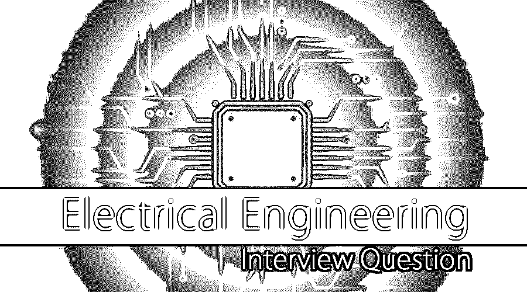

# 电气工程面试问题

> 原文：<https://www.educba.com/electrical-engineering-interview-question/>

## 电气工程概论面试问答

电气工程是[电气概念](https://www.educba.com/digital-electronics-interview-questions/)的一个分支和学科，其应用涉及电气系统、电磁和电子器件。电气工程领域涉及的子领域的不同范围包括例如电子学、控制系统、电信系统、微电子器件、电力工程、电磁动力系统、数字信号处理、信号和系统、数字仪器、电力电子学、材料科学、微波器件等。磁学和电学是电气工程理论的主要概念和基础。

电气系统中涉及的基本电路系统是串联和并联电路，以及不同的电压和电流定律、功率方程，以确定电路的不同分支和节点上的功率或电压或电流。电路的核心组件是电流、电荷、电压，而多个其他组件可以从核心组件导出，如功率、电压、电势等。

<small>网页开发、编程语言、软件测试&其他</small>

如果是找电气工程相关的工作，需要准备 2022 年电气工程面试题。根据不同的职位描述，每次面试都是不同的。在这里，我们准备了重要的电气工程面试问答，帮助你面试成功。

这篇 2022 电气工程面试问题文章将呈现 10 个最重要和最常用的电气工程面试问题。这些问题分为以下两部分:

### 第 1 部分-电气工程面试问题(基础)

这第一部分包括基本的面试问题和答案。

#### Q1。什么是电气工程，并解释其不同的应用？

**答案:**
电气工程是电气系统的一个分支，是与电磁或电子子系统相关的电气系统的应用。

不同的应用如下:

*   二极管、整流器和变压器
*   数字电路
*   DC 或交流电机
*   DC 或交流发电机
*   电力系统
*   电气控制系统
*   仪器系统
*   通信系统
*   数字和模拟电子

#### Q2。电路的基本元件是什么？

**答案:**
下面是不同的基本组件——

*   **有源电路:**有源电路是能够从其系统内部以一种能源形式产生能量的元件。
*   **无源电路**:无源电路是消耗或允许电流通过而不产生任何能量的元件。
*   **交流或 DC 电路:**交流是交流电，DC 是直流电。交流电总是会产生一些波动的电流，而 DC 总是会产生一个稳定的恒流源形式的电流。
*   **串联或并联电路:**串联电路是元件串联的电路，并联电路是元件并联的电路。

#### Q3。什么是电容、电阻、电感？

**答案:**
请在下面找到电气工程支持的不同表格。电容器是一种电气元件，它阻止电流流动，充当无源元件，并在施加电势时存储某种形式的电荷。电阻器是一种电子元件，它也阻止电流流动，是一种双端元件。它主要用于减少电流。电感器也是一种电气元件，也称为扼流圈或线圈，用于构建电路并在磁场中存储能量。

#### Q4。构建电路时有哪些不同类型的网络？

**答案:**
这是一次面试中问到的电气工程基础面试问题。有两种电路称为无源或有源网络。无源网络是指网络中包含无源元件的网络，如电阻、电容或电感。相反，有源网络是在其网络中包含有源元件的网络，例如电流或电压源。

#### Q5。构建电路时使用了哪些不同的网络术语？

**答:**
下列术语与电路及其应用一起使用:

*   结节
*   连接
*   环
*   网状物
*   树枝
*   线性和非线性电路
*   有源和无源网络

### 第 2 部分-电气工程面试问题(高级)

现在让我们来看看高级面试问题。

#### Q6。测量电路中电气参数的基本工具是什么？

**答:**
用于测量电气参数的测量工具清单如下:

*   电表
*   伏特计
*   欧姆计
*   万用表
*   功率表
*   微波测量仪
*   阴极射线示波器
*   信号发生器和分析仪
*   瓦特计
*   扫频仪

#### Q7。有哪些不同类型的耦合机制？

**答:**
不同类型的耦合机制如下:

*   **传导耦合:**在传导耦合中，传感器和负载同时供电。
*   **电感耦合:**在电感耦合中，电场是噪声的起因。
*   **容性耦合:**容性耦合中，磁场是电流流动中产生的噪声。

#### Q8。什么是交流发电机和发电机？

**答案:**
交流发电机是发电机，而发电机通过将一种形式的能量转化为另一种形式的能量来发电。交流发电机和发电机之间唯一的主要区别是产生的功率和应用的应用。交流发电机根据小规模需求发电，而发电机则满足大规模需求或供应。在交流发电机中，电是由铜线绕组内的磁场旋转产生的。交流发电机总是只储存所需的能量，而发电机则利用所有产生的能量。

#### Q9。什么是控制系统，有哪些不同类型的控制系统？

**答案:**
这是电气工程面试中被问得最多的问题。控制系统被定义为输出和输入相互关联的系统，使得输入参数控制输出参数。有两种控制系统，称为开环控制系统和闭环控制系统。

*   **开环控制系统:–**开环控制系统是指没有从输出到输入的反馈来进行校正的系统。
*   **闭环控制系统:–**闭环控制系统是从输出到输入都有反馈的系统，目的是校正控制期望的输出量。

#### Q10。什么是变压器，它有什么应用？

**答案:**
变压器是一种电气设备，用于将较小的电压转换为较大的电压，反之亦然。下面列出了它的应用:

*   为了匹配阻抗
*   整流器
*   电压整流器或稳压器
*   电压表或电流表应用
*   升压或降压电压
*   电路的隔离

### 推荐文章

这是电气工程面试问题和答案列表的指南，以便候选人可以轻松地解决这些面试问题。在本帖中，我们研究了一些常见的电气工程面试问题。您也可以阅读以下文章，了解更多信息——

1.  [微服务面试问题](https://www.educba.com/microservices-interview-questions/)
2.  [阿帕奇面试问题](https://www.educba.com/apache-interview-questions/)
3.  [物联网面试问题](https://www.educba.com/iot-interview-questions/)
4.  [JIRA 面试问题](https://www.educba.com/jira-interview-questions/)

