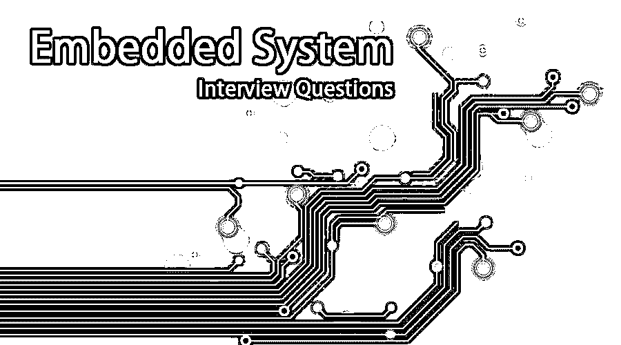

# 嵌入式系统面试问题

> 原文：<https://www.educba.com/embedded-system-interview-questions/>

## 嵌入式系统介绍面试问答

一个嵌入式系统实际上是[硬件和软件](https://www.educba.com/hardware-vs-software/)的组合，考虑到任何计算机系统。它主要有助于将系统配置为可编程的，或者修复一些改善其性能的更好的特性。它也有助于设计一些特定的功能，考虑到任何计算机系统比通常的大。有很多电子产品之所以受欢迎，主要是因为它们可以识别正确的位置，并帮助人们找到使用该位置标识符到达目的地的方法。嵌入式系统主要帮助识别各种工业机器、汽车、医疗设备、照相机、飞机、玩具、家庭设备等的可能位置。

现在如果要找嵌入式系统相关的工作，需要准备 2022 年嵌入式系统面试题。根据不同的职位描述，每次面试都是不同的。在这里，我们准备了重要的嵌入式系统面试问答，帮助你在面试中取得成功。

<small>网页开发、编程语言、软件测试&其他</small>

在这篇 2022 年嵌入式系统面试问题文章中，我们将介绍 10 个最重要和最常被问到的嵌入式系统面试问题。这些问题分为以下两部分:

### 第 1 部分-嵌入式系统面试问题(基础)

这第一部分包括基本的面试问题和答案。

#### Q1。详细解释按值传递和按引用传递。如果我们想传递一个结构作为参数，那么我们该怎么做呢？

**答案:**
假设一个程序员需要将一个函数的一个值传递给另一个函数。有一种非常常见的方法来通过特定函数的参数传递这个值。现在，我们可以将所需值的一个副本作为变量、对象引用或存储变量值的内存引用来传递。第一种是按值传递，第二种和是按引用传递。在按值传递的情况下，在该函数内传递参数时所做的更改不会反映在调用函数中，而在按引用传递的情况下，任何更改都会反映在调用函数中。

#### Q2。解释何时使用内联和宏功能的区别？

**答:**
宏只是在编程时随时假设一种符号表示，但它从来没有像我们通常所做的那样帮助区分数据类型。而在内联函数的情况下，我们也可以很容易地定义不同的数据类型。

#### Q3。volatile 关键字什么时候需要用？详细解释一下？

**答案:**
假设任何一个程序愿意使用一个属于其他映射设备的特定参数；在这种情况下，可以使用 volatile 关键字，用该变量映射到另一个设备的内存条件点来表示该特定变量。这种方法的主要用途是可以在特定程序之外轻松地更改声明的变量。通常，当我们编译任何程序时，编译器默认为该特定程序执行一些额外的优化。但是在可变参数的情况下，编译器不能对特定代码执行任何类型的额外优化。

#### Q4。详细解释一个软硬实时系统？

**答案:**
这是面试中问的基本嵌入式系统面试问题。在嵌入式系统的情况下，硬实时在时间线的情况下总是非常严格，从不考虑交付或响应的延迟，不专注于可交付的产品，只考虑延迟时间和考虑相同的故障。但是对于软实时的情况，它在时间线上也非常严格，但是仍然有点软。它主要考虑产品的质量和交货的性能。其他一些点可能会被认为是由于更好的产品很少延迟交货或错过时间表。

#### Q5。详细解释一下信号量？市场上有各种类型的旗语。请详细解释一下？

**答:**
信号量基本上是维护各种抽象数据的存储，以控制所有正在运行的活动线程或多个进程对各种资源的访问。

我们通常会发现两种信号量:

*   一种是二元信号量；它实际上只处理或接受 0 和 1 值。它主要用于单个资源实体可能发生争用的情况。
*   第二个是计数信号量，用了一些增量值，但是要有一定的限制。

### 第 2 部分-嵌入式系统面试问题(高级)

现在让我们来看看高级面试问题。

#### Q6。解释递归函数的特征。有没有可能让他们内联？如果是，请解释这是如何可能的。

**答案:**
递归函数是任何一种编程方法中最流行的方法之一。它实际上是自己调用或者自己调用。它引用一个特定的函数，在给出最终结果之前的任何时候调用它们。

是的，可以将其定义为内联函数。在内联函数的情况下，通常，当该函数在整个程序执行中特别是第一次调用时，编译器可以自己为其分配内存空间。

#### Q7。给出一些默认大小的解释需要从原始类型如 Int、Char 和 Float 数据类型来维护。

**答案:**
其实，char 和 int 的大小，不可能定义，因为它总是取决于具体的操作系统或固件定义。它总是取决于地址栏中可用的地址行数。但是平均来说，int 考虑的值在 2-4 字节之间，char 考虑的值在 1-2 字节之间。float 通常取稍高的值，即 4 个字节。

让我们进入下一个嵌入式系统面试问题。

#### Q8。解释 Malloc 的详细特征。一个非常流行的 malloc 语句是 Malloc(sizeOf(0))；执行同样的操作后，可能的结果是什么。

**答案:**
Malloc 是一种流行的将内存动态分配给不同变量的函数。Malloc 主要用于获取内存指针。上面提到的语句总是返回一个有效的整数值，它指向一个传递整数值 0 的内存指针。

#### Q9。解释 C 编程语言中可用的转发引用。

**答案:**
这是面试中被问到最多的嵌入式系统面试问题。C 中的前向引用表示当我们计划用 C 编程语言中一个较大数据类型的特定指针来寻址或指向一个较小的数据类型时。

#### Q10。如果我们为一个继承类创建一个可能的对象，那么在构造函数和析构函数的情况下，调用的确切顺序是什么？

**回答:**
在最近的面向对象编程概念中，非常普遍地使用了一个继承类。这里，构造函数和析构函数都在调用一些特定的定时。这里，构造函数主要以基类的情况一阶调用，而析构函数通常以一阶调用子类。这就是为什么如果我们使用两个继承级别，比如 A(基类)> > B(子级 1) > > C(子级 2)，那么 A 的构造函数总是首先调用，然后是 B 和 C。

### 推荐文章

这是嵌入式系统面试问题和答案列表的指南，以便候选人可以轻松解决这些面试问题。在本帖中，我们研究了常见的嵌入式系统面试问题，这些问题在面试中经常被问到。您也可以阅读以下文章，了解更多信息——

1.  [微服务面试问题](https://www.educba.com/microservices-interview-questions/)
2.  [UI 开发者面试问题](https://www.educba.com/ui-developer-interview-questions/)
3.  [网络安全面试问题](https://www.educba.com/cyber-security-interview-questions/)
4.  [冬眠面试问题](https://www.educba.com/hibernate-interview-questions/)

