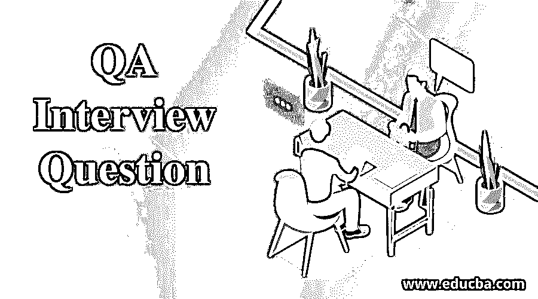

# 问答面试问题

> 原文：<https://www.educba.com/qa-interview-question/>

## QA 面试问答介绍

质量保证(QA)被定义为验证或确定产品或服务是否满足客户或用户的要求和规格的过程。QA 定义了一套开发产品或服务的规则或要求；他们需要满足这些要求，从而提高生产效率，从而提高客户对产品的信心。QA 的主要目标是在向客户发布产品之前解决和跟踪问题。QA 是一种过程驱动的方法，它定义了[产品设计、](https://www.educba.com/how-to-use-indesign/)开发和生产的目标和规则，从而改进团队的工作过程和效率，并最终使一家公司能够与业内其他公司竞争。QA 规则或标准会经常变化，需要符合 ISO 标准。QA 在产品从设计到部署的过程中扮演着重要的角色，有许多热门的 QA 职位空缺。因此，我们将通过[的实时例子](https://www.educba.com/real-time-analytics/)来讨论一个人在质量保证职位的面试中可能面临的不同类型的话题和场景。
在这篇文章中，我们将讨论常见的问答面试问题。

如果是找 QA 相关的工作，需要准备 2022 年的 QA 面试问题。根据不同的职位描述，每次面试都是不同的。在这里，我们准备了重要的 QA 面试问答，帮助你在面试中取得成功。

<small>网页开发、编程语言、软件测试&其他</small>

在这篇 2022 年问答面试问题的文章中，我们将提出 10 个最重要和最常见的问答面试问题。这些问题分为以下两部分:

### 第 1 部分-问答面试问题(基础)

这第一部分包括基本的问答面试问题和答案。

#### Q1。构建和发布的区别是什么？

**答案:**
构建和发布的区别可谓是构建。它被定义为分配给开发团队的测试团队的可安装软件或可执行软件的数量。同时，一个版本被定义为由开发人员或测试人员提供给客户的可安装软件或可执行软件的编号。

#### Q2。解释一个 Bug 的生命周期或者 Bug 周期？

**答案:**
一个 Bug 周期的步骤定义如下:

*   用户创建了一个包含所有细节的 bug，并被分配给相应的团队或人员，状态为 open。
*   相应的团队或人员将验证 bug，如果它是有效的 bug，则将状态更改为已接受；否则，将其更改为无效，并用适当的消息关闭 bug。
*   根据错误的优先级，开发人员将决定是在这个版本中还是在下一个版本中修复错误。
*   如果 bug 已经存在，那么开发人员会关闭 bug，状态为重复。
*   当开发人员开始处理 bug 并将 bug 的状态更改为正在处理时。
*   当开发人员修复 bug 时，他/她会将状态更改为已修复，并将其分配给测试人员来验证 bug。
*   测试人员验证修复；如果已修复，则将 bug 状态更改为已关闭；否则，用观察更新 bug。

让我们转到下一个问答面试问题。

#### Q3。软件开发周期中所有的软件质量实践是什么？

**答:**
在[软件开发](https://www.educba.com/what-is-software-development/)周期的过程中正在使用或遵循的软件质量实践是

*   在开发阶段之前评审项目的需求。
*   一旦开发阶段完成，接下来就是代码评审。
*   开发测试用例来验证开发的代码。
*   执行不同类型的测试，如基于会话的测试、基于风险的测试等。
*   根据需求确定 bug 的优先级。
*   为产品的安全相关测试和性能测试组建专门的团队。
*   执行所有测试用例的回归循环，并在生产环境中运行健全性测试用例。
*   在生产中模拟客户环境，运行健全性检查，并生成软件 QA 报告或分析。

#### Q4。什么是测试驱动开发规则？

**回答:**
这是面试中问的基本 QA 面试问题。测试驱动开发的基本规则是，在开发产品或编写代码之前，我们需要准备好测试计划和测试用例。我们将在开发相应的模块之前开发测试用例。

#### Q5。什么时候应该选择自动化测试而不是手工测试？

**答:**
[自动化测试](https://www.educba.com/automation-testing-interview-questions/)和[手动测试](https://www.educba.com/manual-testing-interview-question/)之间的选择将基于不同的因素，例如

1.  特定测试用例的使用频率
2.  手动运行和通过脚本运行需要多少时间
3.  自动化脚本的可重用性
4.  自动化测试用例的适应性
5.  自动化工具的开发以及开发自动化脚本所涉及的工作量。

### 第 2 部分-问答面试问题(高级)

现在让我们来看看高级问答面试问题。

#### Q6。QA、QC 和软件测试的区别是什么？

**答:**
质量保证被定义为一种有计划、有系统地监控过程质量的方法，我们需要遵循这种方法来生产高质量的产品或服务。QA 使我们能够跟踪进展和结果，并使我们能够调整过程以满足期望。

质量控制能够发现错误或缺陷，并建议质量控制实施定义的改进和流程。

[软件测试被定义为](https://www.educba.com/software-testing-interview-questions/)确保产品是否满足客户需求的过程，主要目的是在发布前发现 bug 并修复。

#### Q7。什么是测试装具？

**答:**
[测试工具被定义为](https://www.educba.com/test-harness/)通过在压力、负载、数据驱动和监控结果等不同条件和环境下运行来验证应用程序所需的软件和测试数据的集合。测试工具由测试执行引擎和测试脚本库两部分组成。

让我们转到下一个问答面试问题。

#### Q8。定义测试存根和测试驱动程序？

**回答:**
测试存根将是来自要测试的软件组件的调用，并且以自顶向下的方式工作。

测试驱动程序将调用要测试的组件，并以自底向上的方式工作。

#### Q9。验证活动应该如何进行？

**答案:**
这是面试中被问得最多的 QA 面试问题。验证活动可以通过聘请第三方验证工程师进行验证和确认，聘请不参与验证活动的内部团队成员，像客户一样对一个产品进行独立评价。

#### Q10。测试任何产品时有哪些不同的测试级别？

**答:**
在测试任何产品时，有以下四种测试级别:

*   **组件级测试**
*   **系统级测试**
*   **集成测试:**检查模块之间的交互
*   **验收测试:**这里，客户或用户期望给定输入的期望输出。

### 结论

我希望你能很好地理解这些概念，我建议你仔细检查你的项目，你在项目中的角色，以及你的公司遵循的测试过程。对 QA 面试会有帮助，祝大家面试顺利。

### 推荐文章

这是问答面试问题和答案列表的指南。这里我们列出了最有用的 10 组面试问题，这样求职者就能轻松应对面试。您也可以阅读以下文章，了解更多信息——

1.  [微服务面试问题](https://www.educba.com/microservices-interview-questions/)
2.  [UI 开发者面试问题](https://www.educba.com/ui-developer-interview-questions/)
3.  [网络安全面试问题](https://www.educba.com/cyber-security-interview-questions/)
4.  [PowerShell 面试问题](https://www.educba.com/powershell-interview-questions/)

