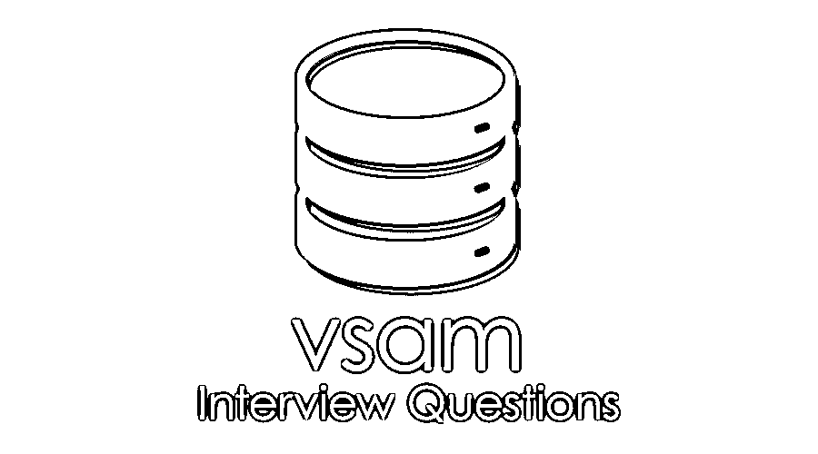

# VSAM 面试问题

> 原文：<https://www.educba.com/vsam-interview-question/>

## VSAM 面试问答介绍

VSAM 代表“虚拟存储存取方法”。IBM 在 20 世纪 70 年代推出了这款产品。这是一种文件存储访问方法，用于 MVS、z/OS 和 OS/390 版本的操作系统。VSAM 帮助在大型计算机中以文件的形式组织数据。VSAM 是操作系统(如 MVS、z/OS 和 OS/360)用来执行必要操作的访问方法

为了便于理解，我们先来看看[什么是大型机](https://www.educba.com/careers-in-mainframe/)以及它与超级计算机有何不同。

<small>网页开发、编程语言、软件测试&其他</small>

两者都有不同的应用领域——大型机在可靠量方面表现出色(如金融、索引和比较等整数运算)。相比之下，超级计算机被设计为执行浮点运算，如精确的算术运算。

大型机最初是在 20 世纪 40 年代由 IBM、Hitachi 和 Amdahl 等供应商推出的。这些具有特殊的特征，如大尺寸、存储量、处理能力和高可靠性水平。这些设计用于处理非常大的输入和输出(I/O)。一台大型机有能力取代数十台甚至数百台较小的服务器。

因此，这些大型计算机都有专门设计的操作系统来支持其广泛的操作能力。这些操作系统是-

*   MVS
*   z/OS
*   OS/390

所以，如果这个巨大的数据量在考虑中，那么一定有一些操作技术。这就是 VSAM 参与进来的地方。

如果你想找一份与 VSAM 相关的工作，你需要准备 2022 年 VSAM 的面试问题。根据不同的职位描述，每次面试都是不同的。在这里，我们准备了重要的 VSAM 面试问题和答案，将帮助你在面试中取得成功。

这篇 2022 年 VSAM 面试问题文章将呈现 10 个最重要和最常被问到的 VSAM 面试问题。这些问题分为以下两部分:

### 第 1 部分 Basic 面试问题(基础)

这第一部分包括基本的面试问题和答案。

#### Q1。什么是 VSAM 命令？

**答案:**
VSAM 命令用于对 VSAM 的数据集执行操作。这些命令用于根据需要操作数据集。

一些最重要和最有用的 VSAM 命令是

*   **修改**:修改 VSAM 的文件属性
*   **Repro** :用于加载 VSAM 数据集中的数据，也用于从一个 VSAM 数据集复制到另一个数据集
*   **Listcat** :帮助获取 VSAM 数据集的目录细节
*   **检查**:验证关键序列数据集簇的结构完整性。
*   **验证**:进行交叉检查和验证，以修复因错误而无法正常关闭的 VSAM 文件。

#### Q2。快速浏览 VSAM 命令的语法？

**答案:**

*   **修改**:修改文件簇名【密码】
*   **再现**:再现 INFILE (in-ddname)

输出文件(out-ddname)

*   Listcat : LISTCAT 条目(vsam-file-name)全部
*   **检查**:检查名称(vsam-ksds-name)

索引测试数据集

误差极限(50)

*   **验证**:验证 DS(VSAM-文件名)

让我们转到下一个 VSAM 面试问题。

#### Q3。VSAM 的主要组成部分是什么？

**答案:**
VSAM 有 3 个主要组成部分-

*   VSAM 集群
*   控制区
*   调节间隔

#### Q4。对于数据库，有哪些可用的 VSAM 数据集类型？

**答案:**
这是 VSAM 面试中问的基本问题。有 3 种类型的 VSAM 数据库，即。

*   **ESDS** :录入测序数据集
*   **KSDS** :关键测序数据集
*   **RRDS** :相对记录数据集

#### Q5。这些记录在 ESDS 是如何保存的？

**答案:**
在 ESDS，记录是按照它们包含在文件中的顺序存储的。需要记住的一点是，它们不是按照记录的内容存储的。

#### Q6。什么是集群？

**答:**
一个聚类结合了所有这些——索引、序列集和其中数据集的数据部分。负责的操作系统允许程序访问集群(同时访问数据集的每个部分)。

#### Q7。如果在 COBOL 程序中打开一个空的 VSAM 文件，你认为会有什么输出？

**答:**
打开一个没有记录的 VSAM 文件是不可能的。试图这样做的用户将无法使用它。
相反，可以打开一个空文件用于某些输出。 [COBOL](https://www.educba.com/what-is-cobol/) 会在文件中写一个虚拟记录，当用户打开它进行一些输出时会删除它。

### 第 2 部分-VSAM 面试问题(高级)

现在让我们来看看高级面试问题。

#### Q8。什么样的问题与 VSAM 空间不足的情况有关？

**答:**
–在定义新的 VSAM 数据集的同时为 ti 分配更多空间
–在再现中，使用 IDCAMS
将旧的 VSAM 文件转换为新的 VSAM 数据集–同时使用 IDCAMS
更改/重命名旧的数据集–也可以使用 IDCAMS 将新的 VSAM 数据集更改为原始的 VSAM 数据集。

#### Q9。您对下面的命令有什么理解？

**答案:**
命令《VSAM 归来——代号 28》

这将导致数据集中出现空间不足的情况。

让我们转到下一个 VSAM 面试问题。

#### Q10。根据您的观点，使用 VSAM 数据集的最大缺点是什么？

**答案:**
在我看来，最大的劣势将是自由空间(FPSC)。

#### Q11。举出几个 VSAM 文件状态代码？

**答案:**
这些是 VSAM 面试中经常被问到的问题。有一些 VSAM 文件状态代码

*   00–操作完全完成
*   04–无效的固定长度记录
*   22–发现主重复键

#### Q12。什么是 IDCAMS？

**答案:**
IDCAMS 是一个访问方法服务程序。用户通过 SYSIN 提供 AMS 命令来运行 IDCAMS 程序。一些重要的 AMS 命令是 DELETE、DEFINE 和 REPRO。

#### Q13。如何定义 KSDS？

**答:**
这可以通过用索引参数定义集群来实现。此外，为相关组件和 DS 索引组件指定 DS 名称。

#### Q14。如何加载包含记录的 VSAM 数据集？

**答案:**
通过使用 REPRO 命令

#### Q15。解释一下 KSDS 的文件结构？

**答案:**
唯一键(值)就是在那里找到任何特定的记录。有索引组件和数据组件。在索引部分中搜索键值。一旦被搜索到，相应的内存地址就被检索到。一旦此过程结束，将获取实际数据，用户将获得以下详细信息

让我们看看下面的结构

**指数成分**

| **键** | **内存地址** |
| 关键 1 | Two hundred and forty-five |
| 关键 2 | One hundred |

**数据成分**

| **内存地址** | **键** | **记录文件 1** | **记录文件 2** |
| Four hundred | 关键 3 | 出席 | XXXX |
| Two hundred | 关键 1 | ID 的 | Twelve thousand three hundred and forty-five |

### 推荐文章

这是一个 VSAM 面试问题和答案的列表指南，以便候选人可以轻松地解决这些面试问题。在本帖中，我们研究了 VSAM 面试中常见的问题。您也可以阅读以下文章，了解更多信息——

1.  [OpenStack 面试问题](https://www.educba.com/openstack-interview-question/)
2.  [甲骨文 SOA 面试问题](https://www.educba.com/oracle-soa-interview-questions/)
3.  [PLC 面试问题](https://www.educba.com/plc-interview-questions/)
4.  [卡夫卡面试问题](https://www.educba.com/kafka-interview-questions/)

