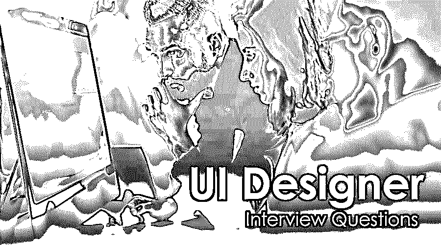

# UI 设计师面试问题

> 原文：<https://www.educba.com/ui-designer-interview-questions/>

## UI 设计师面试问答介绍

UI 设计师是指开发和设计系统、计算机、应用程序、手机和其他设备的用户界面设计师。它有助于用户更容易、更有效地与应用程序交互。用户主要使用由设计者或工程师设计或提供的视图功能。

如果你找的是与 [UI 设计师](https://www.educba.com/what-is-ui-designer/)相关的工作，需要准备 2022 UI 设计师面试题目。根据不同的职位描述，每次面试都是不同的。在这里，我们准备了重要的 UI 设计师面试问答，帮助你在面试中取得成功。

<small>网页开发、编程语言、软件测试&其他</small>

这篇 2022 UI 设计师面试问题的文章将呈现 10 个最重要的和最常被问到的 UI 设计师面试问题。这些问题分为以下两部分:

### 第 1 部分-用户界面设计师面试问题(基础)

这第一部分涵盖了基本的 UI 设计师面试问题和答案。

#### Q1。什么是 UI(用户界面)设计？

**答:**
为特定设备、手机或电脑制作[应用软件](https://www.educba.com/applications-software-developer/)界面的过程，主要关注产品的手感和外观，以吸引顾客对产品的兴趣。用户应该轻松舒适地使用它。用户界面应该是有效的，给人印象深刻的，比如元素应该被很好的维护，标签应该清晰。在设计界面时，应该注意文本对齐、页面布局、颜色、亮度和对比度。一个设计师应该控制一个用户主要使用的对象，这样会比较好用。另一个要点是尽量减少执行任务的动作数量。

#### Q2。定义用户界面设计的原则？

**答:**
这些原则主要集中在提高用户界面设计的质量上，这些原则是:

*   简单性原则:用户界面设计应该简单，使用简单的语言，简单的常见任务，清晰的交流，快捷方式。
*   **结构原则:**用户界面设计应该是结构化的意思，这个原则告诉我们要遵循一定的结构来设计应用程序的 UI。它应该以有意义和有用的方式，把事物结合起来，在一定的基础上把事物区分开来，等等。
*   **反馈原理:**该原理主要集中于为用户已经执行的每个动作提供反馈，如点击按钮、改变文本的颜色和改变的字体。应该是清晰明确的。
*   **可见性原则:**这个原则主要关注的是对于一个用户来说，所有的东西应该是可见的。它帮助用户关注他们想要的东西，而不是多余的东西。
*   **复用原则:**该原则主要关注复用事物，保持不同组件内部和外部行为的一致性和复用性。
*   **宽容原则:**这个原则主要关注于应该宽容的设计。用户界面应该是灵活的，以减少错误和缺陷的成本。

让我们转到下一个 UI 设计师面试问题。

#### Q3。UI 设计模式由什么组成？

**答案:**
UI 设计模式主要由不同的元素组成:问题、使用情境、原理、解决方案、实现。这些元素主要解释用户在使用系统时遇到的问题，以及系统是在什么环境下使用的。遵循[原则或设计模式](https://www.educba.com/design-pattern-interview-questions/)来构建用户界面——解决方案和功能的实际工作方式。现实系统的例子已经应用到一个系统中。

#### Q4。如何实现设计模式库？

**答案:**
以上是面试中被问到的基本 UI 设计师面试问题。[设计模式库](https://www.educba.com/what-is-design-pattern/)是用户界面设计元素的集合。它主要用于解决常见的设计问题。设计模式可以完全基于个人来实现或创建。只有一个人必须确保设计模式应该是响应性的。模式应该是可访问的，这个模式库使得维护更加容易。

#### Q5。定义设计语言系统(DLS)？

**答:**
设计语言系统是按钮、论坛、页眉、标签、布局等可重用功能元素的集合。当定义到一个特定的接口时，它们有一定的标准。借助于一个好的设计语言系统，它创造了所有平台的和谐。在开发过程中，它有助于识别不一致的部分，并使用基本原则来构建系统。

### 第 2 部分-用户界面设计师面试问题(高级)

现在让我们来看看高级 UI 设计师的面试问题。

#### Q6。有哪些不同的 UI 框架和技术？

**答案:**
UI 框架是指用于构建软件或者移动和 web 应用的工具。技术有 [HTML，CSS](https://www.educba.com/html-vs-css/) 主要用于 UI。 [Bootstrap](https://www.educba.com/bootstrap-commands/) 、Angular JS 和 React JS 是目前广泛用于前端或用户界面的其他技术。

#### Q7。用户界面设计流程是怎样的？

**答:**
它是几个阶段的过程，分别是功能需求收集、用户和任务分析、原型、信息架构、[可用性测试](https://www.educba.com/what-is-usability-testing/)、图形用户界面和软件维护。为了建立系统，需要为设计用户界面、用户如何需要特定的事物及其分析、开发和系统的流程等进行适当的需求收集。

让我们转到下一个 UI 设计师面试问题。

#### Q8。为什么 UI 设计如此重要？

**答案:**
用户界面设计因为吸引客户而必不可少。如果用户界面是有吸引力的和更容易的，这吸引了互联网用户和流量的产品或应用程序。其次是应用程序的内容；首先是应用程序的用户界面。假设一个人必须在网络营销上取得成功，或者希望网站的点击率高于用户界面所扮演的重要角色。如果一个网站有好的图形，并且它的文字内容容易阅读，那么在线访问者将会非常多。

#### Q9。你如何改进你的用户界面设计？

**答案:**
这是一次面试中被问得最多的 UI 设计师面试问题。用户界面设计可以通过在正确的地方使用正确的元素来改进，并在重用组件或元素的帮助下使用户界面变得轻便。界面元素就像输入控件、导航组件、信息组件和容器。其他改进设计的方法是保持界面简单，元素的一致性，颜色和纹理，页面布局和默认选择。

#### Q10。如果你必须重新设计已知的用户界面，你会怎么做？

**回答:**
为了重新设计已经知道的用户界面，我将首先收集用户到底在寻找什么以及他们在界面中最常用什么的信息。我想改变的感觉，文字，颜色和字体。变化是不可避免的，最好有新的用户界面体验。

### 推荐文章

这是一个 UI 设计师面试问题和答案列表的指南。这里我们列出了最有用的 10 组面试问题，这样求职者就能轻松应对面试。您也可以阅读以下文章，了解更多信息——

1.  [嵌入式系统面试问题](https://www.educba.com/embedded-system-interview-questions/)
2.  [甲骨文 SOA 面试问题](https://www.educba.com/oracle-soa-interview-questions/)
3.  [继承面试问题](https://www.educba.com/inheritance-interview-questions/)
4.  [RMAN 面试问题](https://www.educba.com/rman-interview-questions/)

